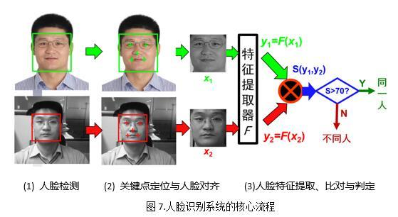

人脸特征提取与比对模块SeetaFace Identification

人脸识别本质上是要计算两幅图像中人脸的相似程度，其一为注册阶段（类比人的相识过程）输入系统的，另一幅为识别阶段（即再见时的辨认过程）的输入。为此，如图7所示，一套全自动的人脸识别系统在完成前述的人脸检测与人脸对齐两个步骤之后，即进入第三个核心步骤：人脸特征提取和比对。这个阶段也是深度学习风起云涌之后进步最大的模块，目前大多数优秀的人脸识别算法均采用卷积神经网络（CNN）来学习特征提取器（即图7中的函数F）。

