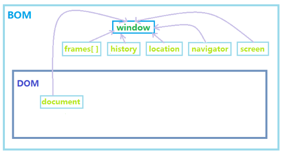

[TOC]

# 写在前面的话

Tip 5: 为何 拷贝(Copy)/粘贴(Paste)功能不能用了? 
不怕大家笑话，我有几次使用 UltraEdit 的过程中发现拷贝与粘贴的内容是不匹配的．不知所以然，干脆重新启动了笔记本.今天翻看手册才恍然大悟:UltraEdit有10个剪切板(clipboard),分别用Ctrl+0 - Ctrl+9　切换． Ctrl+0 是　Windows 的，其他则为用户自定义的．我在使用的过程中错调用了 CTRL+n, 结果内容就有问题了．你遇到过没? 


# React部分

## 项目运行

### 关于npm run dev和build

`npm run build:dll`

`npm run XXX`是执行配置在package.json中的脚本，比如：

```js
"scripts": {
    "dev": "node build/dev-server.js",
    "build": "node build/build.js",
    "unit": "karma start test/unit/karma.conf.js --single-run",
    "e2e": "node test/e2e/runner.js",
    "test": "npm run unit && npm run e2e",
    "lint": "eslint --ext .js,.vue src test/unit/specs test/e2e/specs"
  },
 ```
只有这里配置了，你才能run，所以不是所有的项目都能npm run dev/build。
要了解这些命令做了什么，就要去scripts中看具体执行的是什么代码。
这里就像是一些命令的快捷方式，免去每次都要输入很长的的命令（比如unit那行）。

为什么会出现ERROR，就是因为在跑这些对应的脚本文件的时候，可能是某些依赖没有被加载等的。

一般项目都会有build, dev, unit等，从名字上基本能看出来是干什么的。比如上面配置的unit，就是开启karma去跑单元测试，具体测试内容，要去看karma.conf.js；e2e就是end to end的端到端测试；而test则会将单元测试和端到端测试都执行。

有些项目中根据需要，还会配置其他命令，例如自动生成文档，比如这里：
`"build:doc": "node ./scripts/build-doc.js"`,
如果你去build-doc.js中看的话，会发现，这个脚本在遍历所有源文件，解析注释和其他内容，自动生成API文档

## 源码阅读理解

### State和 Props
`state是状态机`

应该包括：
那些可能被组件的事件处理器改变并触发用户界面更新的数据，(譬如需要对用户输入,服务器请求或者时间变化等作出响应。)

不应该包括：
计算所得数据、React组件（在render()里使用props和state来创建它）、基于props的重复数据（尽可能保持用props来做作为唯一的数据来源，把props保存到state中的有效的场景是需要知道它以前的值得时候,因为未来的props可能会变化）。


`props： 父级向子级传递数据的方式。`


### 有状态组件和无状态组件（纯函数组件）

#### 有状态组件

通过React.createClass或者es6的class继承React.Component创建的组件。
特性：具备完整的生命周期及实例化过程、支持this及ref指向。


## webpack.config.js配置文件
```js
module.exports={
devtool:'eval-source-map',
/__dirname 获取nodejs的详细路径/
/入口文件/
entry:dirname+'/app/app.js',
/输出文件/
output:{
/输出路径/
path:dirname+'/build',
/输出文件名/
filename:'bundle.js'
},
module: {
/es6转换es5的配置文件/
loaders: [
{
test:/.json$/,
loader:'json-loader'
},
{
test:/.js$/,
exclude:'node_modules',
loader:'babel-loader',
query:{
presets:['es2015','react']
}
},
]
}
}

```


# Redux部分

## 为什么需要Redux
前后端分离的思潮越来越浓烈以及单页应用开发日趋复杂，前端JavaScript 需要管理越来越多的应用状态(state)。

这里的应用状态可能包括： 
－Ajax请求 
－服务器响应 
－数据缓存 
－本地生成但是尚未持久化到服务器的数据 
－UI 状态

## Redux的三大原则

单一数据源

State 是只读的

使用纯函数来执行修改


## 三大核心概念


### Action和Action Creator
Action是一个对象，用来代表所有会引起状态（state）变化的行为

### Reducer
Reducer是一个函数

### Store
而Store则是Actions和Reducers连接在一起的对象


# ECMAScript6

## 变量声明 var
众所周知在es6之前js的变量没有块级，只存在函数内外访问之分；
例如：
```js
var a = 5;
if(true){
  var b = 3;
  console.log(a) // 5;
  var a = 's';
}
console.log(a) // s;
console.log(b) // 3;
```
从上面的代码可以知道var定义的a在if语句块中一样可以被访问和修改，同样在if语句块里面定义的变量b，在其快外面也一样可以被访问和修改；所以在es6之前用var定义声明一个变量时不会存在if,for这些语句块的作用域。
接下来看一下es6中新增的变量声明let;

## 变量声明let
let也是用来声明变量的，但是所声明的变量，只在let命令所在的代码块内有效。
例如：
```js
if(true){
  let b = 3;
  console.log(b) // 3;
  var a = 's';
}
console.log(a) // s;
console.log(b) //报错 b is not defined;
```
也就是在if语句块中用let定义的变量b，出了这个区域块就没法获取到b了，这和var就不一样了

```js
var arr = [];
for(var i =0;i<6;i++){
   arr[i] = function(){
    console.log(i)
	}
}
arr[3]();//6
```

在上面的代码中i是被var定义的没有语句块的限制，当循环结束后他的值被累加到6了，当你再去调用函数去访问i时，不管是arr[3]还是arr[4]或者其他的得到的都会是6；因为它的值在循环结束后已经更新为6了;
如果改成let声明i会怎样？
```js
var arr = [];
for(let i =0;i<6;i++){
   arr[i] = function(){
    console.log(i)
	}
}
arr[3](); //3
```
结果是我们想要的.

## 变量常量声明const

（1）const 声明的是常量，一旦声明，值将是不可变的,const 声明的变量必须设置初始值，且不能重复赋值
```js
const PI = 3.1415;
PI = 3;// 抛出异常：Assignment to constant variable.不能给一个常量再赋值；
console.log(PI) //3.1415
```
(2) const 也具有块级作用域
```js
if (true) {
  const a = 5;
}
console.log(a);// a is not defined;
```
(3) const声明的常量没有声明提前的效果，也不能被重复声明；
```js
    var a = 5;
    function b(){
       console.log(a);
       var a = 5;
    }
    b();//undefind 这里得到的undefined就是因为函数内部有var声明提前造成的；这个例子是题外话，一个比较常见的陷阱
    
    if(true){
       console.log(PI);// 抛出一个错误PI is not defined
       const PI = 3.14
    }
    if(true){
       console.log(PI);// 不会报错只会打印出undefined,说明他已经声明了只是没有赋值
       var PI = 3.14 
    }
    //重复声明
    var message = "Hello";
    const message = "Goodbye!"; //会报错  Identifier 'message' has already been declared
```

# JavaScript部分

基本认识

定义:
JavaScript的简写形式就是JS，是由Netscape公司开发的一种脚本语言，一种广泛用于客户端Web开发的脚本语言,常用来给HTML网页添加动态功能(其编写的程序可以被嵌入到HTML或XML页面中,并直接在浏览器中解释执行).

组成部分:
核心（ECMAScript）、文档对象模型（Document Object Model，简称DOM）、浏览器对象模型（Browser Object Model，简称BOM）

描述:
主流的javaScript框架有：YUI ,Dojo，Prototype，jQuery...

## BOM

### Location对象
Location 对象存储在 Window 对象的 Location 属性中，表示那个窗口中当前显示的文档的 Web 地址
Location 对象表示的却是浏览器当前显示的文档的 URL（或位置）。但是 Location 对象所能做的远远不止这些，它还能控制浏览器显示的文档的位置。
`如果把一个含有 URL 的字符串赋予 Location 对象或它的 href 属性，浏览器就会把新的 URL 所指的文档装载进来，并显示出来。`

### 我们来看看DOM和BOM到底是什么呢？

DOM（Document Object Model）是HTML和XML的应用程序接口(API)，W3C的标准即事为它而制定。

BOM（Browser Object Model）是提供与浏览器进行交互的方法和接口，由于不同的浏览器实现方法不同，从而表现也可能不同。

且BOM的核心是window对象，而window又是一个全局对象，这就意味着网页中定义的任何对象、变量、函数都是以window作为全局对象的。

### 为什么BOM是包含了DOM

因为DOM是通过document来访问、检索、修改网页内容与结构的，但BOM中的window又包含了这个document属性。


## JavaScript对象可分为三类：
- Window对象
- 内建对象（例如日期，数学等对象）,共有四大类：
    + 日期（Date）
    + 数学（Math）
    + 字串（String）
    + 阵列（Array）
- 使用者自定义对象

JavaScript中字符串比对方法：
没有equals()方法，字符转比较可以直接时候使用"=="或者is()函数


## JavaScript判断两个变量是否相等
判断两个变量是否相等是程序设计中非常重要的运算。在处理原始值时，这种运算相当简单 ，但涉及对象，运算就稍有点复杂。

ECMAScript提供了两套等性运算符，等号和非等号 用于处理原始值；全等号和非全等号用于处理对象

全等号(===)，只有在无需类型转换运算数就相等的情况下，才返回true。

例如：
var sNum = "66";
var iNum = 66;
alert(sNum == iNum);  //输出 "true"
alert(sNum === iNum); //输出 "false"


非全等号(!==)，只有在无需类型转换运算数不相等的情况下，才返回true。

例如：
var sNum = "66";
var iNum = 66;
alert(sNum != iNum);  //输出 "false"
alert(sNum !== iNum); //输出 "true"

## 正则表达式
/\{\{(.+?)\}\}/g

 前后的 / 是正则表达式的分隔符表示开始和结束
 最后的 g 表示全局匹配
 其中的 () 表示子组

 /\{\{(.+?)\}\}/g完整的意思就是：在全部范围内查找匹配前后有两组花括号的字符串.

[^]表示字符类取反，比如[^abc]匹配的就是不是a和b和c的单个字符,[^?&=]匹配不是^和?和=的单个字符.

字符类[]后面的+或*表示量词：
+等价于{1,} 重复1次或多次
*等价于{0,} 重复0次或多次

实例：
```js
var str = "foo=bar&lang=js";
var reg = /[^?&=]{1,}=[^?&=]{0,}/g;
console.log(str.match(reg)); //输出 ["foo=bar", "lang=js"]

var str = "foo=bar&lang=js";
var reg = /[^?&=]{1,}=[^?&=]{0,}/;
console.log(str.match(reg)); //输出 ["foo=bar"]

var str = "foo=bar&lang=js";
var reg = /([^?&=]{1,})=([^?&=]{0,})/;
console.log(str.match(reg)); //输出 ["foo=bar", "foo", "bar"]
```


## JavaScript AJAX jQuery 三者间的关系


JavaScript是用于Web客户端开发的脚本语言，
AJAX是基于JS语言，主要组合JS,CSS,XML 三种技术的新技术，是用于创建交互式网页应用的网页开发技术。
jQuery是JS的框架，基于JS语言，集合AJAX技术开发出来的JS库，封装JS和AJAX的功能，提供函数接口，大大简化了JS和AJAX的操作。


JavaScript对大小写敏感. 关键词function必须是小写的, 并且必须以与函数名称相同的大小写来调用函数.

`<script>中不赞成使用language属性, 规定脚本语言. 请使用type属性代替它.`


## 变量

变量的命名
JS中的变量名必须以字母(a-z或A-Z)开头, 其后可以跟数字和下划线等, 但不能有空格, “+”, “—”, “，”, “？”等运算符或标点符号作为变量名. 另外, 对于JS中的关键字不能作为变量名.
变量的类型
	对于同一变量可以赋不同类型的变量值.
var number1 = 100
number1 = “野马”

Window(窗口)对象
Window(窗口)对象的方法
alert()方法
使用Window(窗口)对象的alert()方法, 可以在屏幕中显示一个警告框, 这些警告框是用来显示一条简短的信息, 向用户表明某个情况的发生, 单击OK按钮来关闭警告框.
在下面的实例中我们将在页面中创建一个按钮, 当用鼠标单击按钮时, 将弹出一个警告框来显示某些警告信息. 然后, 当用户单击警告框中的按钮时, 警告框将自动消失. 下面是实例程序的代码清单.

```html
<input TYPE=button VALUE=”警告框” onClick=”alertwin()”>
<script type="text/javascript">
function alertwin(){
	window.alert(“您将看到一个警告框!”);
}
</script>
```

## JS声明提前
声明提前这个概念对于前端攻城狮来说是一个很了解的了，但是对于初入前端的新人来说，这又是一个不得不谈的话题

下面我将介绍一下什么是声明提前
```js
console.log(a);               //undefined
var a;
a=10;
console.log(a)                //10;
```
如上面代码所示，在我并未定义a时，试着输出a，js并没有报错，而是用undefined显示，

在第4行输出a时结果是正确显示的，第一行为什么不报错呢？

原因是这样的，在js中存在这样一种机制，在程序正式执行之前，会将var声明的变量和function声明的函数预读到当前作用域的顶部，

但赋值会保留在原位置，这也就形成第一行输出的结果，`js真实的过程是将第二行提前到了第一行之前`，当js执行到第一行时，由于var a被提前了，但并未赋初始值，所以输出了undefined，到这里大家应该理解了什么是声明提前

声明提前破坏了程序的执行顺序，所以大家知道原理即可，切勿在实际开发过程中使用，不仅会降低代码可读性，还容易造成程序错误

```js
function a(){
    console.log(10);  
}
a();                                       //20
function a(){
    console.log(20);      
}
a();                                       //20
```
如上图所示，本意是想调用这个函数输出10和20，但由于声明提前，后一个a函数将第一个a函数覆盖，10永远无法输出，

这在生产环境中是很容易产生的，两个人一起工作，你声明一个函数或变量，而另一个人也声明了一个跟你相同的函数或变量，

导致出现的bug非常难以发现和修改，所以在ES6的规定中，`建议用let关键字来代替var`，采用匿名函数自调`一种解决js全局作用域弊病的方法`的方式来解决声明提前的问题

## JavaScript 回调函数


### 什么是回调或者高阶函剩

一个回调函数，也称为高阶函数，是一个被作为参数传递给另一个函数（在这里我们把另一个函数叫做“otherFunction”）的函数，回调函数在otherFunction中被调用。一个回调函数本质上是一种编程模式（为一个常见问题创建的解决方案），因此，使用回调函数也叫做回调模式。

下面是一个在jQuery中使用回调函数简单普遍的例子：

```
//注意到click方法中是一个函数而不是一个变量
//它就是回调函数
$("#btn_1").click(function(){
	alert("Btn 1 clicked");
});
```

正如你在前面的例子中看到的，我们将一个函数作为参数传递给了click方法。click方法会调用（或者执行）我们传递给它的函数。这是JavaScript中回调函数的典型用法，它在jQuery中广泛被使用。

## 回调函数是怎样运作的？


## 实现回调函数的基本原理

- 使用命名或匿名函数作为回调

比如下面的例子：

```
//全局变量
var allUserData = [];

//普通的logStuff函数，将内容打印到控制台     
function logStuff (userData){
    if ( typeof userData === "string")
    {
        console.log(userData);
    }
    else if ( typeof userData === "object"){
        for(var item in userData){
            console.log(item + ": " + userData[item]);
        }
    }
} 

//一个接收两个参数的函数，后面一个是回调函数     
function getInput (options, callback){
    allUserData.push(options);
    callback(options);
}

//当我们调用getInput函数时，我们将logStuff作为一个参数传递给它     
//因此logStuff将会在getInput函数内被回调（或者执行）     
getInput({name:"Rich",speciality:"Javascript"}, logStuff);
//name:Rich
//speciality:Javascript
```

- 传递参数给回调函数

- 在执行之前确保回调函数是一个函数

- 使用this对象的方法作为回调函数时的问题


## JavaScript弹窗

```
<SCRIPT LANGUAGE="javascript"> 
<!-- 
window.open ('page.html', 'newwindow', 'height=100, width=400, top=0, left=0, toolbar=no, menubar=no, scrollbars=no, resizable=no,location=n o, status=no') //这句要写成一行
--> 
</SCRIPT> 
```
	参数解释：
	<SCRIPT Language="javascript0">js脚本开始；
	window.open 弹出新窗口的命令
	'page.html'弹出窗口的文件名
	'newwindow'弹出窗口的名字（不是文件名），非必须，可用空''代替
	height=100
	width=400
	top=0窗口距离屏幕上方的像素值
	left=0窗口距离屏幕左侧的像素值
	toolbar=no是否显示工具栏，yes为显示
	menubar, scrollbars 表示菜单栏和滚动栏
	resizable=no 是否显示地址栏，yes为允许
	location=no 是否显示地址栏，yes为允许
	status=no 是否显示状态栏内的信息（通常是文件已经打开），yes为允许
	</SCRIPT>

  js脚本结束

【1、最基本的弹出窗口代码】 

	<SCRIPT language='javascript'>
		<!--
		window.open('page.html')
		-->
	</SCRIPT>
	
	因为这是一段javascripts代码，所以它们应该放在<SCRIPT LANGUAGE="javascript">标签和</script>之间。<!--和-->是对一些版本低的浏览器起作用，在这些老的浏览器中不会将标签中的代码作为文本显示出来。要养成这个好习惯。window.open('page.html')用于控制弹出新的窗口page.html,如果page.html不与主窗口在同一路径下，前面应写明路径，绝对路径(http://)和相对路径(../)均可。用单引号和双引号都可以，只是不要混用。这一段代码可以加入HTML的任意位置，<head>和</head>之间可以,<body>和</body>之间也可以,越前越早执行,尤其是页面代码长,又想使页面早点弹出就尽量往前放.

【3、用函数控制弹出窗口】 
	下面是一个完整的代码。
``` 
<html> 
<head> 
  <script LANGUAGE="JavaScript"> 
  <!-- 
  function openwin() { 
  window.open ("page.html", "newwindow", "height=100, width=400, toolbar =no, menubar=no, scrollbars=no, resizable=no, location=no, status=no") //写成一行
  } 
  //--> 
  </script> 
</head> 
<body onload="openwin()"> 
  任意的页面内容... 
</body> 
</html>
```

这里定义了一个函数openwin(),函数内容就是打开一个窗口。在调用它之前没有任何用途。怎么调用呢？

方法一：<body onload="openwin()"> 浏览器读页面时弹出窗口； 
方法二：<body onunload="openwin()"> 浏览器离开页面时弹出窗口； 
方法三：用一个连接调用： 
`<a href="#" onclick="openwin()">打开一个窗口</a> `
注意：使用的“#”是虚连接。 
方法四：用一个按钮调用： 
`<input type="button" onclick="openwin()" value="打开窗口">`


### a标签中调用javascript方法的几种方法与window.open()

常用的在a标签中有点击事件:

- a href="javascript:void(0);" onclick="js_method()"
这种方法是很多网站最常用的方法，也是最周全的方法，onclick方法负责执行js函数，
而void是一个操作符，void(0)返回undefined，`地址不发生跳转`。而且这种方法不会像第一种方法一样直接将js方法暴露在浏览器的状态栏。

```html
<a href="javascript:void(0)" onclick="del(1, 'java程序员');">删除</a>
```

- a href="#" onclick="js_method()"
这种方法也是网上很常见的代码，#是标签内置的一个方法，代表top的作用。所以用这种方法点击后网页后返回到页面的最顶端。

- a href="#" onclick="js_method();return false;"
这种方法点击执行了js函数后return false，页面不发生跳转，执行后还是在页面的当前位置。

# JSON

JSON(JavaScript Object Notation)一种简单的数据格式，比xml更轻巧。JSON是JavaScript原生格式，就是说在JavaScript中处理JSON数据不需要任何特殊的API或工具包。

## JSON规则：
对象是一个无序的“键值对”集合。

## JSON格式

简单说，每个JSON对象，就是一个值。要么是简单类型的值，要么是复合类型的值，但是只能是一个值，不能是两个或更多的值。这就是说，每个JSON文档只能包含一个值。

###JSON对值的类型和格式有严格的规定。

- 复合类型的值只能是数组或对象，不能是函数、正则表达式对象、日期对象。

- 简单类型的值只有四种：字符串、数值（必须以十进制表示）、布尔值和null（不能使用NaN, Infinity, -Infinity和undefined）。

- 字符串必须使用双引号表示，不能使用单引号。

- 对象的键名必须放在双引号里面。

- 数组或对象最后一个成员的后面，不能加逗号。


# jQuery部分

使用jQuery的唯一前提就是引用jQuery类库:

## jQuery核心函数
jQuery(expression, [context])
jQuery(html, [ownerDocument])
jQuery(html, props)
jQuery(elements)
jQuery()
jQuery(callback)
jQuery(html)
由于频繁使用核心函数，于是用`$`替代`jQuery`

## jQuery选择器
     
选择器	|实例	|选取
--|--|--
*	|$("*")	|所有元素
#id	|$("#lastname")	|id="lastname" 的元素
.class	|$(".intro")	|所有 class="intro" 的元素
element	|$("p")	|所有 <p> 元素
.class.class	|$(".intro.demo")	|所有 class="intro" 且 class="demo" 的元素
:first	|$("p:first")	|第一个 <p> 元素    
:last	|$("p:last")	|最后一个 <p> 元素
:even	|$("tr:even")	|所有偶数 <tr> 元素
:odd	|$("tr:odd")	|所有奇数 <tr> 元素
:eq(index)	|$("ul li:eq(3)")	|列表中的第四个元素（index 从 0 开始）
:gt(no)	|$("ul li:gt(3)")	|列出 index 大于 3 的元素
:lt(no)	|$("ul li:lt(3)")	|列出 index 小于 3 的元素
:not(selector)	|$("input:not(:empty)")	|所有不为空的 input 元素
:header	|$(":header")	|所有标题元素 <h1> - <h6>
:animated|	 	|所有动画元素 
:contains(text)	|$(":contains('W3School')")	|包含指定字符串的所有元素
:empty	|$(":empty")	|无子（元素）节点的所有元素
:hidden	|$("p:hidden")	|所有隐藏的 <p> 元素
:visible	|$("table:visible")	|所有可见的表格 
s1,s2,s3	|$("th,td,.intro")	|所有带有匹配选择的元素
[attribute]	|$("[href]")	|所有带有 href 属性的元素
[attribute=value]	|$("[href='#']")	|所有 href 属性的值等于 "#" 的元素

[attribute!=value]	|$("[href!='#']")	|所有 href 属性的值不等于 "#" 的元素

[attribute$=value]	|$("[href$='.jpg']")	|所有 href 属性的值包含以 ".jpg" 结尾的元素
:input	|$(":input")	|所有 <input> 元素
:text	|$(":text")	|所有 type="text" 的 <input> 元素
        |$(":text:eq(0)") |type="text" 的 第一个<input> 元素
:password	|$(":password")	|所有 type="password" 的 <input> 元素
:radio	|$(":radio")	|所有 type="radio" 的 <input> 元素
:checkbox	|$(":checkbox")	|所有 type="checkbox" 的 <input> 元素
:submit	|$(":submit")	|所有 type="submit" 的 <input> 元素
:reset	|$(":reset")	|所有 type="reset" 的 <input> 元素
:button	|$(":button")	|所有 type="button" 的 <input> 元素
:image	|$(":image")	|所有 type="image" 的 <input> 元素
:file	|$(":file")	|所有 type="file" 的 <input> 元素
:enabled	|$(":enabled")	|所有激活的 input 元素
:disabled	|$(":disabled")	|所有禁用的 input 元素
:selected	|$(":selected")	|所有被选取的 input 元素
:checked	|$(":checked")	|所有被选中的 input 元素

```js
$(":radio:checked").val(); //获取radio被选中的选项的值

```

## jQuery/javascript对象转换
jQuery --> javascript对象

```js
$("xx")[0].innerHTML;
$("xx").get(0).innerHTML;
```
javascript对象 --> jQuery

```js
document.getElementById("xx");
$(document.getElementById("xx")).html();
```

### jQuery添加/删除Select的Option项：
语法解释：
1.  $("#select_id").append("<option value='Value'>Text</option>");   //为Select追加一个Option(下拉项)
2. $("#select_id").prepend("<option  value='0'>请选择</option>");  //为Select插入一个Option(第一个位置)
3.  $("#select_id option:last").remove();  //删除Select中索引值最大Option(最后一个)
4.  $("#select_id option[index='0']").remove();  //删除Select中索引值为0的Option(第一个)
5.  $("#select_id option[value='3']").remove();   //删除Select中Value='3'的Option
5. $("#select_id option[text='4']").remove();   //删除Select中Text='4'的Option 

### jquery获取复选框checkbox的值
```js
//jquery获取复选框值    
var chk_value =[];//定义一个数组    
$('input[name="interest"]:checked').each(function(){
	//遍历每一个名字为interest的复选框，其中选中的执行函数 
	chk_value.push($(this).val());//将选中的值添加到数组chk_value中    
});

//下拉框点击事件
$("select[name='fstart']").click(function () {
	//获取下拉框选中value
    start = $("select[name='fstart']").val();
});
```


## jQuery事件

height()
jQuery设置元素宽度方法
实例
var h = $(window).height();
h表示获取到的iFrame的高度
$('#deptTree').height(h-5);//这里设置id='deptTree'的div的高度


### 页面加载完成后执行
```js
//javascript写法
window.onload=function(){}

//jQuery写法(2种)
$(function(){
	
});
//或者
$(document).ready(function(){});
```

### jquery live()方法
live在jQuery1.7中就不再建议使用，在1.9中就给删除了。
在jQuery官方网站上说明了原因，并声称用on方法取代live方法。
jQuery官方网站声称下面三行代码是等价的
```
$("a.offsite").live("click", function(){ alert("Goodbye!"); });                // jQuery 1.3+
$(document).delegate("a.offsite", "click", function(){ alert("Goodbye!"); });  // jQuery 1.4.3+
$(document).on("click", "a.offsite", function(){ alert("Goodbye!"); });        // jQuery 1.7+
```


ready()

实例
在文档加载后激活函数:
$(document).ready(function(){
  $(".btn1").click(function(){
    $("p").slideToggle();
  });
});

提示：ready() 函数不应与 <body onload=""> 一起使用

focus()方法

click() 方法

实例
当点击按钮时，隐藏或显示元素：
$("button").click(function(){
  $("p").slideToggle();
});

将函数绑定到 click 事件
语法
$(selector).click(function)
参数	描述
function	可选。规定当发生 click 事件时运行的函数。

dblclick()方法

语法
$(selector).dblclick()

delegate()方法

语法
$(selector).delegate(childSelector,event,data,function)
参数	描述
childSelector	必需。规定要附加事件处理程序的一个或多个子元素。
event	
必需。规定附加到元素的一个或多个事件。
由空格分隔多个事件值。必须是有效的事件。
data	可选。规定传递到函数的额外数据。
function	必需。规定当事件发生时运行的函数。

die()方法  (die和live正相对)

移除所有通过 live() 方法向 p 元素添加的事件处理程序：

scroll()方法

实例
对元素滚动的次数进行计数：
x=0;
$("div").scroll(function() {
  $("span").text(x+=1);
});

select()方法

当 textarea 或文本类型的 input 元素中的文本被选择时，会发生 select 事件

pageX属性

实例
显示鼠标指针的位置：
$(document).mousemove(function(e){
  $("span").text("X: " + e.pageX + ", Y: " + e.pageY).css("color","olive");
});

mouseleave()

实例
当鼠标指针离开元素时，改变元素的背景色：
$("p").mouseenter(function(){
  $("p").css("background-color","olive");
});
$("p").mouseleave(function(){
  $("p").css("background-color","#E9E9E4");
});

trigger()

实例
触发input元素的select事件：
$("input").select(function(){
  $("input").after("文本被选中！");
});
$("button").click(function(){
  $("input").trigger("select");
});

triggerHandler()
triggerHandler() 方法与 trigger() 方法类似。不同的是它不会触发事件（比如表单提交）的默认行为，而且只影响第一个匹配元素
      
      
## jQuery - 添加元素（例如“报表打印”JSP页面中领导姓名设置隐藏的效果）

添加新的 HTML 内容

我们将学习用于添加新内容的四个 jQuery 方法：
			append() - 在被选元素的结尾插入内容
		prepend() - 在被选元素的开头插入内容
		after() - 在被选元素之后插入内容
		before() - 在被选元素之前插入内容

实例
例如“报表打印”JSP页面中领导姓名设置隐藏的效果
  			
  			
## jQuery - Ajax
  			
jQuery 库拥有完整的 Ajax 兼容套件。其中的函数和方法允许我们在不刷新浏览器的情况下从服务器加载数据。

jQuery.ajax([settings])
执行异步HTTP (Ajax)请求

$("#b01").click(function(){
	htmlobj=$.ajax({url:"/jquery/test1.txt",async:false});
	$("#myDiv").html(htmlobj.responseText);
});

jQuery.getScript(url, success(response, status))

该函数是简写的 Ajax 函数，等价于：
$.ajax({
	url: url,
	dataType: "script",
	success: success
});

### jQuery.get请求
jQuery.get(url, [data], [callback], [dataType])
返回值 XMLHttpRequest
使用HTTP GET请求从服务器加载数据

```js
$.ajax({
	type: "get",
	url: url,
	data: data,
	succses: success,
	dataType: dataType
});
```

参数	描述
url	必需。规定将请求发送的哪个 URL。
data	可选。规定连同请求发送到服务器的数据。
success(response,status,xhr)	
可选。规定当请求成功时运行的函数。
额外的参数：
response - 包含来自请求的结果数据
status - 包含请求的状态
xhr - 包含 XMLHttpRequest 对象
dataType	
可选。规定预计的服务器响应的数据类型。
默认地，jQuery 将智能判断。
可能的类型：
"xml"
"html"
"text"
"script"
"json"
"jsonp"

例 1
请求test.php网页,传递2个参数, 忽略返回值:
$.get("test.php", {name: "John", time: "2pm"});

例 2
显示test.php返回值(HTML或XML, 取决于返回值):
$.get("test.php", function(data){
	alert("Data loaded: " + data);
});

### jQuery.post请求
jQuery.post(url, [data], [callback], [dataType])
返回值 XMLHttpRequest
使用HTTP POST请求从服务器加载数据

```js
$.ajax({
	type: 'POST',
	url: url,
	data: data,
	dataType: dataType
	succses: success,
});
```

param()
创建数组或对象的序列化表示

示例
序列化一个key/value对象:
var params = {width:1900, height:1200};
var str = jQuery.param(params);
$("#results").text(str);
结果:
width=1900&height=1200

serialize()
将表单内容序列化为字符串

示例
输出序列化表单值的结果
$("button").click(function(){
	$("div").text($("form").serialize());
});

ajaxComplete()
当Ajax请求完成时注册要调用的处理程序. 这是一个Ajax事件

load()
从服务器加载数据, 然后把返回的HTML放入匹配元素

示例
使用AJAX请求来改变div元素的文本:
$(button).click(function(){
	$("div").load('demo_load.txt');
});

该方法是最简单的从服务器获取数据的方法。它几乎与 $.get(url, data, success) 等价，不同的是它不是全局函数，并且它拥有隐式的回调函数。当侦测到成功的响应时（比如，当 textStatus 为 "success" 或 "notmodified" 时），.load() 将匹配元素的 HTML 内容设置为返回的数据


### jQuery ajax - getJSON() 方法
在 jQuery 1.2 中，您可以通过使用 JSONP 形式的回调函数来加载其他网域的 JSON 数据，如 "myurl?callback=?"。jQuery 将自动替换 ? 为正确的函数名，以执行回调函数。 
注意：此行以后的代码将在这个回调函数执行前执行。
语法
jQuery.getJSON(url,data,success(data,status,xhr))
参数	描述
url	  										必需。规定将请求发送的哪个 URL。
data											可选。规定连同请求发送到服务器的数据。
success(data,status,xhr)	
可选。规定当请求成功时运行的函数。
额外的参数：
response - 包含来自请求的结果数据
status - 包含请求的状态
xhr - 包含 XMLHttpRequest 对象

```js
	//提交时验证
	var isValid = $("#xxxForm").form('validate'); 

	//如果#dseForm验证未通过, 则返回.
	if (!isValid) {
		return;
	}
```

## ajax提交Form
```js
jQuery的$.ajax方法可以实现ajax调用，要设置url，post，参数等。
如果要提交现有Form需要写很多代码，何不直接将Form的提交直接转移到ajax中呢？	

//将form转为AJAX提交
function ajaxSubmit(frm, fn) {
    var dataPara = getFormJson(frm);
    $.ajax({
        type: frm.method,
        url: frm.action,
        data: dataPara,
        success: fn
    });
}

//将form中的值转换为键值对。
function getFormJson(frm) {
    var o = {};
    var a = $(frm).serializeArray();
    $.each(a, function () {
    });

  return o;
}
```


### jQuery jsonp 

必须使用最底层的ajaax请求
```js
$.ajax({
	type: "post",
	url: "localhost:8081/demo1",
	dataType: "jsonp",
	jsonpCallBack: "a123",
	jsonp: "callback",
	success: function(data) {
		alert(data);
	}
});
```


#	jQuery  EasyUI部分

combobox 默认不选中下拉选项

```js
//初始化用户类型
  $('#usertype_auto').combobox({
      valueField: 'id',
      textField: 'text',
      editable:false,
      data: [{
          'id':1,
          'text':'一般用户'
      },{
          'id':2,
          'text':'管理员'
      }]
  });
  $('#usertype_auto').combobox('clear');
```
事实上，是先给combobox选中value后，又通过clear方法清除了该value；

textbox, databox控件都可以通过clear方法清除查询控件的值，如下
datagrid进行Refresh刷新操作时，清除查询控件的值
	$('#gridRefresh').click(function () {
	    //清除查询控件的值
	    $("#cap_name").textbox('clear');
	    $("#strDate").datebox('clear');
	    $("#endDate").datebox('clear');
	    myModule.loadData();
	});


## 数据表格（DateGrid）的特性

## 列（Column）的特性
	
DataGrid的Column是一个数组对象，它的每个元素也是一个数组。数组元素的元素是一个配置对象，它定义了每个列的字段。
代码示例：
```
columns:[[   
    {field:'itemid',title:'Item ID',rowspan:2,width:80,sortable:true},   
    {field:'productid',title:'Product ID',rowspan:2,width:80,sortable:true} 
]]
```
	
## datagrid属性
	idField		string		指明哪一个字段是标识字段
	

## 谈谈easyui datagrid  左右两个Grid的数据  互相编辑  的[过滤操作函数]
```
	/**
	 * 右侧datagrid被过滤
	 * @param pdata.records[].id 部门数据
	 * @param data[].userid 短信已选人员
     */
	var filterRight = function(pdata,data){
		var pndata = [];
		var ndata = [];
		pdata.records.forEach(function(puser){
			var isInt = false;
			data.forEach(function(duser){
				if(duser.userid === puser.id){
					ndata.push(duser);
					isInt = true;
				}
			});
			if (!isInt) pndata.push(puser);
		});

		$('#firstGrid').datagrid('loadData', { total: 0, rows: pndata});
		$('#secondGrid').datagrid('loadData', { total: 0, rows: ndata });

	};

	/**
	 * 左侧grid被过滤
	 * @param pdata.records[].id 部门数据
	 * @param data[].userid 短信已选人员
     */
	var filterLeft = function(pdata,data){
		var pndata = [];
		pdata.records.forEach(function(puser){
			var isInt = false;
			data.forEach(function(duser){
				if(duser.userid === puser.id){
					isInt = true;
				}
			});
			if (!isInt) pndata.push(puser);
		});

		$('#firstGrid').datagrid('loadData', { total: 0, rows: pndata});
		$('#secondGrid').datagrid('loadData', { total: 0, rows: data });

	};
```

## 谈谈easyui datagrid的数据加载


只有两种方式：
	1. ajax加载目标url返回的json数据
	2. 加载js对象，也就是使用loadData方法，这种方法用于加载本地js数据(非url调用)

## datagrid加载JSON数据
获取的数据源，比如JSON对象， 这个标准数据对象必须包含类似如下
{"total": n,
"rows": [{}...]}
或者
{"total": n,
"rows": [{}...], 
"footer": []}

例如：
var obj = eval('(' + data + ')');  //转换为JSON对象
$('#datagrid').datagrid('loadData', {total: obj.count, rows: obj.records});


	
二次加载问题
对于使用url方式的初学者，经常碰到重复请求的问题，这个问题的根源是多次渲染组件，如何避免二次加载这样问题呢，个人觉得注意以下两点基本就可以防止二次加载了：
1. 使用load和reload函数去动态加载数据，而不是选择再次渲染组件。
很多人再次渲染组件的目的仅仅是为了设置url，这得不偿失，url的设置可以通过options方法获取到组件实例的opts，然后再给opts.url重新赋值即可；
2. class方式注册组件和javascript注册方式不要同时使用。
class注册方式一般是为了初始化属性，javascript方式则属性和事件都可初始化，但是不管是class方式还是javascript方式注册组件爱你，每次注册，只要被设置过url属性就会做请求。所以在不可避免要使用javascript方式注册的情况下，索性就不要使用class方式注册了。
	


## loadDataGrid方法  加载表格
```
function loadDataGrid() {

		_data = _getAutoObject($(form));
    _data["RID"] = RID;
    _url = 'jf/SbjlxxCtrl/getListInfoByParams';
    
    _MyDataGrid = $(datagrid).datagrid({
        url: _url,
        idField: _keyId, // 变更ID
        //初始加载DataGrid, 使用和查询一样的方式_{dataStr: JSON.stringify(_data)}
        queryParams: {dataStr: JSON.stringify(_data)},
        width: '100%',
        height: _h + 'px',
        singleSelect: true,
        pagination: true,
        rownumbers: false,
        pageSize: _pageSize,
        pageList: _pageList,
        onLoadSuccess: function (data) {},
        onLoadError:function(){},
        columns: ,
        onClickRow: function () {);
        }
    });
}
```

## 发现问题：datagrid的二级表头属性colspan,rowspan影响  数据加载
```
columns: [[{
    field: 'bp_name',
    title: '项目名称',
    //colspan: 2,  若不是二级表头,则去除该属性
    width: '14%'
}, {
    field: 'ts_name',
    title: '标段名称',
    width: '14%'
}
]]
```

##　谈谈easyui tree  初始化，选中第一个孩子节点

在tree初始化数据加载完成后，
在tree的onLoadSuccess()方法中，定义选中第一个孩子节点的操作。
例如：
```
$("#deptTree").tree({
	onClick: function(){

	},
	onLoadSuccess: function(node, data){
    // 默认选中处领导
    var val = $('#departmentTree').tree('getSelected');
    if (val == null){
        var roots = $('#departmentTree').tree('getRoots');
        var arr = $('#departmentTree').tree('getChildren', roots[0].target);
        selectNode = arr[0];
        $(selectNode.target).trigger('click');
    }
	}
});
```


# AJAX(Asynchronous Javascript And XML)部分


## ajax的本质
ajax和web服务器交互是通过HTTP协议来进行的，说白了，ajax实际上也是在访问一个HTTP地址。
再者，浏览器底层通信都是通过socket来实现的，socket只负责发送和接收数据，至于数据包结构就是不同的上层协议（如HTTP协议或FTP协议）来自行规定的

你可以简单的理解为ajax反正是通过HTTP协议和服务器进行信息通信的

HTTP1.0版本：客户机每次向服务器请求一次，都会和服务器建立一次连接，处理完毕后会断开；
HTTP1.1版本：客户机向服务器请求时，不会马上端口连接，会通过多次握手来确定同一个连接目标，说白了就是和服务器建立一次连接，做多次通信，比如打开一个网页，网页里面会含有css文件，js文件或者图片等等，那么这些请求只会使用同一个连接，这是浏览器自己实现的。


## 原生ajax和jquery-ajax的了解

再次了解我们使用ajax技术宏观上有两种方式，一种使用原生的ajax，另外一种使用jquery封装的ajax，在.net项目当中我们使用的是后者，但是在ssh学习时遇到了原生的ajax算是了解，在公司里对于原生ajax也得会写

比较而言，原生ajax写起来5个步骤，代码行相比而言会多一些，而jquery封装ajax的仅仅按照格式书写就ok了。没有jquery的话，ajax的使用就得用原生的javascript去写，比较麻烦。
```
一个抽象的ajax请求：
$.ajax({
	type: 
	url: 
	dataType: 
	contentType:
	data: 
	success: 
	error:
});
```

以jquery封装的ajax方法做示例，ajax标准写法：
```
$.ajax({
	async: true,		//请求是否异步，默认为异步，这也是ajax重要特性
	type: "GET",		//请求方式
	url: "http://www.microsoft.com",		//请求的url地址
	dataType: "json",		//返回格式为json
	contentType:
	data: {"id":"value"},		//参数值
	beforeSend: function(){
		//请求前的处理
	},
	success: function(){
		//请求成功时处理
	},
	complete: function(){
		//请求完成的处理
	},
	error: function(){
		//请求出错处理
	},
});
```

回调函数中'success','error','complete'解读

success是ajax成功后执行的函数。complete是ajax完成后执行的函数。error是ajax失败后执行的函数。就像是try catch finally一样，finally永远都会执行，在'success','complete','error'当中，complete也是会永远执行的。


