[TOC]

# 第1章 初识Java


## 8月31日更新 JDK知识

### 特别注意
4月17日安装的JDK1.8是安装版，写入很多注册信息到注册表中，卸载时不能卸载干净。

###　java 命令如何被调用
如果安装了 JRE，安装时会将 java.exe, javaw.exe 拷贝到 C:\Windows\System32 中，而 C:\Windows\System32 是系统默认的`最高优先的 PATH 搜索路径`，我们在 cmd 中执行 java 命令时，实际上最先执行的就是此目录下的 java.exe。


所以安装多版本的 JDK 时之前出现了奇怪的现象：

```
C:\Users\Albert>javac -version
javac 1.7.0_67
C:\Users\Albert>java -version
java version "1.8.0_45"
Java(TM) SE Runtime Environment (build 1.8.0_45-b15)
Java HotSpot(TM) 64-Bit Server VM (build 25.45-b02, mixed mode)
```
`原因是 JAVA_HOME 环境变量指定的是1.7的 JDK, 但是在安装1.8的 JDK 时顺便安装的 JRE 会覆盖原来的注册表。这样很容易出问题，比如会使用 1.8 的 javac 可以正常编译出 class 文件，但是使用 java 命令时实际用的是1.7版本的，很容易出现问题。`


### Linux安装压缩版JDK

解压完压缩文件
*.tar.gz和*.tgz 用 tar –xzf 解压
`tar –xzf jdk-8u161-linux-x64.tar.gz`


配置环境变量的方法
1. 修改/etc/profile文件 
如果你的计算机仅仅作为开发使用时推荐使用这种方法，因为所有用户的shell都有权使用这些环境变量，可能会给系统带来安全性问题。 
·用文本编辑器打开/etc/profile 
·在profile文件末尾加入： 
export JAVA_HOME=/usr/local/jdk8
export PATH=$JAVA_HOME/bin:$PATH  
export CLASSPATH=.:$JAVA_HOME/lib/dt.jar:$JAVA_HOME/lib/tools.jar 


## Java版本
Java SE：Java Standard Edition
Java ME: Java Micro Edition
Java EE：Java Enterprise Edition

Java是由Sun公司推出的（2010年初被Oracle公司收购）。

收购价格：74亿美金

J2SE、J2ME、J2EE

JDK：Java Development Kit （Java开发必备）
JRE：Java Runtime Environment （Java执行环境）

JDK包含了JRE。


jdk 1.5(5.0)：Tiger，老虎
jdk 1.6(6.0)：Mustang，野马
jdk 1.7(7.0)：Dolphin，海豚
jdk 1.8(8.0)：Spider，蜘蛛

1.  下载JDK
2.  安装JDK
3.  设定环境变量（可以是用户变量，也可以是系统变量），指向JDK安装目录中的bin目录
4.  通过运行，输入cmd打开命令行窗口，输入java –version，显示出Java版本信息

接下来就可以编写Java程序了。

可以直接使用windows记事本来编写Java程序，也可以使用Editplus，UltraEdit等高级文本编辑工具编写Java程序，还可以使用专业的IDE（Integrated Development Environment）编写。

所有的Java代码，其后缀都是以java结尾。

Java程序的执行过程分为两步：
1.  编译
2.  执行

Class文件是字节码文件，程序最终执行的就是这个字节码（bytecode）文件。
编译命令：java Test.java
执行命令：java Test（注意，Test后面没有.class）

Java是跨平台的语言，真正执行的不是二进制代码，而是字节码。

JVM（Java Virtual Machine，Java虚拟机）

Java是跨平台的，而JVM不是跨平台的（JVM是由C语言编写的）

Java之所以能够做到跨平台，本质原因在于JVM不是跨平台的。


完成：
更新JDK1.8


path变量：
OS在path变量里边寻找相关的可执行文件

更好的配置方法：
在path中直接引用%JAVA_HOME%

## 计算机的组成
 cpu (运算器 控制器) 存储器 输入设备 输出设备
 内存 优点：速度快 缺点：不能永久保存数据
 外存 优点：可以永久保存数据 缺点：速度慢


## DOS命令

dir 列举目录下的文件
cd 切换到指定目录
cls 清屏

md(make dir) 创建目录
rd(remove dir) 删除目录

copy source [target] 复制文件
del 删除文件
copy con a.txt 创建a.txt

XCOPY是COPY的扩展，可以把指定的目录连文件和目录结构一并拷贝，但不能拷贝系统文件；使用时源盘符、源目标路径名、源文件名至少指定一个；
xcopy source [target] 参数

参数介绍
/S 复制目录和子目录，除了空的。
/E 复制目录和子目录，包括空的。 与 /S /E 相同。

## Java的发展历史

背景：
应用环境：机顶盒等消费类电子产品
语言本身是中立的，跨平台的

1991年SUN公司竞争Green项目时，James Gosling带领研发 Oak语言
1995年 正式更名Java
1998年 Java1.2
1999年 分三大类 J2SE J2EE J2ME
2006年 Java1.6  更名JavaSE JavaEE JavaME
2009年 SUN被甲骨文公司收购
Java 8 (codename: Spider) was released on 18 March 2014

## Java为什么流行
外部环境：互联网爆发式增长，java跨平台的特性适合行业发展需求
内部环境；Java核心优势 虚拟机 跨平台

## Java跨平台
Java跨平台是因为JVM不是跨平台的
```
      编译                 解释----->   Windows(JVM)
.java --------->  .class   解释----->   Linux(JVM)
      javac.exe            解释----->   Unix(JVM) 
```
解释器包含于JVM中

一次编译，到处执行

## Java是跨任何平台的吗？
不是。具体平台拥有专属的JVM的平台，java才支持该平台

## JDK配置JAVA_HOME和PATH
JAVA_HOME
D:\Java\jdk1.8.0_20
PATH
最前面 最后面 %JAVA_HOME%\bin;
%JAVA_HOME% 引用变量，便于更新版本，便于其他环境变量用来引用，如PATH
classpath
JDK1.6之后，可以不用配置classpath

## Java采用Unicode编码

## UTF-8编码规则
UTF-8是Unicode的一种实现方式，也就是它的字节结构有特殊要求，所以我们说一个汉字的范围是`0X4E00到0x9FA5，是指unicode值`，至于放在utf-8的编码里去就是由三个字节来组织，所以可以看出unicode是给出一个字符的范围，定义了这个字是码值是多少，至于具体的实现方式可以有多种多样来实现。


## 编辑Java源文件注意问题
public class 的名称必须要和.java源文件的文件名完全一致
注意层次缩进
花括弧{}成对出现
''单引号中只能放一个字符，如'张'或'a'
Java严格区分大小写

## Java注释类型
```
//单行注释
/* 
  多行注释

*/
/** 
* 文档注释
*
*/
```

## 进制

二进制->十进制
求和展开 
2:权 n:权的幂(0~位数-1) a各位的系数
`SUM(a*2^n)`

十进制->二进制
除2倒取余数法

byte型计数范围
表示 无符号数（0~255）或者 有符号数(-128~127) 共256个数字

char型计数范围
表示 无符号数(0~65535) 或者 有符号数(-32768~32767) 共65536个数字


# 第2章 数据类型和运算符

## 标识符
包的命名： 
全部小写
例如： com.sxt.identifier.test

接口/类的命名： 
开头必须以下划线_,英文字母，$符号开头，
其他部分可以是下划线_,英文字母，$符号和数字的任意组合
大小写敏感，长度无限制
不可以是Java关键字
(大驼峰命名法)
如果一个单词首字母大写，如果多个单词组成，每个单词的首字母都要大写

常量命名：全部大写
例如：long ID = 1234567890;

变量/方法命名：
(小驼峰命名法)
如果一个单词则小写，如果多个单词组成，从第二个单词开始首字母大写

Java采用Unicode字符集  

## 班委会
班长：师玉立
英语委员：王卓
哲学委员：万倩妮

## 变量
变量：值可以随着程序需求的变化而变化的量
特点：一次定义，多次使用
      可变化的
      没有初始化值，必须赋值(局部变量)
使用格式
数据类型   变量名称 = 初始化值；
例如： int  age = 18;
int  age ;
age = 18
总结：
4.1  在以后编写程序当中，合理利用基本数据类型。
4.2  如果在程序当中没有明确定义数据类型，则整数默认的是int类型，小数（浮点数）是double
4.3  int类型在内存当中，分配4个字节   double分配8个字节

## Java的数据类型
8种基本数据类型 
整数型     byte  short int   long
占用字节数      1    2   4   8
字符型     char
        2
浮点型     float double
        4   8
布尔型     boolean
        一字节中的一位 1bit
3种引用数据类型 
类class      接口Interface   数组Array
特性：任何引用数据类型，在内存中都会分配4个字节空间

问题：对于整数类型，取值范围的大小可以根据内存分配空间的大小来决定
总结：浮点数的取值范围比任何整数类型的取值范围都大
问题：long类型占用8个字节，计数范围+-2^63
    但是long并不是可以接受长度超过16位的十进制整数，会出现“整数值过大”的错误
解决：如果没有超出long类型计数范围，在数值后加L
    如果超出long类型计数范围，则更该数据类型，由long变为double/float
小技巧：long类型变量的值超过int类型的取值范围时，在数值后+L,以表示是long类型


## java整数运算采用十进制
各种进制赋值给java整数类型
八进制： 必须以0开头，不能超过7
十六进制：必须以0x开头，

### java中 Integer的decode()，parseInt()，valueOf()
```shell
decode合适用来分析数字
可以分析
8进:010=>分析后为 8
10进:10=>分析后为 10
16进:#10|0X10|0x10=>分析后是 16

而valueof    只能数字的String
像 010 这样的8进制 他会解析成 =>10

```

## 认识浮点数
分两种:
单精度，在内存中占4字节，
双精度，在内存中占8字节，
注意：
JVM中浮点数默认类型是double，加不加d都一样

4. 笔试题
    float类型  float  f =3.4 问是否正确？
  答： 不正确。 因为float类型是单精度，而且后面的值必须加f，以便和double的值进行区分。
       改正如下： float  f = 3.4f;
       
5.浮点数的表示形式
  5.1十进制表示形式
  5.2科学计数法

## 字符型
```
char 变量名称 = '值';
```
特征
在内存中占2个字节，只能存储一个字符
字符型变量只能存储一个字符(汉字，字母，数字，符号...)，但不允许为''

空字符与字符串的区别
字符串在内存中占4个字节，一个字符型变量最多最少包含一个字符

char类型和int型是什么关系？
int类型可以接收char类型，字符型与int型混合使用时，可以转换成int型

面试：char类型是否可以存储中文汉字
  答：可以  原因如下
  1.Java使用Unicode编码，其中收录了全世界各个国家地区的语言文字。
  2.汉字在内存中占用两个字节，char类型在内存中也占用两个字节， 所以char可以接受汉字


## 布尔数据类型
应用场景：布尔表达式，一般用于程序流程控制
请不要这样写：
if(is == true && done == false){},只有新手才这么写
要这样：
`if(whether && !done){}`
所以，去掉所有的==false和==true

## 自动类型转换图
图中的单实线表示无精度丢失的自动类型转换
而双实线表示在自动类型转换时可能丢失精度
```
            char
            |
byte ——>  short ——> int ——> long
            ||  \// ||
           float ——>double
```
特例：
可以直接将整型常量(必须是常量)赋值给byte,short,char等类型变量，而不需要进行强制类型转换，只要该整型常量值不超过对应类型的计数范围


## 常量
模版
final 数据类型 常量名称 = 常量值;
使用final修饰变量，那么该变量即成为常量
所以，final又叫做终结器
特点：
1常量名称全部大写
2它的值是固定不变的

#
变量的认识加深
变量的数据类型，不仅仅可以是8种基本数据类型，引用数据类型也可以充当变量的数据类型
例如：
`String name = "张三";`

## 扫描器Scanner类
可以按照字符串形式输入，next() nextLine()
可以按照整数形式输入，nextInt()
可以按照浮点数形式输入，nextFloat() nextDouble();
注意：
```
Scanner类属于java.util包，需要手动导入
String类属于java.lang包，JVM默认自动导入了
可以导入java.util.*;这样编译速度较慢，但运行速度正常
若精确导入`java.util.Scanner;`这样编译速度较快，运行速度正常
```

## 运算符
运算符(算术运算符[二元运算符,一元运算符] 赋值运算符 关系运算符 逻辑运算符 扩展赋值运算符 位运算符 条件运算符[三元运算符])

算数运算符[一元运算符,二元运算符]
`+-*/`
`%取余运算和/除法运算`

注意
`%取余运算的结果的正负，根据被除数的正负来决定`

```
//表达式中的类型提升问题
int a = 3;
long b = 4;
int c = (int)(a+b);//做所有的二元运算符(+-*/)，都会有类型提升的问题
```

## 算术运算符中类型提升是怎么回事? int a=3; long b=3;a+b返回什么类型?
类型转换分为自动转换和强制转换。
自动转换：计数范围小的类型的变量值赋值给计数范围大的类型的变量
例如：int x=1; float a = x;
强制转换：计数范围大的类型的变量值赋值给计数范围小的类型的变量
例如：float m = 1.6f; int n = (int)m;
从定义看出：a+b返回long类型

## 一元运算符 ++ --

++特点：
++在后 先赋值后自增（什么时候自增？当再一次用到此变量时就会自增，如果没有调用，永远不会自增）
++在前 先自增后赋值

应用场景：
1循环语句当中，作为循环的控制
2方法当中

注意：
常量不允许使用自增，自减


## 重新认识 + 和 -
+ 的三种含义
1表示数值的正号
2表示运算符 相加
3表示连接符

a +在常量前面修饰，JVM认为+是正号
b +两边都是数值类型，JVM认为+是运算符 相加
c +两边有一边是字符串类型，JVM认为+是连接符

- 的三种含义
1表示数值的负号
2表示运算符 相减

a -在常量前面修饰，JVM认为-是负号
b -两边都是数值类型，JVM认为-是运算符 相减

## 赋值运算符=
特点：
右边的值赋给了左边。
规律：在java当中，对于赋值运算符，右边的值永远赋值给左边
应用：
变量的值的位置进行交换
思路：需要一个中间变量 temp
总结：
在整个运算符当中，赋值运算符优先级最低

## 关系运算符
包括：
> < >= <= == !=
"=="使用此运算符比较基本数据类型
"!="在键盘上找不到数学中的不等号，所以使用"!="

应用场景：
1使用在布尔表达式中
2循环语句，判断语句，普通方法都可以使用关系运算符

## 扩展赋值运算符
包括：
```
+=求和 -=求差 *=求积 /=求商 %=取余
x+=y  x = x+y;
x-=y  x = x-y
```

## 经典试题
`short s1 = 1; s1 = s1+1; `有什么错？
`short s1 = 1; s1 += 1;` 有什么错？
有错，s1+1 运算后是int型，赋值给short，丢失精度，编译不通过；
没错，s1+=1 JVM认为s1 与 1的类型相同，直接相加运算，不会丢失精度

总结：
扩展赋值运算符 运算效率高，但是可读性差
在以后的求和运算中，首选使用扩展赋值运算符

## 逻辑运算符
包括：
&单与 |单或 &&双与 ||双或 ^异或
异或：
符号两边的布尔值，如果都相同，则结果为false；
如果不相等，则结果为true，

## 位运算符
位运算符是对操作数以二进制比特位为单位进行操作和运算，操作数和运算结果都是整型数
包括：
~按位非 &按位与 |按位或 ^按位异或 <<左移 >>右移 >>>无符号右移
`<<左移是乘法` 左移一位相当于乘2；
`>>右移是除法` 右移一位相当于除2取商；
`无符号右移的规则只记住一点：忽略了符号位扩展，0补最高位  无符号右移运算符>>> 只是对32位和64位的值有意义`
注意：
操作数不能是布尔值或者字符串

## 用最有效率的方法算出2乘以8等于多少
使用位运算来实现效率最高，2乘以8相当于二进制位左移三位。所以实现方式为2<<3
因为将一个数左移n位，就相当于乘以了2的n次方，那么，一个数乘以8只要将其左移3位即可，而位运算cpu直接支持的，效率最高，所以，2乘以8等於几的最效率的方法是2 << 3

## 5乘4最快的运算方式是?
符号左移2位。

JVM内存中分4块区域
code segment 存放代码
data segment 静态变量 字符串常量
stack 局部变量
heap new出来的东西

java中没有全局变量，是{成员变量}


## 条件运算符(三元运算符)
三元运算符要注意的细节：
使用三元运算符的时候，一定要使用该表达式返回的结果，或者是定义一个变量接收该表达式返回的结果。

布尔表达式 ? 表达式1 : 表达式2
应用：
判断两个整数，输出最大值
技能：条件运算符(三元运算符)/if选择结构
```
int a=10; int b=20;
int max = a>b ? a : b;
```

特性：
先判断布尔表达式的值，如果true，执行表达式1；如果false，执行表达式2
与if(){}else{} 类似
条件运算符的优先级仅高于赋值运算符，倒数第二
结合性(从右至左)：先计算出表达式1，值表达式2的，再判断布尔表达式的值

## 三元运算符和if else 的区别
三元运算符用于判断，其等价的if-else语句如下所示：
```
　　boolean a; //声明boolean变量
　　if(20<45) //将20<45作为判断条件
　　　　a = true; //条件成立将true赋值给a
　　else
　　　　a = false;
```

很多时候三元运算符可以和if-else语句进行互换，它们两个可以等价的实现判断的效果。但是三元运算符与if-else语句也还是有不同之处的，下面来具体的谈谈不同之处。

第一，返回值有不同的要求
三元运算符是必须要有返回值要求，其运算后{一定会有一个结果返回}供程序开发人员使用；
而if-else语句并不一定有返回值，其执行结果可能是赋值语句或者打印输出语句（相信这一点大家都比较好理解）。

## 运算符优先级
赋值<三元<逻辑<关系<算术<一元<

## 类型转换
类型转换的两种方式
1自动转换：计数范围小的自动向计数范围大的靠拢，自动提升到计数范围大的类型
byte short char同类型之间运算 运算结果都会自动向int转
//试一试 byte+short  ?
答：byte+short运算结果也会转换为int

byte类型之间进行和运算，结果会自动提升到int，同理，short也是一样
2强制转换：计数范围大的向计数范围小的靠拢，需要手动完成（会造成精度损失）
显示转换 需要手动完成
强制转换符
规律：如果发生强制转换，此时强制转换符需要和等号左边的类型保持一致
根据赋值运算符两边的计数范围的大小，判断类型转换是哪一种(自动转换/强制转换)
左 > 右  自动转换
左 < 右  强制转换

注意：
布尔类型不参与类型转换，7个基本数据类型，都是以字节为单位进行换算，而布尔类型是按照位进行运算，

## int能否自动转换成byte,short,char? 是否有一定条件才能转换?
不能。
int型转换为byte，short，char型需要强制转换
注意：int型常量在不超过byte，short，char型的计数范围的情况下，可以自动转换成byte，short，char型


# 第3章 控制语句
## 三种结构
1顺序结构
2选择结构
3循环结构

## 顺序结构
按照从上向下的顺序执行，如果遇到了变量，则JVM进行读取，遇到判断语句则进行判断
遇到输出语句，则输出打印。这就是顺序结构

## if选择结构
```
if(布尔表达式){
  语句块1;
}
```
发散：
Math 数学类
public static double random()
返回带正号的double值，随机产生[0.0, 1.0)之间的值


## if-else双分支选择结构
模版
if(布尔表达式){
  语句块1;
}else{
  语句块2;
}
特征
1 只有一个语句块被执行

## if-else if-else多分支选择结构
模版
if(布尔表达式1){
  语句块1;
}else if(布尔表达式2){
  语句块2;
....  
}else if(布尔表达式n){
  语句块n;
}else{
  语句块n+1;
}
特征
1 只有一个语句块被执行
2 可以进行条件区间判断，也可以进行等值判断。

## switch语句
模版
```
switch(表达式){
  case 值1: //执行语句 
      break;
  case 值2: //执行语句
      break;
  ...

  default: //执行语句
      break;
}
```
表达式允许类型：byte char short int；不能是布尔表达式

### 特征
1 它只是进行[等值判断]的，无法进行条件区间判断
2 如果等值匹配，没有满足，则执行default语句
3 不允许重复的case值
4 一般在每个case后面都要加break,防止出现case穿透现象
5 可以利用case穿透现象，对于相同的结果，case所要写的代码，只写一遍即可。
6 default可以省略，但不推荐省略
7 表达式中结果的类型
byte short int char enum枚举型 JDK1.7之后支持String

### 与if-else if-else多分支选择结构的异同
相同点：
1 都是选择结构语句
2 都可以进行等值判断
3 都有默认的执行语句，if-else if-else多分支选择结构有else语句，switch语句有default语句
不同点：
1 多重ifelse语句，可以进行区间判断，而switch不允许
2 switch语句，使用了break关键字

## 循环结构
1 while循环
2 do-while循环
3 for循环
循环结构都由如下四个结构组成：
初始化，条件判断，循环体，迭代

## while循环
```
while(布尔表达式){
  语句块;
}
```

### 特征
1 需要改变布尔表达式的值，来控制循环的次数，以改变为有限循环
2 如果条件为真，则执行；如果条件为假，则不执行；
3 可以在执行while循环的语句块中，修改布尔表达式的值；
4 先判断再执行
 
## java中转义字符
\t  制表符     间距
\r  回车符     回车符(字车移动到当前行最左边)
\n  换行符     换行

## do-while循环
```
do{
  语句块;
}while(布尔表达式);
```

### 特征
1 先执行再判断
2 需要在do{语句块}中改变布尔表达式的值，来控制循环的次数，以改变为有限循环
3 while()右括号后必须加上';'，否则编译不通过
4 如果条件为真，则继续执行第二次循环；如果条件为假，则不执行第二次循环；

```
下面代码都有什么问题：
do{ 
  System.out.println(a);
  a++;
} while (a<0)

while(a<0);后面必须加分号;
a没有声明数据类型，也没有初始化
do-while循环的布尔表达式中使用的变量a, 需要在do-while循环外面声明并且初始化
```

## for循环
```
for(初始化表达式; 布尔表达式; 循环后的条件表达式){
  语句块;
}
```

### 特征
1 先执行且仅执行一次初始化表达式，
2 根据初始化表达式的值判断布尔表达式，如果条件为真，则执行；如果条件为假，则不执行；
3 循环后的条件表达式用于改变布尔表达式的值，以控制循环
4 while 不确定循环次数用while循环
  for 确定循环次数后用for循环

## 素数(质数)

## 跳转语句--break和continue

### break
特征
1 如果有多个for循环进行嵌套，break写在最内部的for循环中的话，终止最内部的for循环语句
2 return代表结束方法，return关键字后面代码一律不再执行；使用break，循环外部的代码还会执行，


### continue
特征
1 在循环语句当中使用continue，指的是结束本次迭代，执行下一次迭代
2 break结束整个循环，continue中止本次迭代
3 循环语句中使用，方法当中不允许使用continue

### 与break return的异同
相同点:
1 都能实现循环语句的跳转
不同点：
1 break 结束当前循环(整个循环语句结束) continue结束本次循环(其他循环可以执行)
2 return 结束整个方法，返回到调用该方法的语句处，可以在任何语句中使用
3 在for循环内部执行他们，后续的代码是不再执行的

## 嵌套for循环
一个for循环当中再定义一个for循环

特征
1 外层for循环执行一次，内层for循环执行一遍
2 关于局部变量的作用域，只在for循环的一对花括号之间有效
3 关于内存for循环的从属关系(包含关系)
  外层for循环包含内层for循环，先执行外层for循环，随后执行内存for循环
4 内层for循环之间一般性的都是平行关系

## ++和--的时机
++使用次数比较多
特征
初始化表达式的值要低一些
循环条件表达式 <=
步进 ++
依次递增，建议使用++

--使用次数比较少
特征
初始化表达式的值要高一些
循环条件表达式 >=
步进 --
依次递减，建议使用--


## 方法
封装在一起来执行操作语句的集合，用来完成某个功能操作
不可能所有的功能都放到main中，需要定义其他方法完成指定功能，需要时调用方法即可

```
权限修饰符 返回值类型 方法名称(参数列表){
  方法体;
  [return 返回值;]
}
```

### 特征
1 权限修饰符 public protect default private
2 方法的返回值类型可以是基本数据类型也可以是引用数据类型
3 如果有具体的返回类型，必须写return语句
4 方法名必须遵从标识符的规定
5 形参--不能够确定具体的值 实参--已经确定了的值
6 如果方法当中存在形参，则在调用方法的时候，必须传入实参，而且数目+类型都要保持一致
7 方法的实参，可以是具体的常量值，也可以是变量
8 方法当中只能调用方法，不能定义方法

### 优点
1 完成封装，提高代码重用性
2 实现某些功能，例如，调用封装后的打印等腰三角形的方法，

## 方法的重载
overload的特征
1 overload在同一个类中，方法名相同，参数类型不相同
2 必须要求参数的数据类型不同，和参数名称是没有关系的

## Java中，参数的传递机制是使用值传递还是引用传递?
java中有且仅有的一种参数传递机制--即按值传递
在java应用程序中永远不会传递对象，而只传递对象引用。因此是按引用传递对象。
java应用程序按引用传递对象这个事实并不意味着java应用程序按引用传递参数。参数可以是对象引用，但java应用程序是按值传递对象引用的


# 第4章 数组
>Java的数组是引用类型
数组中的元素可以是任何数据类型，包括基本类型和引用类型

## 一维数组的应用
1 查询元素
2 数组元素做形参
3 查询最大值最小值
4 添加元素或删除元素
5 冒泡排序
6 Arrays工具类
7 理解main(String[] args)
8 可变参数

## 数组定义：
用来存储相同类型数据的有序集合
每一个数据称作一个数组元素

模版
数据类型[] 数组名称 = new 数据类型[元素个数];//声明数组并初始化

## 数组初始化

### 1默认初始化
如果定义数组，没有进行初始化，则有默认值，默认值和对象的成员变量的规则一样
```
int[] arr1 = new int[10];//默认值是0
double[] arr2 = new double[10];//默认值0.0
boolean[] arr3 = new boolean[3];//默认值false
char[] arr4 = new char[3];//默认值\u0000
String[] arr5 = new String[5];//默认值null
```
### 2动态初始化
数组定义与为数组元素分配空间并初始化分开操作
```
int[] a= new int[3];
a[0]=1;
a[1]=2;
a[2]=3;
```
### 3静态初始化
数组定义的同时就为数组元素分配空间并赋值
```
int[] a=new int[]{1,2,3};
int[] a={1,2,3}
```

## 特征
其长度是确定的，一旦创建其长度不可改变
数组也是引用类型
其元素是相同类型，不允许出现混合类型
数组中的元素可以是任何类型，可以是基本数据类型和引用数据类型
每个数组都有一个属性length指明它的长度

### 数组遍历方式
1 标准for循环
2 foreach循环

引用数据类型一般都要在堆内存当中开辟空间

## stack栈内存
1 它的容量比堆内存较小
2 它只能存放局部变量和引用变量，而且方法或类执行完毕之后，会自动释放内存
3 先进后出原则--在main方法当中，先定义的变量，会存放在栈内存最底部
4 每一个方法，在栈内存当中都会分配一定的区域
5 stack栈内存中存放
a 基本数据类型的值，
b 引用类型的对象在heap堆内存中的地址值

## heap堆内存
1 使用new关键字，在堆内存当中开辟空间
2 关于无用的对象，会等待垃圾回收器进行回收！至于回收的时间，程序员无法控制
3 方法分区其实是在堆内存当中

## Java栈(Java虚拟机栈)
Java栈与线程的生命周期相同，java栈中存放的是一个个栈帧。栈帧中存放的是局部变量表、操作数栈、指向运行时常量池的引用、方法返回值地址和附加信息。也就是当jvm创建一个线程时，Java栈也随之创建（因此它也是线程私有），线程执行一个方法时就会创建一个栈与之对应的帧并压入栈中，方法执行结束，栈帧出栈。

局部变量表：这里面存放的是方法中的局部变量（方法中声明的非静态变量以及形参和returnAddress类型）。局部变量表的大小在编译时期就完成分配，方法运行期间大小不会改变。

## main方法
模版
public static void main(String[] args){}

### 特征
1 它是程序的入口，如果一个.java文件要执行，JVM先找main方法，如果没有则无法执行
2 static修饰，说明此方法是一个静态方法
3 参数列表--String[] args
  main方法也是方法，被谁调用--JVM
  main方法也存在形参，程序员可以自己手动传入参数。JDK1.6之前，程序员需要传入实参

### 作用：
除了充当程序的入口之外，还有其他的功能，例如：模拟拷贝文件
真正的使用main方法拷贝文件还需要使用到IO流
DOS命令： copy  源文件  目标文件
参数传递：
java TestMain 源文件 目标文件

## 可变参数
引入
方法的重载，优点：不同的方法实现不同的功能；缺点:方法定义很多，占用内存，还有更优的方法吗？
JDK1.5新特性
模版
权限修饰符 返回类型 方法名称(数据类型... 形参){}
1 参数列表中，只能使用一个可变参数，不能使用两个可变参数；
2 如果一个方法有多个参数，一个非可变参数，一个可变参数，可变参数 应该放在参数列表的最后位置。

### 特征
1 形参---可以是0个参数，可以是1个参数，可以是多个参数
2 同时，可变参数也可以充当数组来使用

## 经典试题
```
public class Test {
    public static void main(String[] args) {
        int a = 5;
        System.out.println(a<5 ? 10.9 : 9);
    }
}
```
注解:
在进行多种数据类型混合运算时，会进行自动转换，转换遵循“计数范围小的类型自动转换成计数范围大的类型”，本例中有int，double，运算时int类型转换成了double类型，5转换为5.0 9转换为9.0 然后参与三元运算符，结果打印输出9.0


## 二维数组
模版
1 静态初始化： 
  直接赋值即可。
  数据类型[][] 数组名 = {{元素1}, {元素2}...};
  当定义某些数据为时不规则的矩阵的候，建议使用静态初始化
2 动态初始化
  手动为数组赋值
  可以通过扫描器进行赋值
  数据类型[][] 数组名 = new 数据类型[length2][length1];
  数组名[0][0] = 元素1;
  数组名[0][1] = 元素2;
  [length2]不能为空，[length1]随意


特征
1 二维数组就是以一维数组为元素的数组。
  三数组就是以二维数组为元素的数组
2 某些情况下，对一维数组的优化
3 java中二维数组不必是规则的矩阵阵列
4 遍历方式--for-each语句/标准for循环


## 本类对象调用本类方法
static修饰的 静态方法：类名.方法名();
类加载时，优先为静态方法在内存中开辟空间
动态方法：对象名.方法名();
类加载时，不会优先在内存中开辟空间，必须先创建对象，对象调用动态方法时，再为动态方法在内存中开辟空间

## 类Arrays(工具)
此类包含用来操作数组(比如排序和搜索)的各种方法。
除非特别注明，否则如果指定数组引用为null，则此类中的方法都会抛出NullPointerException
方法
```
static <T> List<T> asList(T... a) //返回一个受指定数组支持的固定大小的列表。
static void sort(Object[] a) //根据元素的自然顺序对指定对象数组按升序进行排序。
static String toString(Object[] a) //返回指定数组内容的字符串表示形式。  
```

# 第5章 面向对象

在某些情况下，一个类的实例对象的数量是有限且固定的，如季节类，它的实例对象只有春、夏、秋、冬。

在Java中像这种对象实例有限且固定的类被称为枚举类；

## 枚举
`枚举类型编译后生成一个 class 并且继承 Enum 类型（敲黑板，划重点，一定要记住）`

### 枚举的使用


Java 中的枚举是一个比较特殊的类型，既具有 class 的特性，又具有自己特殊的特性。定义枚举类型使用 enum 关键字，枚举值一般使用大写字母，如下所示。使用枚举类型的 name() 方法可以获取字符串的名称，使用 ordinal() 方法可以获取枚举值的下标，这里不做赘述。
```java
enum SexOne {
    MALE,FEMALE
}
```
枚举同样可以拥有构造器和变量，但枚举类型的构造器要求必须是 private 类型。这是为了确保枚举的值一定由自己定义，拒绝外界传入。与 class 不同的是，枚举类型的构造器不定义访问权限时，默认为 private。

```java
enum SexTwo {
    MALE("man"),
    FEMALE("woman");

    String alias;
    SexTwo(String alias){
        this.alias = alias;
   }
}
```
枚举类型自动拥有 values 和 valueOf 方法，values 用于获取枚举所有的值，valueOf 用于根据名称反查枚举值。在后面的实现原理中，我们将看到这两个方法的实现。

### 枚举的实现原理


`枚举类型编译后生成一个 class 并且继承 Enum 类型（敲黑板，划重点，一定要记住）`。反编译可以看到 SexTwo 的字节码，对字节码进行还原可以得到如下的 class。
```java
final class SexTwo extends Enum{
    public static SexTwo[] values(){
        return (SexTwo[])$VALUES.clone();
    }

    public static SexTwo valueOf(String s){
        return (SexTwo)Enum.valueOf(SexTwo, s);
    }

    private SexTwo(String s, int i, String s1){
        super(s, i);
        alias = s1;
    }

    public static final SexTwo MALE;
    public static final SexTwo FEMALE;
    String alias;
    private static final SexTwo $VALUES[];

    static {
        MALE = new SexTwo("MALE", 0, "man");
        FEMALE = new SexTwo("FEMALE", 1, "woman");
        $VALUES = (new SexTwo[] {
            MALE, FEMALE
        });
    }
}
```
SexTwo 编译后变成了一个普通的 class 类型。这里需要注意的是，SexTwo 拥有修饰符 final，因此不能有子类。同时继承了 Enum 类型，因此开发中 SexTwo 也将不能继承任何父类。

SexTwo 生成的构造器是 private 类型，有两个 public static final SexTwo 类型的变量 MALE 和 FEMALE。编译时编译器自动根据枚举值的顺序确定下标，并在创建枚举值时使用。枚举类型定义的值都是 public static final 类型，在静态初始化中进行初始化。这里可以看到 SexTwo 在静态初始化中为变量 MALE、FEMALE 进行赋值，使用的参数就是我们给定的参数 man 和 woman。

### 自动生成的 values 和 valueOf


Java 编译枚举类型时，自动加上两个静态方法 values 和 valueOf。如果我们定义了签名完全相同的方法会编译报错 “已在枚举中定义了方法 values”。

枚举类型使用私有静态变量 $VALUES 存储所有的值，在静态初始化中赋值，类型为数组，值为所有枚举值，用于 values 和 valueOf 方法。

values 方法的作用是返回所有枚举值，实现很简单，就是 clone 一下 $VALUES 的值。valueOf 方法的作用是根据枚举值的名称返回枚举值，实现方法是调用 Enum.valueOf 方法，后文会在 Enum 类型中介绍这个方法。


## 对象和类的关系
把对象抽象成类；
把类实例化成对象；
类是用于创建对象的模板；

>编写Java程序时，你实际上是设计并构建了一组类。程序运行时，将根据需要使用这组类创建对象，并使用它们。作为Java程序员，您的任务是创建一组合适的类，以完成程序需要完成的任务。
好在不必每次从头开始。Java语言包含Java类库，其中拥有超过4000个类，实现了你所需的大部分基本功能。这些类随诸如JDK等开发工具一起被安装。
>>当你谈论如何使用Java语言时，实际谈论的是如何使用Java类库以及Java定义的标准关键字和运算符。
类库处理很多任务，比如数学函数，图形处理，网路功能。使用这些类与使用你自己创建的类没有什么区别。
对于复杂的Java程序，可能需要一整套新类，这些类可以组成一个新的独立的类库，比便在其他程序中使用。
>>>重用是面向对象编程的基本优点之一。
 
## 属性
属性是对象区别于其它对象的数据。
`在类中，属性是通过变量定义的，变量是计算机程序中用来存储信息的的位置。`
实例变量定义了特定对象的属性。对象的类定义了属性的类型，每个实例都存储了自己的属性值。
对于其他变量，让类的全部对象共享一个值更合理，这些属性叫做类变量
>在MarsRobot类中，存储机器人最大移动速度的变量topSpeed就是一个类变量。如果使用实例变量存储这种速度，则在每个对象中，该变量的值都可能不同。这可能引发问题，因为没有机器人能超过指定的速度。

## 行为
行为指的是对象能够对自身和其他对象执行的操作。
行为是使用方法实现的。
方法是类中用来完成特定任务的相关语句。
一种是静态方法，一种是实例方法。

## 面向对象的设计思想
思维三步走：
1 对于这个问题，应该有哪些类，哪些个对象？
2 这些类，这些个对象，应该具有哪些属性，哪些方法？
3 再考虑类和类之间具有了哪些关系？

## 学习画内存分配图
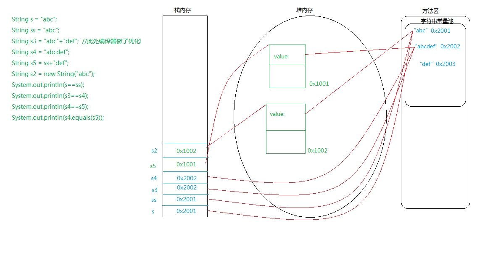
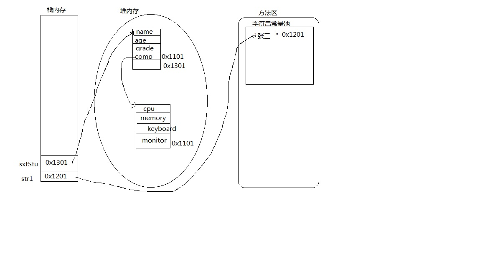

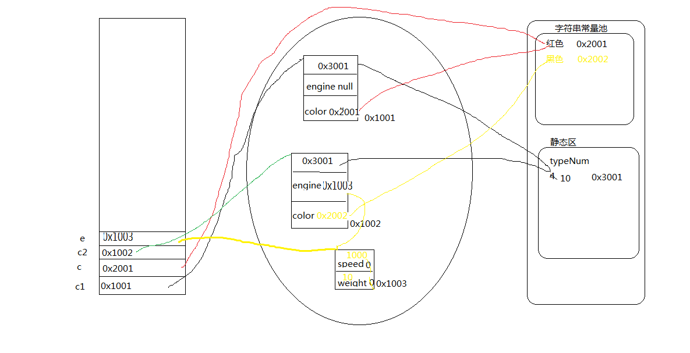

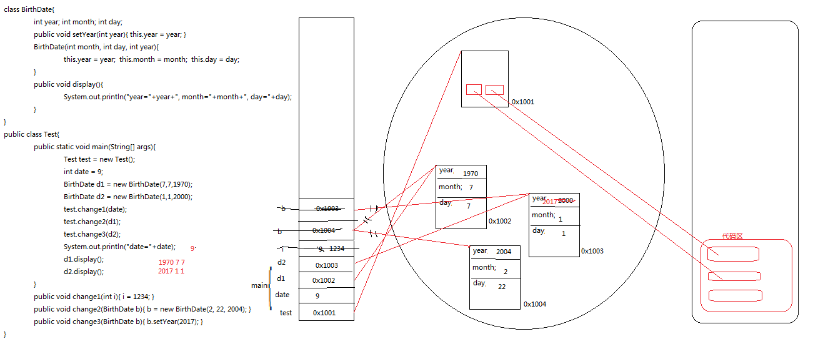
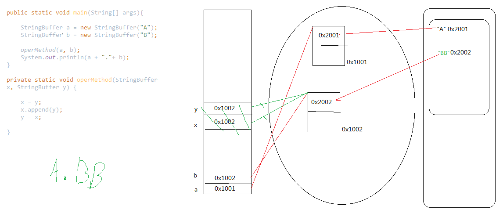

### 栈内存
先进后出的原则，同时只会存放引用以及局部变量 自动释放空间

### 堆内存
存放new出来的引用数据类型对象和成员属性，GC负责垃圾回收

### 方法区
常量池和静态区
存放类的信息(代码),static变量，字符串常量

Java中的对象和数组是通过引用对其操作的

## 类(对象)之间的关系
### 关联关系
最弱的一种关系

### 继承关系(一般和特殊)
{XX是一种XX}

### 聚合关系(整体和部分)
{XX是XX的一部分}
- 聚集
队长和队员组成球队
- 组合
身体属于人，密不可分

### 实现关系
父类和子类
接口和实现类

### 多态
有继承关系
有方法重写
父类引用指向子类对象

## 对象和引用

## 为啥用对象
代码可重用性
面向对象：
为了更容易达到Reusable，Extensibility，维护和替换更加方便

## 构造方法
一个在创建对象时被自动调用的特殊方法
作用
为对象进行初始化(成员变量)工作
特征
1*方法名称必须和类名称保持一致
2*构造函数虽然有返回值，但是不能定义返回值类型，也不允许出现return语句
3通过new关键字调用
4构造方法也可以重载，不同参数列表确定不同重载
5如果我们没有定义构造函数，JVM会自动定义一个无参构造方法
6如果定义了构造函数，则JVM不会再自动定义一个无参构造函数

## 有继承结构时，构造方法的调用顺序
有继承结构时：
子类对象的无参构造方法中，总是默认先调用父类的无参构造方法super()，构造出父类对象后，在构造出子类对象自己

## 重写中，子类的返回值类型可不可以跟父类不完全一致?说出你的理由。
可以。
理由：
只要是父类方法返回值类型的子类就可以；
但是，如果父类方法的返回值类型是int等基本数据类型，子类重写父类的方法，返回值类型要和int等基本数据类型保持一致

## 方法调用
特征
1方法内不能定义方法，但是能调用方法
2调用方法时，如果方法是静态的，那么被调用的方法也需要是静态的

参数传递
基本数据类型的参数传递， 无法通过方法调用改变变量的值
引用数据类型的参数传递， 可以通过方法调用改变变量的值

如果想改变变量的值，需要借助引用数据类型
1 把局部变量变为成员变量(在main方法当中定义的两个变量，变为成员变量)

## null关键字
Java中，null是一个关键字，用来标识一个不确定的对象。因此可以将null赋给引用类型变量，但不可以将null赋给基本类型变量

## this关键字
`一般出现在方法当中，当这个方法还没有调用的时候，this指的是谁并不知道`

`你在对哪个对象调用这个方法，this指的就是谁。`

this代表当前类对象的引用
作用
1 区分成员变量和局部变量重名问题
2 在方法中，this可以代替当前类对象来执行某些操作
3 构造器中，this表示调用同一个类中的另一个构造器，

使用
在普通方法中 ，方法中任意地方
在[构造方法]中， this()方法必须在第一行
this(实参列表)调用本类的带参构造方法

特征
1 this代表的是当前类对象的引用 
```
Student stu = new Student();

把所有的this换成stu
原因：1在类加载的时候，对象可能还没有创建
      2this在整个类当中都代表的是对象的引用，作用范围比stu的作用范围要大
```
2 在普通方法中，this可以调用其它的方法，而且this关键字可以省略，同时位置在某一个方法当中任意
3 在构造方法当中，this必须放在第一行
构造方法可以重载的
4 如果在构造方法当中，试用了this.school=school; 在没有形参school的情况下，对成员变量school是不能够赋值。
5 this/super不能够在静态方法当中使用
原因：this是代表当前类对象，static方法在类加载时就分配空间了，此时可能还没有创建类对象，所以this无效了


## static关键字
用法
修饰属性  变为 类变量/类属性(在类加载的过程中，会显示地初始化值)
修饰方法  变为 静态方法(在调用该静态方法时，不会将对象的引用传递给它，所以在static方法中不可访问非static的成员)

特征
1 在类加载的过程中，会显示的初始化值
2 对于静态方法，也是在类加载的时候，也会分配空间
3 如果定义了某些静态属性，它为该类的公用变量，它在第一次使用时被初始化，对于该类的所有对象来说，static成员变量只有一份
4 静态方法和静态变量，直接使用类名称调用即可。当然也可以使用对象的引用进行调用。
5 在静态方法当中，不允许调非静态的方法及非静态的变量，只能通过对象调用

### 经典试题
如下代码的输出结果是（  A   ）。（选择一项）
``` 
public class Test {
  public static void main(String[] args) {
    Father father=new Father();
    Father child=new Child();//父类引用指向子类对象
    System.out.print(father.getName());
    System.out.print(child.getName());
  }
}
class Father{
  public static String getName(){//静态方法不谈继承
    return "Father";
  }
}
class Child extends Father{
  //！！！这里不是重写
  public static String getName(){//静态方法不谈继承，相当于重新定义了一个新方法
    return "Child";
  }
}
```
A.FatherFather

## 静态初始化块
1 如果希望加载后，对整个类进行某些初始化操作，可以使用静态初始化块
2 类第一次被载入时，先执行static代码块；类多次载入时，static代码块只执行一次；
3 是在类初始化时执行，不是在创建对象的时候
4 静态初始化块中不能访问非static成员

## 扩展
在系统输出语句中，打印对象，都会默认的调用toString()方法


## Java中代码块执行优先级
### 无继承关系
静态属性
静态代码块
非静态属性
非静态代码块
无参构造方法
### 有继承关系
父类静态属性
静态代码块
子类静态属性
静态代码块
父类非静态属性
非静态代码块
父类无参构造方法
子类非静态属性
非静态代码块
子类无参构造方法

## 面向对象编程三大特征

## 如果要把一个类放到包里面
先写 package  编译出来的class文件必须位于正确的目录下面
如果 你想在另外一个类里面用我们这个包里面的类，必须把路径写全了
使用import 语句 引入包路径，然后可以 在程序中直接写 类名

## package import总结
JDK1.6之前，必须class文件的最上层包的父目录位于classpath下
在命令行模式下，class含有package路径，执行一个类需要写全包名

## package的两个作用
区别项目中同名的类
为了便于管理类--合适的类位于合适的包

## 封装
### 为什么要封装？
隐藏对象内部的复杂性，之对外公开简单的接口。便于外界调用，从而提高系统的可扩展性、可维护性
### 核心点
属性的处理
一般使用private(除非本属性确定会让子类继承)
提供 相应的get/set方法来访问相关属性，这些方法通常是public，从而提供对属性的读取操作。(boolean变量的get方法也可以以isXxx命名)
希望其他类调用的方法用public   

## Java bean规范
首先，一个java bean 其实就是一个普通的java 类， 但我们对这个类有些要求：
+ 这个类需要是public 的， 然后需要有个无参数的构造函数
+ 这个类的属性应该是private的，通过setXXX()和getXXX()来访问
+ 这个类需要能支持“事件”，例如addXXXXListener(XXXEvent e),  事件可以是Click事件，Keyboard事件等等， 当然咱们也支持自定义的事件。 
+ 我们得提供一个所谓的自省/反射机制， 这样能在运行时查看java bean 的各种信息“
+ 这个类应该是可以序列化的， 即可以把bean的状态保存的硬盘上， 以便以后来恢复。 

### Java代码不写getter/setter, 转化为public, 有什么弊端?
一个字段被认为是私有的, 那么外部就不能访问它( 最多提供getter )
如果一个私有的字段提供了getter和setter, 那么它就被认为是公开的, 那就前后矛盾了, 应该使用 public
目的是什么?

相关代码
```java
public class Bicycle {
        
    private int cadence;
    private int gear;
    // 比如speed被认为是公开的
    // 所以改成 public 的
    // 然后移除对应的 getter setter
    private int speed;
        
    public Bicycle(int startCadence, int startSpeed, int startGear) {
        gear = startGear;
        cadence = startCadence;
        speed = startSpeed;
    }
        
    public int getCadence() {
        return cadence;
    }
        
    public void setCadence(int newValue) {
        cadence = newValue;
    }
        
    public int getGear() {
        return gear;
    }
        
    public void setGear(int newValue) {
        gear = newValue;
    }
        
    public int getSpeed() {
        return speed;
    }
        
    public void applyBrake(int decrement) {
        speed -= decrement;
    }
        
    public void speedUp(int increment) {
        speed += increment;
    }
}
```
回答：
`每种语言的哲学不一样。Java 讲的是完全的面向对象，在编码时提倡代码高度的灵活性与可扩展性
在Java中你还是应该遵守规范为javabean定义get/set方法，因为你遵守规范才能享受规范给你带来的好处，比如你接入第三方库的时候，要是用reflect的方式来操作javabean时他们大多数都是采用get/set方法来实现的。如果你的javabean此时没有get/set方法那显然你是无法使用该库的。
`


## 对象成员的权限修饰符
public default protected private
        同一个类    同一个包中   子类  所有类
private     *           
default     *       *       
protected   *       *           *   
public      *       *           *       * 

## class的权限修饰符
只可以用public和default
public类可以在任意地方被访问
default类只可以被同一个包内部的类访问


### private
被private修饰的属性或方法，子类无法继承和访问
只能被本类自己访问(类可见性)
在其他类中即使通过对象引用.属性名"访问"私有属性也不允许，例如
Student类有一个private属性school
在Test类中无法通过stu.school访问
```
public class Test1 {

    public static void main(String[] args){
        Student stu = new Student();
        //stu.school = "西三旗小学";//这里编译器报错，private属性只能在本类中访问
        stu.setSchool("西三旗小学");//通过public方法setter访问并设置属性值
    }
}
```

### default
被本类自己访问
被同一个包的其他类访问(包可见性)

### protected
被本类自己访问
被同一个包的其他类访问
被子类(同一个包及不同包的子类)访问

### public
可以被项目中所有的类访问(项目可见性)

## 继承
目的：继承父类的属性和方法，提高代码的复用性
特征
1 *子类继承父类的属性和方法发现：子类*不能*直接继承父类私有的属性*。
方法：
使用super()，代表的是父类对象的引用，在父类中编写构造方法，在子类中应用。
2 构造方法能否继承？能否重写？
 构造方法不会也不能被继承和重写
3 子类调用父类的非私有方法可以直接调用，子类不能调用父类的私有方法

## 继承中的构造方法
1 子类的构造的过程中{必须}调用其基类的构造方法。
2 子类可以在自己的构造方法中使用super(argument_list)调用基类的构造方法。
  使用this(argument_list)调用本类的另外的构造方法
  如果调用super，必须写在子类构造方法的第一行
3 如果子类的构造方法中没有显示地调用基类构造方法，则系统默认调用基类无参数的构造方法。
4 如果子类的构造方法中既没有显示地调用基类构造方法，而基类中又没有无参构造方法，则编译报错


## [180731]私有的成员能被子类继承吗?
首先请看两个类的代码:
BaseClass:
```java
package com.sitinspring;

import java.util.Vector;

/**
 * 基类BaseClass,ChildClass类的父类
 * @author: sitinspring(junglesong@gmail.com)
 * @date: 2007-12-4
 */
public class BaseClass{
    // 私有动态数组成员,注意它是"private"的
    private Vector objects;
    
    /**
     * 在构造函数
     *
     */
    public BaseClass(){
        objects=new Vector();
    }
    
    /**
     * 公有函数,向动态数组成员objects添加字符串
     * @param str
     */
    @SuppressWarnings("unchecked")
    public void addStr2Obs(String str){
        objects.add(str);
    }
    
    /**
     * 公有函数,打印objects中的诸元素
     *
     */
    public void printAll(){
        for(int i=0;i<objects.size();i++){
            System.out.println("序号="+i+"\t元素="+objects.get(i));
        }
    }
}
```
ChildClass,BaseClass的派生类:
```java
package com.sitinspring;

/**
 * ChildClass,BaseClass的派生类
 * @author: sitinspring(junglesong@gmail.com)
 * @date: 2007-12-4
 */
public class ChildClass extends BaseClass{
    public void printObjects(){
        // 下面的句子是不能编译通过的
        /*for(int i=0;i<objects.size();i++){
            System.out.println("序号="+i+"\t元素="+objects.get(i));
        }*/
    }
    
    public static void main(String[] args){
        ChildClass childClass=new ChildClass();
        
        childClass.addStr2Obs("Hello");
        childClass.addStr2Obs("World");
        childClass.addStr2Obs("China");
        childClass.addStr2Obs("sitinspring");
        
        childClass.printAll();
    }
}
```
再让我们把断点停在main函数中的childClass.printAll()上,看看实例childClass中到底有什么.

`截图省略，可以DEBUG调试探究`
以上截图证明:objects确实是ChildClass类实例childClass的成员,而且四个字符串也都被加进去了.

最后执行出来,结果如下:
序号=0    元素=Hello
序号=1    元素=World
序号=2    元素=China
序号=3    元素=sitinspring

再翻看书籍,关于private限制的成员变量是这样写的:
private  只允许来自改类内部的方法访问.不允许任何来自该类外部的访问.

我们上面添字符串和遍历输出函数都是BaseClass的成员,所以它当然被这两个函数访问.而ChildClass的printObjects是BaseClass类外部的函数,结果当然是编译也不能通过.

实际上,private,public,protected和继承没有关系,他们对成员函数和变量的限制只是在成员的可见性上,
`public允许来自任何类的访问;`
`private只允许来自改类内部的方法访问,不允许任何来自该类外部的访问;`
`protected允许来自同一包中的任何类以及改类的任何地方的任何子类的方法访问.`

而关于成员变量的继承,`父类的任何成员变量都是会被子类继承下去的`,私有的objects就是明证,这些继承下来的私有成员虽对子类来说不可见,但子类仍然可以用父类的函数操作他们.

这样的设计有何意义呢?我们可以用这个方法将我们的成员保护得更好,让子类的设计者也只能通过父类指定的方法修改父类的私有成员,这样将能把类保护得更好,这对一个完整的继承体系是尤为可贵的. jdk源码就有这样的例子,java.util.Observable就是这样设计的.


## .java源文件增加package以后，我们在DOS下编译怎么做?
命令行
```
javac -d . TestStatic.java
```
编译之后，会自动生成一个包含多个目录的字节码文件
解释执行
```
$ java oop/static1/TestStatic
```
或者
```
java oop.static1.TestStatic
```


### 命令行编译运行Java程序时，加载指定目录中的Jar包

命令行编译运行Java程序时，加载指定目录中的Jar包：
添加`-Djava.ext.dirs`参数

解决方案：

编译：
`javac -Djava.ext.dirs=./lib Test.java  或  javac -Djava.ext.dirs=D:/javacode/lib`

运行：
`java -Djava.ext.dirs=./lib Test  `


### 打jar包
`jar -cvf [jar包的名字] [需要打包的文件]`

`jar -cvf Local_TCPTest.jar ./com ./t19`

#### MANIFEST.MF文件
```
Manifest-Version: 1.0
Created-By: 1.8.0_102 (Oracle Corporation)
Main-Class: t19.performance.TestTCPer 
Class-Path: ./lib/FaceId-1.0.jar ./lib/log4j-1.2.17.jar ./lib/mybatis-3.2.8.jar ./lib/mysql-connector-java-5.1.40.jar 

```
以下是需要注意的各个要点： 

0. 最后一样一定要回车，空一行，不然无法识别最后一行的配置。

1. Manifest-Version、Main-Class和Class-Path后面跟着一个英文的冒号，冒号后面必须跟着一个空格，然后才是版本号、类和ClassPath。 

2. Class-Path中的各项应使用空格分隔，不是逗号或分号。 

3. Class-Path中如果有很多项，写成一行打包的时候会报错line too long，这时需要把Class-Path分多行写。注意：从第二行开始，必须以两个空格开头，三个以上我没试过，不过不用空格开头和一个空格开头都是不行的，我已经试过了。 

4. Class-Path写完之后最后一定要有一个空行。 

5. jar包内有些配置文件想放在jar包外面，比如文件config.properties：如果这个文件是以路径方式载入的，比如new file("./config/config.properties")，那么将config.properties放在jar包相同目录下的config目录下即可，也就是说`./`路径等价于`jar包所在目录`；如果这个文件是以ClassPath下的文件这种方式载入的，比如在Spring中载入classpath:config.properties，则在MF文件的配置文件的ClassPath中添加“./”，然后将这个配置文件与jar包放在同一个目录即可，当然也可以在MF文件的配置文件的ClassPath中添加“./config/”，然后把配置文件都放在jar包相同目录下的config目录下。

#### 运行jar包
`java -jar UDPTest.jar 262 10`

## 方法重写override
到父类中copy要重写的方法签名到子类中，避免字母输入错误
只有非private方法才可以被覆盖

两同三不同
### 两同
方法名和参数列表
### 三不同 
在有继承关系的类中(在子类)
权限修饰符不同 子类(更宽松)>=父类
返回值类型和抛出异常类型不同 子类<=父类

通过继承关系，子类(Student)优先调用的是直接父类的方法，如果直接父类(Person)没有，则调用间接父类(Object)的方法

### 特殊
父类方法的返回值类型是int，子类重写父类的方法，返回值类型要和int保持一致
原因是：int，double，float等都是基本数据类型，不是类，更没有父类了

## Object类
Object类的equals方法默认比较的是引用类型对象的地址值
```
    public boolean equals(Object obj) {
        return (this == obj);
    }
```
>如果我们自定义的类要使用equals方法比较内容的话，必须要在自定义类中override重写从Object类继承下来的equals方法

## toString方法
1 Object 类当定义有public String toString()方法，其返回值是String类型，描述当前对象的有关信息
2 在进行String与其他类型数据的连接操作时(
如：`System.out.println("info"+person);`)将自动调用该对象的toString方法
3 可以根据需要在用户自定义类型中重写toString()方法

## 对象转型(casting)
1 一个父类引用类型变量可以“指向”其子类的对象
2 一个父类引用不能访问子类对象新增的成员(属性和方法)
3 可以使用 引用变量 instanceof 类名 来判断该引用型变量所“指向”的对象是否属于该类或该类的子类
4 子类对象作为父类对象使用称作向上类型转换(upcasting)，反之，称为向下转型(downcasting)

## super关键字
使用super来引用直接父类的成分
如果在子类中想使用父类中被覆盖的属性和方法，可以通过super来访问父类中被子类覆盖的属性和方法

## ==与equals之间的区别
### 相同点：
1 都可以进行判断比较返回值类型都是boolean,如果为真，返回true，反之返回false
### 不同点
1 ==属于关系运算符，equals()属于方法
2 ==既可以比较基本数据类型，也可以比较引用数据类型(class)，但是equals()只能比较引用数据类型
3 ==如果比较的是基本数据类型，则比较的是数值是否相同，如果是引用数据类型，比较的是地址是否相同；equals()如果子类没有重写Object类的equals()方法，则默认比较的是地址值是否相同，如果重写了，则可能比较的是内容是否相同


## 面向对象最核心的机制--(动态绑定)多态(迟绑定)
多态的存在要有(3个条件)
要存在继承关系；
要存在子类重写父类方法；
要存在父类引用指向子类对象；
        
## Java 多态的底层原理
`多态的底层实现是动态绑定，即在运行时才把方法调用与方法实现关联起来`

### 静态绑定和动态绑定
JVM的方法调用指令共有5个，
invokestatic 调用静态方法
invokespecial 调用实力构造器<init>方法，私有方法和父类方法
invokevirtual 调用虚方法
invokeinterface 调用接口方法，运行时确定具体实现
invokedynamic 运行时动态解析所引用的方法，然后再执行，用于支持动态类型语言

其中，invokestatic和invokespecial用于静态绑定，invokevirtual和invokevirtual和invokeinterface用于动态绑定。可以看出，动态绑定主要应用于虚方法和接口方法

静态绑定在编译期就已经确定，这是因为静态方法、构造器方法、私有方法和父类方法可以唯一确定。这些方法的符号引用在类加载的解析阶段就会解析成直接引用。因此这些方法也被称为非虚方法，与之相对的便是虚方法。

虚方法的方法调用与方法实现的关联（也就是分派）有两种，一种是在编译期确定，被称为静态分派，比如方法的重载；一种是在运行时确定，被称为动态分派，比如方法的覆盖。对象方法基本上都是虚方法。

这里需要特别说明的是，final 方法由于不能被覆盖，可以唯一确定，因此 Java 语言规范规定 final 方法属于非虚方法，但仍然使用 invokevirtual 指令调用。静态绑定、动态绑定的概念和虚方法、非虚方法的概念是两个不同的概念。

### 多态的实现
虚拟机栈中会存放当前方法调用的栈帧，在栈帧中，存储着局部变量表、操作栈、动态连接 、返回地址和其他附加信息。`多态的实现过程，就是方法调用动态分派的过程，通过栈帧的信息去找到被调用方法的具体实现，然后使用这个具体实现的直接引用完成方法调用。`

以 invokevirtual 指令为例，在执行时，大致可以分为以下几步：

先从操作栈中找到对象的实际类型 class；
找到 class 中与被调用方法签名相同的方法，如果有访问权限就返回这个方法的直接引用，如果没有访问权限就报错 java.lang.IllegalAccessError ；
如果第 2 步找不到相符的方法，就去搜索 class 的父类，按照继承关系自下而上依次执行第 2 步的操作；
如果第 3 步找不到相符的方法，就报错 java.lang.AbstractMethodError ；

`可以看到，如果子类覆盖了父类的方法，则在多态调用中，动态绑定过程会首先确定实际类型是子类，从而先搜索到子类中的方法。这个过程便是方法覆盖的本质。`

## 多态总结
在java当中，只有方法和对象的多态，属性没有多态
在使用到对象的多态时，必须要先有对象的向上类型转换，才能有向下类型转换
[动态绑定是指“在执行期间(而非编译期)判断所引用对象的实际类型，根据其实际的类型调用其相应的方法”]

多态的特征：父类类型 父类引用 = new 子类类型();
父类对象调用本类被重写的方法时，实际执行的是子类重写后的方法

## 多态的含义
 对象的多态
 Java语言中的多态指的是对象的多种形态及方法的多种形态

### 方法的多态
overload override

### 对象的多态  
- 向上转型  父类的引用指向了子类对象
  + 父类类型 父类引用 = new 子类类型();
  + Person per = new Student();

- 向下转型  子类引用指向了父类对象
  + 子类类型 子类引用 = (子类类型) 父类引用 --- 正确的
  + Student stu = (Student)per;
  + //错误写法 --- 子类类型 子类引用 = (子类类型) new 父类类型();
 
  总结：
      在Java当中，多态只适用于对象和方法，属性没有多态。属性是直接调用的。
      如果要发生对象的多态，必须先要有对象的向上转型，才可以有对象的向下转型；
      编译期间不能确定具体的子类，只能运行期才确定具体的子类类型
      多态的好处：灵活，机动
      如果子类重写了父类的某个方法，通过多态的特征(父类类型 父类引用 = new 子类类型();)
    父类对象调用本类被重写的方法时，执行的是子类中重写之后的那个方法

## 面向对象的设计思想
思维三步走：
1 对于一个问题，应该有哪些类，哪些对象？
2 这些类，这些对象，应该具有哪些属性和方法？
3 再考虑类和类之间具备了哪些关系？


## 代码块
在java中，使用{}括起来的代码被称为代码块
根据其位置和生命的不同，可以分为：
局部代码块
构造代码块
静态代码块


## final 关键字

### final变量 
 final的变量的值不能够被改变
`final变量经常和static关键字一起使用，作为常量`
 final long ID = 1234556667L;
 Math.PI  Math.E
```java
public static final String LOAN = "loan";
LOAN = new String("loan"); //invalid compilation error
```

### final方法
 父类的final方法不能被子类重写，但是可以在本类中重载
`final方法比非final方法要快，因为在编译的时候已经静态绑定了，不需要在运行时再动态绑定`
```java
class PersonalLoan{
    public final String getName(){
        return "personal loan";
    }
}
 
class CheapPersonalLoan extends PersonalLoan{
    @Override
    public final String getName(){
        return "cheap personal loan"; //compilation error: overridden method is final
    }
}
```

### final类
 被final修饰的类
`final类通常功能是完整的，它们不能被继承`
 Math，String等类不能派生子类，但是他们有父类
```java
final class PersonalLoan{

}
 
class CheapPersonalLoan extends PersonalLoan{  //compilation error: cannot inherit from final class
 
}
```

 被final修饰的对象引用，不能再指向新的对象(引用地址值不能改变)，但是对象的成员属性值可以改变，
 
 final修饰 变量，方法，类，对象，产生不同的读写限制

### final关键字的好处
final关键字提高了性能。JVM和Java应用都会缓存final变量。
final变量可以安全的在多线程环境下进行共享，而不需要额外的同步开销。
使用final关键字，JVM会对方法、变量及类进行优化。

### 不可变类
创建不可变类要使用final关键字。不可变类是指它的对象一旦被创建了就不能被更改了。String是不可变类的代表。不可变类有很多好处，譬如它们的对象是只读的，可以在多线程环境下安全的共享，不用额外的同步开销等等
 
面试题
    final 和 finally finallize 的异同点？

### [STAR]关于final的重要知识点
final关键字可以用于成员变量、本地变量、方法以及类。
final成员变量必须在声明的时候初始化或者在构造器中初始化，否则就会报编译错误。
你不能够对final变量再次赋值。
本地变量必须在声明时赋值。
在匿名类中所有变量都必须是final变量。
final方法不能被重写。
final类不能被继承。
final关键字不同于finally关键字，后者用于异常处理。
final关键字容易与finalize()方法搞混，后者是在Object类中定义的方法，是在垃圾回收之前被JVM调用的方法。
接口中声明的所有变量本身是final的。
final和abstract这两个关键字是反相关的，final类就不可能是abstract的。
final方法在编译阶段绑定，称为静态绑定(static binding)。
没有在声明时初始化final变量的称为空白final变量(blank final variable)，它们必须在构造器中初始化，或者调用this()初始化。不这么做的话，编译器会报错“final变量(变量名)需要进行初始化”。
将类、方法、变量声明为final能够提高性能，这样JVM就有机会进行估计，然后优化。
按照Java代码惯例，final变量就是常量，而且通常常量名要大写：
`private final int COUNT = 10;`
对于集合对象声明为final指的是引用不能被更改，但是你可以向其中增加，删除或者改变内容。譬如：
```java
private final List Loans = new ArrayList();
list.add(“home loan”);  //valid
list.add("personal loan"); //valid
loans = new Vector();  //not valid
```

## 抽象类

在了解抽象类之前，先来了解一下抽象方法。抽象方法是一种特殊的方法：它只有声明，而没有具体的实现。抽象方法的声明格式为：

```java
abstract void fun();
```
抽象方法必须用abstract关键字进行修饰。如果一个类含有抽象方法，则称这个类为抽象类，抽象类必须在类前用abstract关键字修饰。因为抽象类中含有无具体实现的方法，所以不能用抽象类创建对象。

　　下面要注意一个问题：在《Java编程思想》一书中，将抽象类定义为“包含抽象方法的类”，但是后面发现如果一个类不包含抽象方法，只是用abstract修饰的话也是抽象类。也就是说抽象类不一定必须含有抽象方法。个人觉得这个属于钻牛角尖的问题吧，因为如果一个抽象类不包含任何抽象方法，为何还要设计为抽象类？所以暂且记住这个概念吧，不必去深究为什么。

```java
[public] abstract class ClassName {
    abstract void fun();
}
```
从这里可以看出，抽象类就是为了继承而存在的，如果你定义了一个抽象类，却不去继承它，那么等于白白创建了这个抽象类，因为你不能用它来做任何事情。对于一个父类，如果它的某个方法在父类中实现出来没有任何意义，必须根据子类的实际需求来进行不同的实现，那么就可以将这个方法声明为abstract方法，此时这个类也就成为abstract类了。

包含抽象方法的类称为抽象类，但并不意味着抽象类中只能有抽象方法，它和普通类一样，同样可以拥有成员变量和普通的成员方法。注意，抽象类和普通类的主要有三点区别：

1）抽象方法必须为public或者protected（因为如果为private，则不能被子类继承，子类便无法实现该方法），缺省情况下默认为public。

2）抽象类不能用来创建对象；

3）如果一个类继承于一个抽象类，则子类必须实现父类的抽象方法。如果子类没有实现父类的抽象方法，则必须将子类也定义为为abstract类。

在其他方面，抽象类和普通的类并没有区别。

>它相当于一个模板，天生来作为父类

含有抽象方法的类必须被声明为抽象类，抽象类必须被继承，抽象方法必须被重写
抽象类不能被实例化

### 为什么需要抽象类? 如何定义抽象类?
1 是一种模版模式。抽象类为所有子类提供了一个通用模版，子类可以在这个模版基础上进行扩展。
2 通过抽象类，可以避免子类- 熟练掌握MySQL数据库及Navicat客户端工具，理解数据库体系结构，熟练运用SQL语句;的随意性

抽象类的抽象方法，不能使用private修饰，不能使用final修饰
抽象类可以属性，普通方法，抽象方法，构造方法，方法的重载，方法的重写
### 与普通类对比
1 普通类中不能定义抽象方法，而抽象类中既可以定义普通方法也可以定义抽象方法
2 抽象类不能够通过new关键字进行实例化对象，而普通类可以；如果抽象类想要创建对象，需要借助子类(对象向上转型)

抽象类(Animal)的子类(Mammal)，也可以是抽象类(可以不重写父类的抽象方法)
### 如何才能重写他们中的抽象方法呢？
如果创建了一个普通类(Rabbit)继承了Mammal，之后，不仅仅要重写直接父类的抽象方法，还需要重写间接父类的抽象方法

抽象类只能用来继承。

抽象方法必须被子类实现。

创建抽象类和抽象方法非常有用,因为他们可以使类的抽象性明确起来,并告诉用户和编译器打算怎样使用他们.抽象类还是有用的重构器,因为它们使我们可以很容易地将公共方法沿着继承层次结构向上移动

## 接口
>接口是抽象方法和常量值的定义的集合
从本质上讲，接口是一种特殊的抽象类，这种抽象类中只包含常量和方法的定义，而没有变量和方法的实现

可以更加规范的对子类进行约束。
全面地专业地实现了：规范和具体实现的分离
接口就是规范，定义的是一组规则，体现了现实世界中“如果你是...则必须能...”的思想。(如果你是汽车，则必须能跑)
接口的本质是契约 制定后就必须遵守

### 特征
接口中所有的方法都是抽象方法
[*接口中的方法__权限修饰符__默认也只能是`public`]
[*接口中声明的属性__权限修饰符__默认也只能是`public static final`]
一个类可以实现多个接口，

抽象类也可以implements 接口，但一般只使用普通类实现接口

extends 必须位于 implements 之前

## 接口和抽象类的异同点
### 相同点:
天生作为父类，都可以当作模板
都可以存在抽象方法，都可以定义规则
都不能使用new关键字实例化对象。
抽象方法都不能使用private修饰，也不能使用final修饰
### 不同点：
抽象类可以定义构造方法，接口没有
抽象类既可以定义普通方法，也可以定义抽象方法，但是接口只能定义抽象方法
抽象方法必须使用`abstract`修饰，接口可以省略
抽象类中既可以定义变量也可以定义常量，但是接口中只能定义成员静态常量
接口中的抽象方法都是public的，即是不写也是public，抽象类不是
接口可以多继承(一个类可以实现多个接口)，抽象类只能间接多层继承

## 垃圾回收机制
程序员可以通过调用System.gc()或者Runtime.getRuntime.gc()来通知系统进行垃圾回收，但是系统是否进行垃圾回收依然不确定。
永远不要主动调用某个对象的finalize()方法，应该交由垃圾回收机制调用。

## 内部类
`注意：在内部类构造的时候，会将外部类的引用传递进来，并且作为内部类的一个属性，所以内部类会持有一个其外部类的引用`

### 内部类特点
内部类作为外部类的成员，可以直接访问外部类的成员(包括private成员)，反之则不行
内部类作为外部类成员，可声明为private,默认,protected或public
内部类成员只有在内部类的范围之内是有效的。
用内部类定义在外部类中不可访问的属性。这样就在外部类中实现了比外部类的private还要小的访问权限。

### 编译规律
编译后生成两个类：OutClass.class和OuterClass$InnerClass.class

### 内部类分类
成员内部类
静态内部类
方法内部类
匿名内部类(只能实现一个接口)

### Java编译后产生class文件的命名规则
今天刚好有同学问了下Java编译后产生的.class文件名的问题，虽然一直都在使用Java做开发，但是之前对编译后产生的.class文件名的规范也基本没做了解过，也真的是忏愧啊！今天无论如何都要总结下。下面是本人今天做的实验
 
1、创建类ClassA，观察产生的.class文件。目的是测试没有任何继承、实现类以及内部类等情况下产生的.class文件以及命名规则
实验结果：
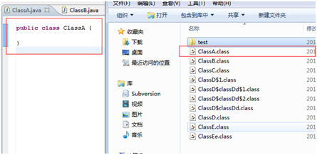
从下图可以看出，只产生了一个.class文件，文件名为类名.class
 
2、创建类ClassB，观察产生的.class文件。目的是测试有实现接口类情况下产生的.class文件以及命名规则
实验结果：
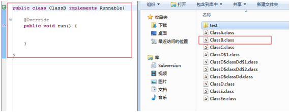
从下图可以看出，只产生了一个.class文件，文件名为类名.class
 
3、创建类ClassC，观察产生的.class文件。目的是测试有继承父类情况下产生的.class文件以及命名规则
实验结果：
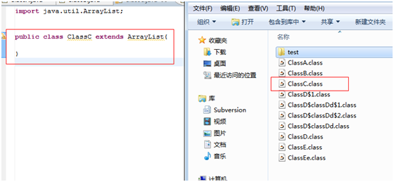
从下图可以看出，只产生了一个.class文件，文件名为类名.class
 
对以上3点做个小结：
从以上3个实验来看，编译后产生的.class文件跟它所实现的接口、继承的父类都没有关系，在这些情况下，它都只产生一个.class文件，而且文件名就是类名.class

4、创建类ClassD，定义了一个普通内部类ClassDd，观察产生的.class文件。目的是测试有内部类情况下产生的.class文件以及命名规则
实验结果：
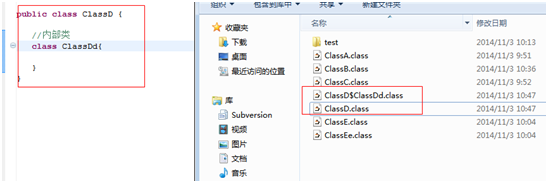
从下图可以看出，产生了2个.class文件，ClassD.class 和 ClassD$ClassDd.class。
这说明产生的.class文件与内部类有关系。外部类产生的文件跟上面的3个实验结果一样，都是类名.class，而内部类，则采用了外部类名$内部类名.class，外部类和内部类名使用符号$隔开
注意：这里的外部类都是相对而言
 
5、创建类ClassD，定义了一个普通内部类ClassDd，再在ClassDd定义它的内部类ClassDdd，观察产生的.class文件。
目的是测试有内部类情况下产生的.class文件以及命名规则
实验结果：
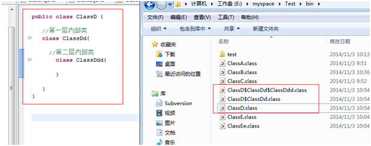
从下图可以看出，产生了3个.class文件，ClassD.class 、 ClassD$ClassDd.class、 ClassD$ClassDd.class$ClassDdd.class。
这个实验结果跟上面的第四个实验是一样的，只是这次的第2层内部类文件是在第1层内部类的基础上增加自己的类名。
注意：这里的外部类都是相对而言
 
对第4和第5个实验做下小结。
以上这两点都是验证有普通内部类情况下产生哪些.class文件以及命名规则如何。最后得出结论如下：
类个数：看定义类的个数，包括外部类和普通的内部类
.class文件名的命名规则：外部类名 + $ + 内部类名 + .class，即等于当层内部类以及每一层外部类的名字叠加，但是每个类之间使用符号$隔开
 
6、创建类ClassE，定义了一个匿名内部类，观察产生的.class文件。目的是测试有匿名内部类情况下产生的.class文件以及命名规则
实验结果：
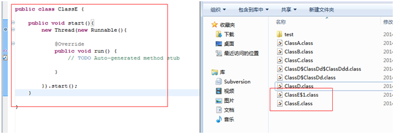
从下图可以看出，产生了2个.class文件，ClassE.class 和 ClassE$1.class。
其实这个实验结果跟第4个实验的结果相似，不同的是，内部类由于没有名字，因此采用数字来表示。这数字按照定义的匿名内部类的顺序来一次增加的。
 
7、创建类ClassF，并在同一个.java文件中定义另外一个类ClassFf，观察产生的.class文件。
目的是同一个.java文件定义的类所产生的.class文件情况
实验结果：
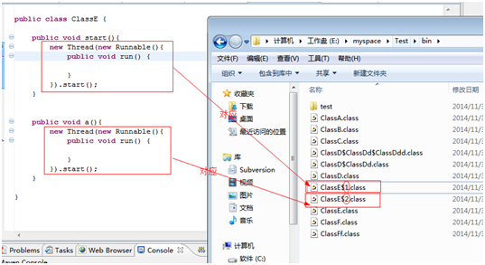
同一个.java文件定义的类所产生的.class文件情况，符合上面上面验证的规范。
 

最后总结：
- 编译后产生的.class文件个数：有多少个类，产生多少个.class文件
 
- .class文件命名规则：
  + 普通内部类
     外部类名 + $ + 内部类名 [+ $ + 内部类名 + ...]+ .class，类名之间使用符号$隔开
     例如：ClassD$ClassDd$ClassDdd.class，这里ClassDdd是对底层的普通内部类，它的父类ClassDd，而ClassDd的父类也是最外层的外部类ClassD
  + 匿名内部类
     外部类名 + $ + 数字 [+ $ + 数字 + ...]+ .class，类名之间使用符号$隔开，数字根据在外部类中定义的顺序决定
     例如：ClassE$1$1.class
 
- 同一个.java文件中定义的其他非public声明的类，都遵循以上2点规范
 
- 继承、或者接口实现，不影响编译产生的.class文件个数和命名规则


# 第6章 异常机制
>[15小大关]一个图 五个关键字 先逮小的再逮大的 异常和重写的关系

## 异常的分类
```
类Throwable  
    类Error(系统的内部错误，管不了)
    类Exception(可处理的错误)
      其他Exception(必须要显示地声明和捕捉catch，程序才能继续)
      类RuntimeException(经常出的一种错误，可以catch，也可以不catch)

```

## try-catch
注意：
1 出现异常后，Java会生成相应的异常对象，Java系统，寻找匹配的catch块，找到后将异常对象付给catch块异常参数
2 出现异常后，try块中尚未执行的语句不会执行
3 出现异常后并处理后，catch块后面的语句还会执行

### 异常的捕获和处理
*在一个try语句块中，基类异常的捕获语句不可以写在子类异常捕获语句的上面。*

```java
try{
  //该语句会抛出检查时Excetion，必须要显式声明和捕获异常
  in = new FileInputStream("myfile.md");
  int b = 0;
  b = in.read();
  while(b!=-1) {
    System.out.print((char)b);
    b = in.read();
  }
}catch(IOException e2) {
  System.out.println("IO异常");
}catch(FileNotFoundException e) {//会有编译错误，这个异常不会被捕获，因为基类异常的捕获语句在前面
  System.out.println("文件未找到");
}
```

## try-catch-finally
在try-catch块后加入finally块，可以确保无论是否发生异常，finall块中的代码总能被执行
通常可以在finally块中关闭程序块中已经打开的资源，比如：文件流，释放数据库连接等。
finally块中语句不执行的唯一情况
异常处理代码中执行System.exit(1)退出JVM虚拟机

## throws 和 throw异同点
同：
都是抛出异常，也是处理异常的方式
异；
throws用在方法声明上，throw用在方法内或语句内
throws后面可以1个或多个异常类，throw后面只能一个异常对象
throws后跟的是具体的异常类，throw后面跟的是异常对象

## Checked异常和Runtime异常的区别
Checked异常
比如：去玩漂流，不穿救生衣，安全员不让登船
Runtime异常
比如：早上没吃饭去玩漂流，安全员不管你是否吃饭允许登船，但有可能在船上饿晕了

受查异常（Checked exception）
编译器要求必须处置的异常

非受查异常（unchecked exception）
编译器`不要求强制处置`的异常
--java.lang.RuntimeException类及它的子类都是非受查异常

*注意：根据java语言规范，如果一个catch子句试图捕获一个Checke异常，那么它对应的try子句必须可能抛出该Checked异常或者其子类异常*

## 自定义异常
可以通过继承java.lang.Exception类声明自己自定义的异常类
在方法适当的位置生成自定义异常的实例，并用throw语句抛出
在方法的生命不分用throws语句声明该方法可能抛出的异常

## 方法重写的抛出异常
重写方法需要与原方法所抛出异常类型一致异常或不抛出异常
例如：
```
class A {
  public void method() throws IOException {...}
}
//错误
class B1 extends A {
  public void method() throws FileNotFoundException {...}
}
//错误
class B2 extends A {
  public void method() throws Exception {...}
}
//正确
class B3 extends A {
  public void method() {...}
}
//错误
class B4 extends A {
  public void method() throws IOException, MyException {...}
}
```

### 方法重写后父类方法在堆内存开辟的空间还有吗？
`你要知道重写是用来做什么的，是用于多态，多态是运行时，解释一下，就是不管你是父类的引用还是子类的引用去调用重写名字的方法，java都是调用你new的那个类的同名字的方法的(通常为了多态是使用父类应用，建立子类实例)。那么回答你的问题，所谓空间是有的，但是你在外部访问不到了，因为多态就是做这个的，但是你在内部可以访问到用super关键字`


## 经典试题
定义了如下类和测试方法，请问测试时期待要捕获下面哪个选项的异常（  C   ）。（选择一项）

```java
class MyException  extends Exception{
  MyException(){
    
  }
}
class A{
  public int format(String str) throws MyException{
    int i=Integer.valueOf(str); //会抛异常 public static Integer valueOf(String s) throws NumberFormatException
    return i;
  }
}
public class Test{
  public static void main(String[] args) {
    new A().format("1");
  }
}
```
C.MyException NumberFormatException

下面选项中有关Java异常处理模型的说法错误的是（  AD  ）。（选择二项）
    
  A 一个try块只能有一条catch语句//错误
  B.一个try块中可以不使用catch语句//√
  C.catch块不能单独使用，必须始终与try块在一起//√
  D.finally块可以单独使用，不是必须与try块在一起//错误，必须和try一起
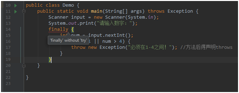
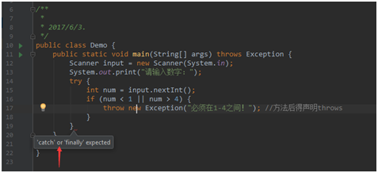
 
下面选项中属于运行时异常的是（  BC  ）。（选择二项）

  B.NullPointerException和InputMismatchException
  C.ArithmeticException和ArrayIndexOutOfBoundsException
  D.ClassNotFoundException和ClassCastException


阅读如下Java代码，在控制台输入"-1",执行结果是（B）。（选择一项）
```java
public class Demo {
  public static void main(String[] args) {
    Scanner input = new Scanner(System.in);
    System.out.print("请输入数字：");
    try {
      int num = input.nextInt();
      if (num < 1 || num > 4) {
        throw new Exception("必须在1-4之间！"); //这里抛出还是会被catch到，只是显式地抛出罢了
      }
    } catch (InputMismatchException e) {
      System.out.println("InputMismatchException");//如果这里再次throw则必须在方法后声明throws
    } catch (Exception e) {
      System.out.println(e.getMessage());
    }
  }
}
```
  B.输出：必须在1-4之间！
  D.编译错误


# 第7章 常用类

8种基本数据类型是primary type,
`byte, short, char, int, long, float, double, boolean`
不是class(引用数据类型)


## 集合
### 特征
集合只能存放对象(引用数据类型)，不能存放基本类型；
集合一般都是以接口形式存在的

## 类String
### 面试题
`String s = new String("xyz")` 创建了几个String对象?
2个，一个在常量池中，一个在堆内存中

String是一个字符序列不可变的字符串
定义：
`public final class String extends Object implements Serializable, Comparable<String>, CharSequence`

构造方法 无参构造方法和有参构造方法
重点：
1 public String(String s);
2 把byte[]数组对象传进来--把二进制的代码转换成字符串
public String(byte[] b);
在String类中，会存在toByte();

返回指定索引处的char值。charAt(int index)
注意：不能超过字符串长度-1，否则会出现StringIndexOutOfBoundsException异常
字符串连接 concat(String s)
注意：默认的是链接到字符串的末尾，如果使用此方法，需要再重新赋值给一个新的变量。


### Java String.format 方法使用介绍
在 Java 的 String 类中，可以使用 format() 方法格式化字符串，该方法有两种重载形式： 
`String.format(String format, Object... args)` 和 
`String.format(Locale locale, String format, Object... args)`。
两者的唯一区别是前者使用本地语言环境，后者使用指定语言环境

1.对整数进行格式化：
`%[index$][标识][最小宽度]`转换方式
格式化字符串由4部分组成，其中`%[index$]`的含义为第几个格式化字符，[最小宽度]的含义也很好理解，就是最终该整数转化的字符串最少包含多少位数字。我们来看看剩下2个部分的含义吧：

标识：
`-`    在最小宽度内左对齐，不可以与“用0填充”同时使用
`#`    只适用于8进制和16进制，8进制时在结果前面增加一个0，16进制时在结果前面增加0x
`+`    结果总是包括一个符号（一般情况下只适用于10进制，若对象为BigInteger才可以用于8进制和16进制）
` `    正值前加空格，负值前加负号（一般情况下只适用于10进制，若对象为BigInteger才可以用于8进制和16进制）
`0`    结果将用零来填充
`,`    只适用于10进制，每3位数字之间用“，”分隔
`(`    若参数是负数，则结果中不添加负号而是用圆括号把数字括起来（同‘+’具有同样的限制）

转换方式：
d-十进制   o-八进制   x或X-十六进制

具体的例子，需要特别注意的一点是：大部分标识字符可以同时使用。

System.out.println(String.format("%1$,09d",-3123));
System.out.println(String.format("%1$9d",-31));

//结果为：

//-0003,123
//-31


## 经典问题
问题1： String s = "a" + "b" + "c" + "d" + "e"; 
问此语句共创建了几个对象， 

答案是 
就创建了一个 
`String s = "a" + "b" + "c" + "d" + "e"; `
赋值符号右边的"a"、"b"、"c"、"d"、"e"都是常量 
对于常量，编译时就直接存储它们的字面值而不是它们的引用 
在编译时就直接讲它们连接的结果提取出来变成了"abcde" 
该语句在class文件中就相当于`String s = "abcde" `
然后当JVM执行到这一句的时候， 就在String pool里找 
如果没有这个字符串，就会产生一个 

## StringBuffer

###StringBuffer与String的区别
相同：
都使用final修饰，都不能被其他类继承
都可以代表字符串
不同：
String字符串与StringBuffer字符串类型不一样
StringBuffer追加append();String字符串追加+或concat()方法，都会赋值给一个新的变量
String是不可变的字符序列，StringBuffer是可变的字符序列
String可以直接赋值字符串，StringBuffer暂时不可以直接赋值字符串

## Date类

### java.util.Date
有无参构造方法Date();
表示特定的瞬间，精确到毫秒ms
是java.sql.Date的父类

### java.sql.Date
没有无参构造方法
是一种适用在数据库中的时间类
使用JDBC后，会需要将sql.Date--->util.Date

### util.Date和sql.Date之间的互转
```
package timer;

import java.text.DateFormat;
import java.text.ParseException;
import java.text.SimpleDateFormat;
import java.util.Date;

/**
 * sql.Date测试类
 * 2017/5/11.
 */
public class SqlDateTest {

    public static void main(String[] args){

        Date now = new java.sql.Date(1494456789000L);

        /*java.sql.Date d = new java.sql.Date(now.getTime()); //用到了父类引用调用getTime()获取毫秒数*/
        //向下转型
        java.sql.Date d = null;
        if(now instanceof java.sql.Date){
            System.out.println("是一个java.sql.Date实例");
            d = (java.sql.Date) now;
        }


        System.out.println("util.Date--->"+now);
        System.out.println("util.Date.getTime()--->"+now.getTime());
        System.out.println("sql.Date--->"+d);

        //日期格式化抽象类
        DateFormat df = new SimpleDateFormat("yyyy-MM-dd HH:mm:ss");

        try {
            now = df.parse("1992-03-30 08:00:00");
        } catch (ParseException e) {
            e.printStackTrace();
        }
        System.out.println("格式化后--->"+df.format(now));
    }
}

```

### 日期格式化
DateFormat类是时间格式化子类的{抽象类}，它以与语言无关的方式格式化并解析日期时间
构造方法
`public DateFormat()`
`public DateFormat(String pattern)`

`public Date parse(String source) throws ParseException`
从给定字符串的开始解析文本，生成一个日期对象并返回
该方法可能抛出ParseException，因此要放入try{}catch(){}块中
得到日期对象后，使用DateFormat对象的format(Date date)方法返回一个String日期字符串

DateFormat类的使用
1 创建DateFormat对象，根据构造方法，传入指定的日期格式。注意：月份必须大写 MM
2 此类有一个方法--parse(String str); 返回的是一个Date类对象
3 parse()方法抛出异常，需要进行处理---捕捉处理
4 DateFormat对象调用format()方法返回的是String--此字符串就是你想格式化之后的字符串

## 垃圾回收
类System中
`public static void gc()`
运行垃圾回收器。
调用gc方法暗示着Java虚拟机做了一些努力来回收未用对象，以便能够快速地重用这些对象当前占用的内存。当控制权从方法调用中返回时，虚拟机已经尽最大努力从所有丢弃的对象中回收了空间。
调用System.gc()实际上等效于调用：
Runtime.getRuntime().gc();

# 第8章 容器

>[1136]一张图 一个类 三个知识点 六个接口

### [1136]一张图 


### 一个类(工具)
类`java.util.Collections`
方法：
```
void sort(List);//排序
void shuffle(List);//对List容器内的对象进行随机排列
void reverse(List);//对List容器内的对象进行逆序排列
void fill(List, Object);//用一个特定的对象重写整个List
void copy(List dest, List src);
int binarySearch(List, Object);
```

### 三个知识点
equals()和hashCode()
接口Comparable<T> 接口java.util.Iterator<E>
泛型

### 六个接口
Collection<E> List<E> Set<E> java.util.Iterator<E>
Map<K, V> Comparable<T>

### 函数是应当返回null还是长度为0的数组（或集合）？ 

有两个约定我觉得应当遵守： 

1.返回零长度的数组或集合而不是null（详见《Effective Java》） 
2.永远不要区分null引用和empty值

### 函数输入参数不当时，是异常还是返回null？ 


##接口Collection<E>
`存储单个值的容器`
方法：
```
int size();
boolean isEmpty();
void clear();
boolean contains(Object element);
boolean add(Object element);
boolean remove(Object element);
Iterator iterator();
boolean containsAll(Collection c);
boolean addAll(Collection c);//双集操作取并集
boolean removeAll(Collection c);//双集操作取差集
boolean retainAll(Collection c);//双集操作取交集
Object[] toArray();
```

###接口List<E> 
有序并且元素可重复的Collection集合

`List容器中的元素都对应一个整数型的序号记载其在容器中的位置，可以根据序号存取容器中的元素`

支持元素索引访问，插入，修改
>List集合元素的遍历方式
[首选]使用接口Iterator<E>遍历元素
ListIterator迭代器
for
for-each

方法：
```
Object get( int index);
Object set(int index, Object element);
void add();
Object remove(int index);
int indexOf(Object o);
int lastIndexOf(Object o);
```

实现类：
ArrayList
采用顺序表存储方式
优点：遍历和随机访问元素效率较高
缺点：删除和添加元素需大量移动元素，效率低下，按内容查找效率低
LinkedList
采用链表存储方式
优点：插入，删除元素效率非常高
缺点：根据元素值查找元素效率低下

###接口Set<E>
无序并且元素不可重复的collection集合

不支持元素索引访问，插入，修改
>Set集合元素的遍历方式
[首选]使用接口Iterator<E>遍历元素
for-each
无法使用for 循环遍历(因为无序，没有get(i))

实现类：
HashSet
采用哈希表+链表存储结构
重复的元素不再插入set
LinkedHashSet
采用哈希表存储结构，同时使用链表维护次序
元素遍历时保持插入顺序
TreeSet
采用二叉树存储结构

#### 什么是重复？
两个对象之间，如果互相地equals，就算重复了

#### 使用HashSet存储自定义对象，为什么需要重写hashCode()和equals()？
重写对象类的hashCode()和equals()方法为了保证HashSet集合中元素的唯一性。

###equals()和hashCode()
`两个对象互相equals，即内容相同，它们两个的hashCode()应该相等`
`重写equals(),必须重写hashCode()方法`
`hashCode()什么时候有用？这个对象当作索引的时候，当作键的时候`

## equals返回true,hashcode一定相等吗?
不一定。
如果是同一个对象，equals返回true，hashcode也相等
当同时重写了自定义类的equals() hashCode()方法后，则equals返回true，hashCode一定相等。


####TreeSet中排序依据
实现接口Comparable
创建实现接口Comparator的类

### 接口Comparable<T>
>所有可以“排序”的类都实现了java.lang.Comparable接口

接口中方法只有一个
``` 
public int comparaTo(Object obj)
返回0 表示 this==obj
返回1 表示 this >obj
返回-1表示 this <obj
```

实现了接口Comparable的类通过实现comparaTo方法从而确定该类对象的排序方式。

### 冒泡排序
如果数组共有n个元素
1 至少进行n-1趟排序
//外层循环比较轮次
2 (第i趟排序，每一次把前n+1-i个元素的最大值找到交换到前n+1-i个元素的最右位置)
//内层循环比较相邻元素并交换
3 相邻的两个数两两比较，如果左>右，交换
4 冒泡排序最坏情况的时间复杂度是O(n^2)

模版
```
//创建数组
int[] arr = {23,97,53,100,37,65,37};

//外层循环比较轮次
// (第i趟排序，每一次把前n+1-i个元素的最大值找到交换到前n+1-i个元素的最右位置)
for(int i=arr.length-1; i>0; i--){
    //内层循环比较相邻元素并交换
    for(int j=0; j<i; j++){
        //左>右 交换
        if(arr[j]>arr[j+1]){
            int tmp = arr[j+1];
            arr[j+1] = arr[j];
            arr[j] = tmp;
        }
    }
    System.out.println("第"+(arr.length-i)+"次排序"+ Arrays.toString(arr));
}
```


##接口Map<K, V>
`存储键值对的容器`
Map集合的定义
 以<键-值>对的形式存储数据的集合
 public interface Map<K, V>

Key唯一无序 
Value不唯一无序
>Map集合元素的遍历方式：
for-each配合EntrySet进行遍历

### 类HashMap<K, V>

 常用的子类
 HashMap 哈希表结构存储数据
 LinkedHashMap
 TreeMap

 对于同一个key，两次put进value，后者覆盖第一次的value

 应用场景3
 电子商城 -- 输入编号 -- 显示具体商品(value)

注意，此实现不是同步的。如果多个线程同时访问一个哈希映射，而其中至少一个线程从结构上修改了该映射，则它必须保持外部同步。

## 请说明HashMap和Hashtable的区别。（5分）
相同点：
都实现了Map接口，都是Java Collection Framework的成员，底层都使用了哈希表实现，保证元素唯一性，无序的，都存放Entry类型键值对
不同点：
Hastable继承自java.util.Dictionary类，HashMap继承自AbstractMap类
hashtable是同步的，HashMap值，hahsMa是非同步的
HashTable不允许nullp允许Null作为一个条目的key和value


## 接口Iterator<E>
要求实现了它的子类必须提供hasNext()和next()两个方法，它的子类以内部类的形式存在具体的集合类中，根据具体集合类的特性实现自己的hasNext()和next()方法

## 思考关于--集合类实现Iterator接口的启示
每个类有自己独一无二的Iterator实现类，并作为自己的内部类存在，可以自由的访问自己的内部属性，并且是根据所在的外部类的具体实现底层来实现自己的hasNext()和next()方法，用起来灵活方便，本身可以返回具体实现
Iterator子类的方法做为了Collection接口的一部分，这就要求了每个集合类型，不仅可以根据他自己的底层来实现集合的功能，也可以根据他自己的底层来实现遍历的功能

## 泛型
就是变量类型的参数化
泛型可以一定程度上消除向下类型转换

### 使用泛型有什么好处?
可以增强程序的可读性和安全性
可以规定放入集合中元素的类型，提前发现可能的错误，避免运行时出错

### 泛型的内部原理
Java语言中的泛型则不一样，它只在程序源码中存在，在编译后的字节码文件中，就已经被替换为原来的原始类型（Raw Type，也称为裸类型）了，并且在相应的地方插入了强制转型代码，因此对于运行期的Java语言来说，ArrayList<int>与ArrayList<String>就是同一个类。所以说泛型技术实际上是Java语言的一颗语法糖，Java语言中的泛型实现方法称为`类型擦除`，基于这种方法实现的泛型被称为伪泛型。（类型擦除在后面在学习）
使用泛型机制编写的程序代码要比那些杂乱的使用Object变量，然后再进行强制类型转换的代码具有更好的安全性和可读性。泛型对于集合类来说尤其有用。
泛型程序设计（Generic Programming）意味着编写的代码可以被很多不同类型的对象所重用。

### Java泛型的实现方法：类型擦除
>前面已经说了，Java的泛型是伪泛型。为什么说Java的泛型是伪泛型呢？因为，在编译期间，所有的泛型信息都会被擦除掉。

正确理解泛型概念的首要前提是理解类型擦除（type erasure）。
Java中的泛型基本上都是在编译器这个层次来实现的。在生成的Java字节码中是不包含泛型中的类型信息的。使用泛型的时候加上的类型参数，会在编译器在编译的时候去掉。这个过程就称为类型擦除。


# Java中的IO(传统IO和NIO)

[传统IO是阻塞式IO，主要是系统资源的浪费。] [比如我们为了读取一个TCP连接的数据，调用InputStream的read()方法，这会使当前线程被挂起，直到有数据到达才把线程唤醒，在数据到达前的这段时间，占用着内存资源(存储线程栈)却无所作为，为了读取其他连接的数据，我们不得不启动另外的线程。然而当连接数量达到一定规模，内存资源会被大量线程消耗殆尽。另一方面，线程切换需要更改处理器的状态，比如程序计数器、寄存器的值，因此频繁的在大量线程之间切换，同样是一种资源浪费]

现代操作系统提供了新的IO机制，可以避免这种资源浪费。基于此，大拿生了Java NIO，NIO的代表性特征就是非阻塞IO。紧接着我们发现，简单的使用非阻塞IO并不能解决问题，因为在非阻塞模式下，read()方法在没有读到数据时就会立即返回，不知道数据何时到达的我们，只能不停的调用read()方法重试，这显然太浪费CPU资源了，从下文可以知道，Selector组件正是为了解决这一问题。

## Java的NIO

### Channel

Java NIO中的所有IO操作都基于Channel对象，就像流操作都要基于Stream一样，必须先了解Channel是什么。摘自JDK1.8文档
> A channel represents an open connection to an entity such as a hardware device, a file, a network socket, or a program component that is capable of performing one or more distinct I/O operations, for example reading or writing.

从上述内容可知，一个channel代表和某一实体的连接，这个实体可以是文件，网络套接字等。就是说，通道是Java NIO提供的一座桥梁，用于我们的程序和操作系统底层IO服务进行交互。

通道时一种很基本很抽象的描述，和不同的IO服务交互，执行不同的IO操作，实现不一样，因此具体的有FileChannle、SocketChannel等。

通道使用起来跟Stream比较像，可以读取数据到Buffer中，也可以把Buffer中的数据写入通道。
当然也有区别，主要两点：
一个通道，既可以读也可以写，而一个Stream是单向的(所以分InputStream和OutputStream)
通道有非阻塞IO模式

### Buffer

NIO中所使用的缓冲区不是一个简单的byte数组，而是封装过的Buffer类，通过它提供的API，我们可以灵活的操纵数据，下面细细道来。

与Java基本类型相对应，NIO提供了多种 Buffer 类型，如ByteBuffer、CharBuffer、IntBuffer等，区别就是读写缓冲区时的单位不一样(以对应类型的变量为单位进行读写)

Buffer中有3个很重要的变量，它们是理解Buffer工作机制的关键，分别是
capacity(总容量)
position(指针当前位置)
limit(读/写边界位置)

在对Buffer进行读/写操作前，我们可以调用Buffer类提供的一些辅助方法来正确设置 position 和 limit 的值，主要有如下几个
flip(): 设置 limit 为 position 的值，然后 position 置为0。对Buffer进行读取操作前调用。
rewind();仅仅将 position 置0。一般是在重新读取Buffer数据前调用，比如要读取同一个Buffer的数据写入多个通道时会用到。
clear(): 回到初始状态，即 limit 等于 capacity，position 置0。重新对Buffer进行写入操作前调用。
compact(): 将未读取完的数据（position 与 limit 之间的数据）移动到缓冲区开头，并将 position 设置为这段数据末尾的下一个位置。其实就等价于重新向缓冲区中写入了这么一段数据。

源代码实例，使用 FileChannel 读写文本文件(篇幅有限省去):
这个例子中使用了两个Buffer，其中 byteBuffer 作为通道读写的数据缓冲区，charBuffer 用于存储解码后的字符。clear() 和 flip() 的用法正如上文所述，需要注意的是最后那个 compact() 方法，即使 charBuffer 的大小完全足以容纳 byteBuffer 解码后的数据，那个compact()方法也必不可少。这是因为常用中文字符的UTF-8编码占3个字节，因此有很大概率出现在中间截断的情况，请看下图：
.jpg)


当 Decoder 读取到缓冲区末尾的 0xe4 时，无法将其映射到一个 Unicode，decode()方法第三个参数 false 的作用就是让 Decoder 把无法映射的字节及其后面的数据都视作附加数据，因此 decode() 方法会在此处停止，并且 position 会回退到 0xe4 的位置。如此一来， 缓冲区中就遗留了“中”字编码的第一个字节，必须将其 compact 到前面，以正确的和后序数据拼接起来。

BTW，例子中的 CharsetDecoder 也是 Java NIO 的一个新特性，所以大家应该发现了一点哈，NIO的操作是面向缓冲区的（传统I/O是面向流的）。


## Java传统流式输入/输出原理
>在java传统IO中，对于数据的输入输出操作以“流”(Stream)方式进行
JDK提供了各种各样的“流”类，用以获取不同种类的数据；程序中通过标准的方法输入或输出数据。

>输入流：向程序输入数据；

(抽象流类型)字节输入流InputStream 
(抽象流类型)字符输入流Reader

>输出流：从程序向外输出数据；

(抽象流类型)字节输出流OutputStream 
(抽象流类型)字符输出流Writer

按处理数据单位的不同可以分为字节流和字符流
按照功能不同可以分为节点流和处理流

## 字节流
InputStream
继承自InputStream的流都是用于向程序中输入数据，且数据的单位为字节(8bit);
OutPutStream
继承自OutputStream的流都是用于向外输出数据，且数据的单位为字节(8bit);

## nextLine() && next()
首先，nextLine()的输入是碰到回车就终止输入，而next()方法是碰到空格，回车，Tab键都会被视为终止符。
所以next()不会得到带空格的字符串，而nextLine()可以得到带空格的字符串。
如果在next()方法后紧跟nextLine()方法，nextLine()方法会吃掉next()的回车符，造成第二个字符串接受了回车符

## 字符流
Reader
继承自Reader的流都是向程序输入数据，且数据单位是字符(16bit);
Writer
继承自Writer的流都是用于向外输出数据，且数据单位是字符(16bit);

## 节点流
"管道"可以直接接入数据源(文件，memory  Array, Memory String, Pipe管道)
```
              字符流          字节流
---------------------------------------------------
文件          FileReader       FileInputStream
              FileWriter       FileOutputStream
Memory Array  CharArrayReader  ByteArrayInputStream
              CharArrayWriter  ByteArrayOutputStream
Memory String String Reader 
              String Writer
Pipe管道      PipedReader      PipedInputStream
              PipedWriter      PipedOutputStream
```

### FileInputStream

源码发现native关键字
```
public int read() throws IOException {
    return read0();
}

private native int read0() throws IOException;
```
为什么有个native呢？这是我所要学习的地方。所以下面想要总结下native。

#### 认识 native 即 JNI,Java Native Interface
凡是一种语言，都希望是纯。比如解决某一个方案都喜欢就单单这个语言来写即可。Java平台有个用户和本地C代码进行互操作的API，称为Java Native Interface (Java本地接口)。

`Java code --> |JNI| --> C/C++ code`

### JNA

#### java使用JNA(Java Native Access)调用dll的方法
JNA(Java Native Access)：建立在JNI之上的Java开源框架，SUN主导开发，用来调用C，C++代码，尤其是底层库文件(windows中叫dll文件，Linux中叫so[shared object]文件)
JNI是Java调用原生函数的唯一机制，JNA就是建立在JNI之上，JNA简化了Java调用原生函数的过程。
JNA提供了一个动态的C语言编写的转发器(实际上也是一个动态链接库，在Linuxi386中文件名是：libjnidispatch.so)可以自动实现Jva与C之间数据类型的映射。从性能上会比JNI技术调用动态链接库要低
开发人员只要在一个Java接口中描述目标native library的函数和结构，JNA将自动实现Java接口到native function的映射

#### JNA特性
1 dll和so是C函数的集合和容器，这与Java中的接口概念吻合，所以JNA把dll文件和so文件看成一个个接口。在JNA中定义一个接口就是相当于了定义一个DLL/SO文件的描述文件，该接口代表了动态链接库中发布的所有函数。而且，对于程序不需要的函数，可以不在接口中声明。

2 JNA定义的接口一般继承com.sun.jna.Library接口，如果dll文件中的函数是以stdcall方式输出函数，那么，该接口就应该继承com.sun.jna.win32.StdCallLibrary接口。

3 Jna难点：编程语言之间的数据类型不一致。

##处理流
这根管道包了另外一根管道

类型
buffering
filtering
converting between byte and character

### 缓冲流
BufferedReader BufferedWriter
带小桶，带缓冲区的
缓冲流要“套接”在相应的节点流之上，对读写的数据提供了缓冲的功能，提高了读写的效率，同时增加了一些新的方法

### 转换流
InputStreamReader OutputStreamWriter
```
字节流 InputStreamReader--> 字符流的桥梁
------------------------------------------------------
          字节流的桥梁 <--OutputStreamWriter 字符流

(FileReader extends InputStreamReader)
(FileWriter extends OutputStreamWriter)
```

### 从文件流读中文字符并显示在cmd窗口(GBK编码)
一句话
`文本文件使用UTF-8编码，从字节流 use转换流(指定charset=UTF-8，将字节按UTF-8转换)--> 字符流, 控制台打印出正确汉字`

## BOM是什么
Unicode的学名是"Universal Multiple-Octet Coded Character Set"，简称为UCS。UCS可以看作是"Unicode Character Set"的缩写。在UCS 编码中有一个叫做 "Zero Width No-Break Space"，中文译名作“零宽无间断间隔”的字符，它的编码是 FEFF。而 FFFE 在 UCS 中是不存在的字符，所以不应该出现在实际传输中。UCS 规范建议我们在传输字节流前，先传输字符 "Zero Width No-Break Space"。这样如果接收者收到 FEFF，就表明这个字节流是 Big-Endian 的；如果收到FFFE，就表明这个字节流是 Little- Endian 的。因此字符 "Zero Width No-Break Space" （“零宽无间断间隔”）又被称作 BOM(即Byte Order Mark)。

### Little endian和Big endian
上一节已经提到，Unicode码可以采用UCS-2格式直接存储。以汉字"严"为例，Unicode码是4E25，需要用两个字节存储，一个字节 是4E，另一个字节是25。存储的时候，4E在前，25在后，就是Big endian方式；25在前，4E在后，就是Little endian方式。

这两个古怪的名称来自英国作家斯威夫特的《格列佛游记》。在该书中，小人国里爆发了内战，战争起因是人们争论，吃鸡蛋时究竟是从大头(Big- Endian)敲开还是从小头(Little-Endian)敲开。为了这件事情，前后爆发了六次战争，一个皇帝送了命，另一个皇帝丢了王位。

因此，第一个字节在前，就是"大头方式"（Big endian），第二个字节在前就是"小头方式"（Little endian）。

那么很自然的，就会出现一个问题：计算机怎么知道某一个文件到底采用哪一种方式编码？

Unicode规范中定义，每一个文件的最前面分别加入一个表示编码顺序的字符，这个字符的名字叫做"零宽度非换行空格"（ZERO WIDTH NO-BREAK SPACE），用FEFF表示。这正好是两个字节，而且FF比FE大1。

如果一个文本文件的头两个字节是FE FF，就表示该文件采用大头方式；如果头两个字节是FF FE，就表示该文件采用小头方式。

## 数据流
DataInputStream和DataOutputstream继承自Inputstream和OutputStream，它属于处理流，需要分别“套接”在InputStream和OutputStream类型的节点流上
提供了可以存取与机器无关的Java原始类型数据(int, double等)的方法
特别说明： 读和写的顺序必须一致
构造方法：DataInputStream(InputStream in)
          DataOutputStream(OutputStream out)

## 打印流
只有输出流，没有输入流
-------------------------
PrintWriter   PrintStream


# 第10章 多线程

## 线程的基本概念
>线程是一个程序里面不同的执行路径

线程的同步是重点，难点

## 创建线程
1 继承Thread类，重写run方法
2 [推荐]实现Runnable接口，重写run方法
3 [有返回值的]实现Callable接口，重写call方法
```java
public interface Callable<V> {
    V call() throws Exception;
}


```

### Runnable和Callable的区别
相同点：
两者都是接口；（废话）
两者都可用来编写多线程程序；
两者都需要调用Thread.start()启动线程；

不同点：
两者最大的不同点是：实现Callable接口的任务线程能返回执行结果；而实现Runnable接口的任务线程不能返回结果；
Callable接口的call()方法允许抛出异常；而Runnable接口的run()方法的异常只能在内部消化，不能继续上抛；

注意点：
Callable接口支持返回执行结果，此时需要调用FutureTask.get()方法实现，此方法会阻塞主线程直到获取‘将来’结果；当不调用此方法时，主线程不会阻塞！

Callable工作的Demo：
```java
package com.callable.runnable;

import java.util.concurrent.Callable;
import java.util.concurrent.ExecutionException;
import java.util.concurrent.FutureTask;

/**
 * Created on 2016/5/18.
 */
public class CallableImpl implements Callable<String> {

    public CallableImpl(String acceptStr) {
        this.acceptStr = acceptStr;
    }

    private String acceptStr;

    @Override
    public String call() throws Exception {
        // 任务阻塞 1 秒
        Thread.sleep(1000);
        return this.acceptStr + " append some chars and return it!";
    }


    public static void main(String[] args) throws ExecutionException, InterruptedException {
        Callable<String> callable = new CallableImpl("my callable test!");
        FutureTask<String> task = new FutureTask<>(callable);
        long beginTime = System.currentTimeMillis();
        // 创建线程
        new Thread(task).start();
        // 调用get()阻塞主线程，反之，线程不会阻塞
        String result = task.get();
        long endTime = System.currentTimeMillis();
        System.out.println("hello : " + result);
        System.out.println("cast : " + (endTime - beginTime) / 1000 + " second!");
    }
}

//测试结果
//hello : my callable test! append some chars and return it!
//cast : 1 second!

//Process finished with exit code 0
```

## 线程状态转换

```
                          阻塞状态
                         /          \
                    阻塞解除     导致阻塞的事件
                       /               \
创建 -> start() -> 就绪状态 <-调度-> 运行状态 -> 终止
```

## 线程的生命周期
新生状态
就绪状态
运行状态
阻塞状态
死亡状态


## 线程启动start()
线程启动使用Thread对象的start()方法，start()方法再去调用run()方法，run()方法一结束，线程就结束
注意，不能直接调用run()方法。
run()方法一结束，线程就结束

## 说说：sleep、yield、join方法的区别
sleep()
使线程停止执行一段时间，将处于阻塞状态；
如果调用了sleep()方法之后，没有其他等待执行的线程，这个时候当前线程不会马上恢复执行
yield()
让当前正在执行线程暂停，*不是阻塞线程*，而是将线程转入`就绪状态`
如果调用了yield()之后，没有其他等待执行的线程，这个时候`当前线程立即恢复执行`
join()
`阻塞`指定线程等到该线程完成以后再继续执行


### 合并某个线程join()
线程main在执行过程中，线程B调用了start()后，线程main分成了两部分，
线程B优先执行完毕之后，线程main再次从该调用点向后继续执行
注意：
先启动线程start()，再 调用join()方法

### 线程休眠sleep()
public static void sleep(long millis) throws InterruptedException
在指定的毫秒数内让当前正在执行的线程休眠（暂停执行）。该线程不丢失任何监视器的所属权。
使线程停止执行一段时间，将处于-->阻塞状态
sleep是静态方法

### 线程礼让yield()
让出CPU，给其它线程执行的机会
线程礼让，并不能保证A，B线程完全交替执行

## 线程同步

使用同步锁
3种同步锁

## 对象监视器锁、轻量级锁、偏向锁详解

阅读本文，你可以了解到：

1、对象监视器锁(重量级锁)、轻量级锁、偏向锁的含义

2、它们之间的区别

3、每一种锁的使用场景什么。

我们跟着一下几个问题一步一步深入了解：

什么是对象监视器锁 为什么它叫重量级锁

我们知道在java中实现同步的一种机制 是利用synchronized关键字来修饰同步代码块,它的本质就是对象进行加锁在达到同步的目的我们称这种锁为对象监视器锁。

那么为什么使用这个关键字来修饰代码块，就能让线程达到互斥同步的目的呢？

根据java虚拟机规范，被synchronized关键字修饰的代码块在被编译成字节码的时候 会在该代码块开始和结束的时候插入monitorenter 和 moniterexist指令,虚拟机在执行这两个指令的时候会检查对象的锁状态是否为空或当前线程是否已经拥有该对象锁 如果是 则将对象锁的计数器加1 直接进入同步代码执行。如果不是当前线程就要阻塞等待 等到锁释放 。

那么为什么说这种操作很重呢？

java的线程是映射到操作系统原生线程之上的，如果要阻塞或唤醒一个线程就需要操作系统的帮忙，这就要从用户态转换到核心态，因此状态转换需要花费很多的处理器时间，对于代码简单的同步块（如被synchronized修饰的get 或set方法）状态转换消耗的时间有可能比用户代码执行的时间还要长，所以说synchronized是java语言中一个重量级的操纵。所以jvm的研究人员在1.6的时候花费了大量的时间来优化重量级锁，于是在1.6中出现了轻量级锁，偏向锁，锁消除，适应性自旋锁，锁粗化(自旋锁在1.4就有 只不过默认的是关闭的，jdk1.6是默认开启的)，这些操作都是为了在线程之间更高效的共享数据 ，解决竞争问题。


# 第11章 网络编程

## TCP协议(Transmission Control Protocol,传输层控制协议)
一种面向连接的，可靠地，基于字节流的运输层(Transport Layer)通信协议

### 特点
面向连接
点到点的通信
高可靠性
占用资源较多，效率低

###生活案例
打电话
HTTP FTP Telnet SMTP

## UDP协议(User Datagram Protocol,用户数据报协议)
一种无连接的传输层协议，提供面向事务的简单的不可靠信息传送服务

### 特点
非面向连接，传输不可靠，可能丢失
发送不管对方是否准备好，接收方收到也不确认
可以广播发送
非常简单的协议，开销小

### 生活案例:
发送短信，发电报
DNS 

## IP地址
用来标识网络中的一个通信实体的地址。通信实体可以是计算机，路由器等。

### IP地址分类
IPV4
IPV6

### 特殊的IP地址
127.0.0.1 本机地址
192.168.0.0--192.168.255.255私有地址，属于非注册地址，专门为组织机构内部使用

## 端口port
IP地址用来标识一台计算机，但是一台计算机可能提供多种应用程序，使用端口来区别这些应用程序
端口是一个虚拟的概念，通过端口，可以在一个主机上运行多个网络应用程序
端口范围0-65535 16位二进制码

### IP和端口的关系
IP地址好比每个人的地址(门牌号)，端口好比是房间号，必须同时提供IP和端口号，才能唯一确认目标应用程序，才能正确发送数据

### 端口分类
0--1023公认端口 比如80端口分配给浏览器，21端口分配给FTP
1024--49151注册端口 分配给用户进程或应用程序
49152--65535动态/私有端口

端口号又分为TCP端口号，UDP端口号

##类 InetAddress
public class InetAddress extends Object implements Serializable
封装计算机的IP地址，但是没有端口

###特点
没有构造方法，
使用getLocalHost()方法返回自身类的一个实例

此类只能获取IP相关的信息，无法获取端口相关的信息，
String getHostName()获取次IP地址的主机名
String getHostAddress()获取IP地址字符串
byte[] getAddress()获取原始的IP地址
InetAddress getByName(String host)根据host获取IP地址类对象

## 套接字
类SocketAddress
public abstract class SocketAddress extends Object implements Serializable
此类表示不带任何协议附件的SocketAddress。作为一个抽象类，应通过特定的、协议相关的实现为其创建子类。

##类 InetSocketAddress
public class InetSocketAddress extends SocketAddress
此类实现IP套接字地址(IP地址+端口号)。他还可以是一个对(主机号+端口号)，在此情况下，将尝试解析主机名。如果解析失败，则该地址将被视为*未解析*地址，但是其在某些情形下仍然可以使用，比如通过代理连接。


###特点
有构造方法，但是都有参数
InetSocketAddress(int port)其中IP地址为通配符地址(0.0.0.0)，端口号为指定值
InetSocketAddress(String host, int port)根据主机名和端口号创建套接字地址
InetSocketAddress(InetAddress addr, int port)根据IP地址和端口号创建套接字地址

final InetAddress getAddress()获取InetAddress
final String getHostName()获取hostname
final int getPort()获取端口号

##类 URL
public final class URL extends Object implements Serializable

类URL代表一个统一资源定位符，它是只想互联网“资源”的指针。资源可以是简单的文件或目录，也可以是简单的文件或目录，也可以是更为负责的对象的引用

### 常用方法
String getHost()获取此URL的主机名(如果适用)
String getProtocol()获取此URL的协议名称
int getPort()获取此URL的端口号
String getPath()获取此URL的路径部分
String getQuery()获取此URL的查询部分
String getRef()获取此URL的锚点(也称为“引用”)

InputStream openStream()打开到此URL的连接并返回一个用于从该连接读入的InputStream


### 常见异常

`java.net.SocketException：Connection reset`
该异常在客户端和服务器端均有可能发生，引起该异常的原因有两个，第一个就是如果一端的Socket被关闭（或主动关闭或者因为异常退出而引起的关闭），另一端仍发送数据，发送的第一个数据包引发该异常(Connect reset by peer)。另一个是一端退出，但退出时并未关闭该连接，另一端如果在从连接中读数据则抛出该异常（Connection reset）。简单的说就是在连接断开后的读和写操作引起的。


###使用URL+IO流完成对网页的拷贝
目标页: www.bjsxt.com/index.html

选用：IO流(BufferedReader+PrintWriter)+URL(openStream)
```
构思：
使用URL定位网页文件
创建输入和输出流
InputStream in = url.openStream()

PrintStream ps = new PrintStream(String fileName, String charset)

读与写的操作

关闭流
```

## 类 ServerSocket
此类实现服务器套接字。
`服务器套接字等待请求通过网络传入。`
它基于该请求执行某些操作，然后可能向请求者返回结果。

### 常用方法
ServerSocket(int port) 创建绑定到特定端口的服务器套接字。

## 对Socket的思考
对于UDP，基本上没有Server，Client的区分
对于TCP编程，可靠的长链接，才区分Server和Client
Server先读输入，再写输出
Client先写输出，在读输入

## 类 InvalidClassException
public class InvalidClassException extends   ObjectStreamException
当 Serialization 运行时检测到某个类具有以下问题之一时，抛出此异常。 

该类的序列版本号与从流中读取的类描述符的版本号不匹配 
该类包含未知数据类型 
该类没有可访问的无参数构造方法 

## C/S聊天程序思路
```
Client
创建Socket对象，用于连接Server
Client需要确定Server的IP和port
连接建立后，可以进行数据传输，使用IO流
IO流中传输信息，
使用完毕后，关闭流关闭Socket

Server
创建ServerSocket对象，监听指定端口，使用accpet()阻塞方法，傻傻的等待
连接到达后SS产生Socket对象，和Client构成链接
IO流中传输信息，
使用完毕后，关闭流，一般不要关ServerSocket
```

## UDP编程

不需要利用IO流实现数据的传输
每个数据发送单元被统一封装成数据报 的方式，发送方将数据报发送到网络上，数据包在网络中去寻找他的目的地

类 DatagramSocket 用于发送或接收数据报包
public class DatagramSocket extends Object
此类表示用来发送和接收数据报包的套接字。 

数据报套接字是包投递服务的发送或接收点


类 DategramPacket 数据报包
public final class DatagramPacket extends Object
此类表示数据报包。


构造方法摘要 
DatagramPacket(byte[] buf, int length) 
构造 DatagramPacket，用来接收长度为 length 的数据包。

public void send(DatagramPacket p) throws IOException
从此套接字发送数据报包。DatagramPacket 包含的信息指示：将要发送的数据、其长度、远程主机的 IP 地址和远程主机的端口号。

public void receive(DatagramPacket p) throws IOException
从此套接字接收数据报包。当此方法返回时，DatagramPacket 的缓冲区填充了接收的数据。数据报包也包含发送方的 IP 地址和发送方机器上的端口号 

## 简述基于UDP的Socket编程的主要步骤
服务器端：(Server)
构造DatagramSocket实例
创建数据报包DatagramPacket，存取发送和接受的数据，IP和端口
调用DatagramSocket对象的receive()方法，接受客户端发送的数据
调用DatagramSocket对象的send()方法，向客户端发送响应数据
关闭DatagramSocket对象
客户端:(Client)
构造DatagramSocket实例
创建数据报包DatagramPacket，存取发送和接受的数据，IP和端口
调用DatagramSocket对象的send()方法，向服务器端发送请求数据
调用DatagramSocket对象的receive()方法，接受服务器端发送的数据
关闭DatagramSocket对象

## 请说出TCP和UDP的联系和区别?
TCP是一种面向连接的，可靠地，基于字节流的传输层通信协议
特点：
有连接的，点到点的通信，占用资源多效率低

UDP是一种无连接的，提供面向事务的简单非可靠的消息传输服务的传输层通信协议。
特点：
无连接的，传输不可靠可能丢失，发送时不管对方是否准备好对方接受后也不确认，可以广播发送，占用资源少

# XML

## 认识XML

## 验证XML
DTD(Document Tyte Definition文档类型定义)
内部DTD，外部DTD
被验证的文档可根据某种DTD语法规则验证格式是否如何此规则

CDATA(Character Data) 字符数据
CDATA是不通过解析器进行解析的文本

PCDATA(Parsed Character  Data)
PCDATA 指的是被解析(已解析)的字符数据


## 解析XML
四种技术：
DOM解析
SAX解析
JDOM
*DOM4J(手写实践)

### DOM解析
DOM解析的缺点：繁琐
1.getChildNodes()得到的Node，没有区分Element，Attribute，Text，需要程序员来区分
 并且空白也会当做Text节点

### DOM4J解析
与W3C DOM解析比较，更加优秀
可以直接获取根元素getRootElement()
获取属性attributes() 返回List
获取子元素elements() 返回List

# 反射机制

## Java加载类两种方式

### 静态加载

源文件.java文件编译成.class字节码文件的过程叫静态加载

### 动态加载
reflect反射
关键点 Class对象
`Class.forName();`

## 什么是反射
>在编译时不确定哪个类被加载，而在程序运行时才加载，探知，使用

### 反射的应用场合
在编译时根本无法知道该对象或类可能属于哪些类，程序只依靠运行时信息来发现该对象和类的真实信息

## Java二进制(class)文件的格式
JAVA的CLASS文件通常是树型结构。根节点包含以下元素：
- ConstantPool：符号表；
- FieldInfo：类中的成员变量信息；
- MethodInfo：类中的方法描述；
- Attribute：可选的附加节点

## 类Class
public final class Class<T> extends Object implements Serializable, GenericDeclaration, Type, AnnotatedElement

Field getField(String name) 
          返回一个 Field 对象，它反映此 Class 对象所表示的类或接口的指定公共成员字段。 
Field[] getFields() 
          返回一个包含某些 Field 对象的数组，这些对象反映此 Class 对象所表示的类或接口的所有可访问公共字段。 

Method getMethod(String name, Class<?>... parameterTypes) 
          返回一个 Method 对象，它反映此 Class 对象所表示的类或接口的指定公共成员方法。 
Method[] getMethods() 
          返回一个包含某些 Method 对象的数组，这些对象反映此 Class 对象所表示的类或接口（包括那些由该类或接口声明的以及从超类和超接口继承的那些的类或接口）的公共 member 方法。 


Class 没有公共构造方法。

类Class-->反射的源头

### 创建Class实例的三种方法
Class.forName(String pathName)
pathName具体包名称+类名称
对象名称.getClass()
类名称.class

## 类Field
public final class Field extends AccessibleObject implements Member

Field提供关于接口或类的单个字段的信息。

## 类Constructor
public final class Constructor<T> extends AccessibleObject implements GenericDeclaration, Member

提供关于类的单个构造方法的信息以及对它的访问权限。 

## 类Method
public final class Method extends AccessibleObject implements GenericDeclaration, Member

## 类Properties
public class Properties extends Hashtable<Object,Object>
Properties 类表示了一个持久的属性集。

## 反射的优点
反射提高了Java程序的灵活性和扩展性，降低耦合性，提高自适应能力。它允许程序创建和控制任何类的对象，无需提前硬编码目标类
Java反射技术应用领域很广，如软件测试，EJB，JavaBean等
许多流行的开源框架例如Struts，Hibernate，Spring在实现过程中都采用了该技术

## 反射的缺点
性能问题
使用反射基本上是一种解释操作，用于字段和方法接入时要远慢于直接代码。因此Java反射机制主要应用在对灵活性和扩展性要求很高的系统框架上，普通程序不建议使用。
使用反射会模糊程序内部逻辑
程序人员希望在源代码中看到程序的逻辑，反射等绕过了源代码的技术，因而会带来维护问题。反射代码比相应的直接代码更复杂。

## 考试

  填空 15(5)
  选择 22(3)
  判断 16(.5*4)
  简答 20(5) 分点
  编码 15(5)

线程  集合  IO流


ClassNotFoundException检查时异常
ClassCastException运行时异常

## 序列化与反序列化
```
字节序列 反序列化-->Java对象
------------------------------------
字节序列<--序列化 Java对象
```

## JAVA 中正则表达式

java.util.regex 是一个用正则表达式所订制的模式来对字符串进行匹配工作的类库包。

它包括两个类： Pattern和 Matcher

Pattern 一个 Pattern 是一个正则表达式经编译后的表现模式。
Matcher 一个 Matcher 对象是一个状态机器，它依据 Pattern 对象做为匹配模式对字符串展开匹配检查。

首先一个 Pattern 实例订制了一个所用语法与 PERL 的类似的正则表达式经编译后的模式，然后一个 Matcher 实例在这个给定的 Pattern 实例的模式控制下进行字符串的匹配工作。

### Pattern 类 
Pattern 的方法如下：
static Pattern  compile(String regex) 将给定的正则表达式编译并赋予给Pattern类

static Pattern  compile(String regex, int flags)  同上，但增加 flag 参数的指定，可选的 flag 参数包括：CASE INSENSITIVE,MULTILINE,DOTALL,UNICODE CASE， CANON EQ

Matcher         matcher(CharSequence input) 生成一个给定命名的Matcher对象

static boolean  matches(String regex, CharSequence input) 编译给定的正则表达式并且对输入的字串以该正则表达式为模开展匹配，该方法适合于该正则表达式只会使用一次的情况，也就是只进行一次匹配工作，因为这种情况下并不需要生成一个Matcher实例。

String          pattern() 返回该Pattern对象所编译的正则表达式。

String[]        split(CharSequence input)  将目标字符串按照 Pattern 里所包含的正则表达式为模进行分割。

### Matcher 类
Matcher 方法如下：
boolean         matches() 尝试对整个目标字符展开匹配检测，也就是只有整个目标字符串完全匹配时才返回真值。


## 线程池
注意区别`数据库连接池`

### 线程池的技术背景
在面向对象编程中，创建和销毁对象是很费时间的，因为创建一个对象要获取内存资源或者其它更多资源。在Java中更是如此，虚拟机将试图跟踪每一个对象，以便能够在对象销毁后进行垃圾回收。所以提高服务程序效率的一个手段就是尽可能减少创建和销毁对象的次数，特别是一些很耗资源的对象创建和销毁。如何利用已有对象来服务就是一个需要解决的关键问题，其实这就是一些"池化资源"技术产生的原因。比如大家所熟悉的数据库连接池正是遵循这一思想而产生的，本文将介绍的线程池技术同样符合这一思想

### 线程池技术如何提高服务器程序的性能
我所提到服务器程序是指能够接受客户请求并能处理请求的程序，而不只是指那些接受网络客户请求的网络服务器程序。
多线程技术主要解决处理器单元内多个线程执行的问题，它可以显著减少处理器单元的闲置时间，增加处理器单元的吞吐能力。但如果对多线程应用不当，会增加对单个任务的处理时间。可以举一个简单的例子：
假设在一台服务器完成一项任务的时间为T
T1 创建线程的时间
 T2 在线程中执行任务的时间，包括线程间同步所需时间
 T3 线程销毁的时间
显然T ＝ T1＋T2＋T3。注意这是一个极度简化的假设。
可以看出T1,T3是多线程本身的带来的开销，我们渴望减少T1,T3所用的时间，从而减少T的时间。但一些线程的使用者并没有注意到这一点，所以在程序中频繁的创建或销毁线程，这导致T1和T3在T中占有相当比例。显然这是突出了线程的弱点（T1，T3），而不是优点（并发性）。

线程池技术正是关注如何缩短或调整T1,T3时间的技术，从而提高服务器程序性能的。它把T1，T3分别安排在服务器程序的启动和结束的时间段或者一些空闲的时间段，这样在服务器程序处理客户请求时，不会有T1，T3的开销了。
线程池不仅调整T1,T3产生的时间段，而且它还显著减少了创建线程的数目。在看一个例子：
假设一个服务器一天要处理50000个请求，并且每个请求需要一个单独的线程完成。我们比较利用线程池技术和不利于线程池技术的服务器处理这些请求时所产生的线程总数。在线程池中，线程数一般是固定的，所以产生线程总数不会超过线程池中线程的数目或者上限（以下简称线程池尺寸），而如果服务器不利用线程池来处理这些请求则线程总数为50000。一般线程池尺寸是远小于50000。所以利用线程池的服务器程序不会为了创建50000而在处理请求时浪费时间，从而提高效率。

###　线程池的简单实现及对比测试
一般一个简单线程池至少包含下列组成部分。
`线程池管理器（ThreadPoolManager）`:用于创建并管理线程池
`工作线程（WorkThread）`: 线程池中线程
`任务接口（Task）`:每个任务必须实现的接口，以供工作线程调度任务的执行。
`任务队列`:用于存放没有处理的任务。提供一种缓冲机制。


### mod函数
mod函数是一个求余函数,其格式为: mod(nExp1,nExp2),即是两个数值表达式作除法运算后的余数


## volatile关键字
volatile 只能保证 “可见性”，不能保证 “原子性”。

count++; 这条语句由3条指令组成：
    （1）将 count 的值从内存加载到 cpu 的某个寄存器r
    （2）将 寄存器r 的值 +1，结果存放在 寄存器s
    （3）将 寄存器s 中的值写回内存

所以，如果有多个线程同时在执行 count++;，在某个线程执行完第（3）步之前，其它线程是看不到它的执行结果的。

在没有 volatile 的时候，执行完 count++;，执行结果其实是写到CPU缓存中，没有马上写回到内存中，后续在某些情况下（比如CPU缓存不够用）再将CPU缓存中的值flush到内存。正因为没有马上写到内存，所以不能保证其它线程可以及时见到执行的结果。
在有 volatile 的时候，执行完 count++;，执行结果写到CPU缓存中，并且同时写回到内存，因为已经写回内存了，所以可以保证其它线程马上看到执行的结果。
但是，volatile 并没有保证原子性，在某个线程执行（1）（2）（3）的时候，volatile 并没有锁定 count 的值，也就是并不能阻塞其他线程也执行（1）（2）（3）。可能有两个线程同时执行（1），所以（2）计算出来一样的结果，然后（3）存回的也是同一个值。

补充几篇资料：
（1）java 内存模型：Java Memory Model
（2）java volatile 关键字：Java Volatile Keyword
（3）使用 volatile 的一些pattern：Java theory and practice: Managing volatility

### Volatile原理
　　Java语言提供了一种稍弱的同步机制，即volatile变量，用来确保将变量的更新操作通知到其他线程。当把变量声明为volatile类型后，编译器与运行时都会注意到这个变量是共享的，因此不会将该变量上的操作与其他内存操作一起重排序。volatile变量不会被缓存在寄存器或者对其他处理器不可见的地方，因此在读取volatile类型的变量时总会返回最新写入的值。

`在访问volatile变量时不会执行加锁操作，因此也就不会使执行线程阻塞，因此volatile变量是一种比sychronized关键字更轻量级的同步机制。`


　　当对非 volatile 变量进行读写的时候，每个线程先从内存拷贝变量到CPU缓存中。如果计算机有多个CPU，每个线程可能在不同的CPU上被处理，这意味着每个线程可以拷贝到不同的 CPU cache 中。

　　而声明变量是 volatile 的，JVM 保证了每次读变量都从内存中读，跳过 CPU cache 这一步。

#### 当一个变量定义为 volatile 之后，将具备两种特性：

　　1.保证此变量对所有的线程的可见性，这里的“可见性”，如本文开头所述，当一个线程修改了这个变量的值，volatile 保证了新值能立即同步到主内存，以及每次使用前立即从主内存刷新。但普通变量做不到这点，普通变量的值在线程间传递均需要通过主内存（详见：Java内存模型）来完成。

　　2.禁止指令重排序优化。有volatile修饰的变量，赋值后多执行了一个“load addl $0x0, (%esp)”操作，这个操作相当于一个内存屏障（指令重排序时不能把后面的指令重排序到内存屏障之前的位置），只有一个CPU访问内存时，并不需要内存屏障；（什么是指令重排序：是指CPU采用了允许将多条指令不按程序规定的顺序分开发送给各相应电路单元处理）。


## Java注解

@SuppressWarnings("rawtypes")
作用：用于抑制编译器产生警告信息。
rawtypes是说传参时也要传递带泛型的参数


### Java中注解如何工作

什么是注解？

用一个词就可以描述注解，那就是元数据，即一种描述数据的数据。所以，可以说注解就是源代码的元数据。

为什么要引入注解？

一个很重要的因素是Annotation定义了一种标准的描述元数据的方式

### 元注解

J2SE5.0版本在 java.lang.annotation提供了四种元注解，专门注解其他的注解：

@Documented –注解是否将包含在JavaDoc中

@Retention –什么时候使用该注解

@Target? –注解用于什么地方

@Inherited – 是否允许子类继承该注解

即：
@Documented–一个简单的Annotations标记注解，表示是否将注解信息添加在java文档中。

@Retention– 定义该注解的生命周期。

RetentionPolicy.SOURCE
在编译阶段丢弃。这些注解在编译结束之后就不再有任何意义，所以它们不会写入字节码。
@Override, @SuppressWarnings偶属于这类注解

RetentionPolicy.CLASS
在类加载的时候丢弃。在字节码文件的处理中有用。注解默认使用这种方式

RetentionPolicy.RUNTIME
始终不会丢弃，运行期也保留该注解，因此可以使用反射机制读取该注解的信息。
我们自定义的注解通常使用这种方式

@Target 
表示该注解用于什么地方。如果不明确指出，该注解可以放在任何地方。以下是一些可用的参数。需要说明的是：属性的注解是兼容的，如果你想给7个属性都添加注解，仅仅排除一个属性，那么你需要在定义target包含所有的熟悉。

@Inherited
定义盖住结合子类的关系

### 注解的内部
注解参数的可支持数据类型

1.所有基本数据类型（int,float,boolean,byte,double,char,long,short)
2.String类型
3.Class类型
4.enum类型
5.Annotation类型


引申--元注解
说到底Spring Boot框架是在Spring框架的基础上做了一层二次封装


## Java8 新特性

### Lambda表达式

#### 函数式接口

理解Functional Interface（函数式接口，以下简称FI）是学习Java8 Lambda表达式的关键所在，所以放在最开始讨论。
FI的定义其实很简单：任何接口，如果只包含 唯一 一个抽象方法，那么它就是一个FI


### 为什么需要Stream
Java 8 中的 Stream 是对集合（Collection）对象功能的增强，它专注于对集合对象进行各种非常便利、高效的聚合操作（aggregate operation），或者大批量数据操作 (bulk data operation)。


## Java9，OSGi以及模块化的未来

### 关键要点
>
- Java9将在2017年发布，一个标志性的新的特性是新的模块化系统，命名为Java平台模块化系统(JPMS)。本文探讨了它与现有的Java标准组件有什么影响
- 自1.0版本以来，Java已经增长了20多倍，模块化平台非常有必要。为了解决这个问题，也有过很多失败的尝试。而与此同时，OSGi已经提供应用程序模块化16年了。
- OSGi和JPMS在实现细节上有本质的区别。如果JPMS被当作模块化的通用解决方案，似乎会由严重的缺陷和缺失的功能
- JPMS的目标是使用起来比OSGi更简单，更容易。但是，让现有的非模块化产品模块化是非常复杂的，而且JPMS在这个目标上似乎没有成功
- JPMS在Java平台自身模块化方面做得很好，这意味着我们可以为特定的工作构建一个小的运行时环境，它只包含Java平台相关的部分。在应用程序模块化方面OSGi有很多优势。我们已经证明了两者可以结合起来，这看起来是一个成功的方式。

Java已经有一个预先存在的模块化系统，自2000年以来一直以各种形式存在。它就是被称为OSGi的模块化系统，是一个独立于供应商的行业标准。它由OSGi联盟发布，由领先的软件供应商，电信公司，和其他组织(包括博世，华为，IBM，NTT，Oracle等)组成。他推进了几乎所有的JavaEE应用服务器、最流行的IDE、Web应用程序(像eBay，Salesforce.com，Liferay)，
并用于政府和军队，如美国空军和联邦航空管理局。

