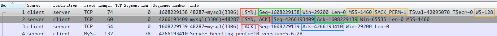
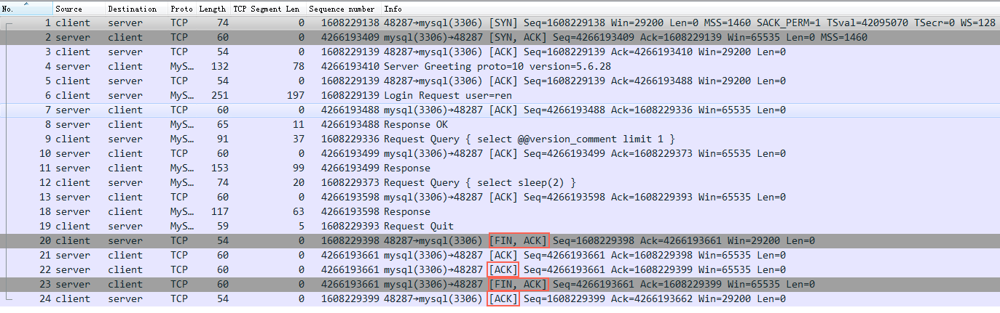
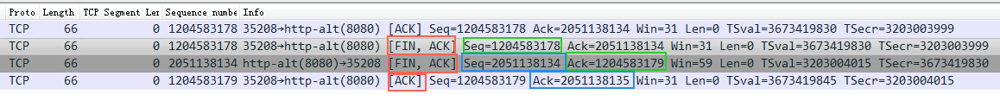
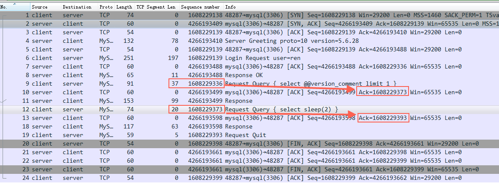

# 预备知识

## SOCKET原理

### 起源

#### 一切皆 Socket
我们已经知道网络中的进程是通过 socket 来通信的，那什么是 socket 呢？ socket 起源于 UNIX，而 UNIX/Linux 基本哲学之一就是「一切皆文件」，都可以用「open → write/read → close」模式来操作。 socket 其实就是该模式的一个实现，socket 即是一种特殊的文件，一些 socket 函数就是对其进行的操作。
使用 TCP/IP 协议的应用程序通常采用系统提供的编程接口：UNIX BSD 的套接字接口（Socket Interfaces） 以此来实现网络进程之间的通信。 就目前而言，几乎所有的应用程序都是采用 socket，所以说现在的网络时代，网络中进程通信是无处不在，一切皆 socket

#### 套接字接口 Socket Interfaces
套接字接口是一组函数，由操作系统提供，用以创建网络应用。 大多数现代操作系统都实现了套接字接口，包括所有 Unix 变种，Windows 和 Macintosh 系统。
>套接字接口的起源 套接字接口是加州大学伯克利分校的研究人员在 20 世纪 80 年代早起提出的。 伯克利的研究者使得套接字接口适用于任何底层的协议，第一个实现就是针对 TCP/IP 协议，他们把它包括在 Unix 4.2 BSD 的内核里，并且分发给许多学校和实验室。 这在因特网的历史成为了一个重大事件。 —— 《深入理解计算机系统》

从 Linux 内核的角度来看，一个套接字就是通信的一个端点。 从 Linux 程序的角度来看，套接字是一个有相应描述符的文件。 普通文件的打开操作返回一个文件描述字，而 socket() 用于创建一个 socket 描述符，唯一标识一个 socket。 这个 socket 描述字跟文件描述字一样，后续的操作都有用到它，把它作为参数，通过它来进行一些操作。
常用的函数有：
socket()
bind()
listen()
connect()
accept()
write()
read()
close()

### 套接字（socket）概念
套接字（socket）是通信的基石，是支持TCP/IP协议的网络通信的基本操作单元。它是网络通信过程中端点的抽象表示，包含进行网络通信必须的五种信息：连接使用的协议，本地主机的IP地址，本地进程的协议端口，远地主机的IP地址，远地进程的协议端口。

应用层通过传输层进行数据通信时，TCP会遇到同时为多个应用程序进程提供并发服务的问题。多个TCP连接或多个应用程序进程可能需要通过同一个 TCP协议端口传输数据。为了区别不同的应用程序进程和连接，许多计算机操作系统为应用程序与TCP／IP协议交互提供了套接字(Socket)接口。
应用层可以和传输层通过Socket接口，区分来自不同应用程序进程或网络连接的通信，实现数据传输的并发服务。

# TCP/IP协议

### tcp的特点
`tcp是可以可靠传输协议，它的所有特点都为这个可靠传输服务`

## TCP报文段 首部格式

### tcp建连接的三次握手

为了保证服务端能收接受到客户端的信息并能做出正确的应答而进行前两次(第一次和第二次)握手，为了保证客户端能够接收到服务端的信息并能做出正确的应答而进行后两次(第二次和第三次)握手。

来看一个java代码连接数据库的三次握手过程

三个红框表示建立连接的三次握手：

第一步：client 发送 syn 到server 发起握手；

第二步：server 收到 syn后回复syn+ack给client；

第三步：client 收到syn+ack后，回复server一个ack表示收到了server的syn+ack（此时client的48287端口的连接已经是established）

握手的`核心目的是告知对方seq（绿框是client的初始seq，蓝色框是server 的初始seq），对方回复ack（收到的seq+包的大小），这样发送端就知道有没有丢包了`。

### tcp断开连接的四次挥手
再来看java连上mysql后，执行了一个SQL： select sleep(2); 然后就断开了连接

四个红框表示断开连接的四次挥手：

第一步： client主动发送fin包给server

第二步： server回复ack（对应第一步fin包的ack）给client，表示server知道client要断开了

第三步： server发送fin包给client，表示server也可以断开了

第四部： client回复ack给server，表示既然双发都发送fin包表示断开，那么就真的断开吧

### 为什么握手三次、挥手四次
这个问题太恶心，面试官太喜欢问，其实他也许只能背诵：因为……。

我也不知道怎么回答。网上都说tcp是双向的，所以断开要四次。但是我认为建连接也是双向的（双向都协调告知对方自己的seq号），为什么不需要四次握手呢，所以网上说的不一定精准。

你再看三次握手的第二步发 syn+ack，如果拆分成两步先发ack再发syn完全也是可以的（效率略低），这样三次握手也变成四次握手了。

看起来挥手的时候多一次，主要是收到第一个fin包后单独回复了一个ack包，如果能回复fin+ack那么四次挥手也就变成三次了。 来看一个案例：

图中第二个红框就是回复的fin+ack，这样四次挥手变成三次了（如果一个包就是一次的话）。

我的理解：
之所以绝大数时候我们看到的都是四次挥手，是因为收到fin后，知道对方要关闭了，然后OS通知应用层要关闭啥的，这里应用层可能需要做些准备工作，有一些延时，所以先回ack，准备好了再发fin。
握手过程没有这个准备过程所以可以立即发送syn+ack。

### ack=seq+len
ack总是seq+len（包的大小），这样发送方明确知道server收到那些东西了。

但是特例是三次握手和四次挥手，虽然len都是0，但是syn和fin都要占用一个seq号，所以这里的ack都是seq+1。

看图中左边红框里的len+seq就是接收方回复的ack的数字，表示这个包接收方收到了。
然后下一个包的seq就是前一个包的len+seq，依次增加，一旦中间发出去的东西没有收到ack就是丢包了，过一段时间（或者其他方式）触发重传，保障了tcp传输的可靠性。

### 为什么TCP“三次”握手建立连接

目的：为了防止已失效的链接请求报文段突然又传送到了服务端，因而产生错误。

假设: 不采用“三次握手”，那么只要server发出确认，新的连接就建立了。由于现在client并没有发出建立连接的请求，因此不会理睬server的确认，也不会向server发送数据。但server却以为新的运输连接已经建立，并一直等待client发来数据。这样，server的很多资源就白白浪费掉了。

结论：采用“三次握手”的办法可以防止上述现象发生

### 为什么TCP“四次”挥手
因为TCP是全双工通信的

（1）第一次挥手
因此当主动方发送断开连接的请求（即FIN报文）给被动方时，仅仅代表主动方不会再发送数据报文了，但主动方仍可以接收数据报文。    

（2）第二次挥手     被动方此时有可能还有相应的数据报文需要发送，因此需要先发送ACK报文，告知主动方“我知道你想断开连接的请求了”。这样主动方便不会因为没有收到应答而继续发送断开连接的请求（即FIN报文）。   

（3）第三次挥手
被动方在处理完数据报文后，便发送给主动方FIN报文；这样可以保证数据通信正常可靠地完成。发送完FIN报文后，被动方进入LAST_ACK阶段（超时等待）。   

（4）第四挥手
如果主动方及时发送ACK报文进行连接中断的确认，这时被动方就直接释放连接，进入可用状态。

