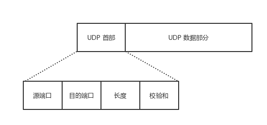

# 预备知识

## SOCKET原理

### 起源

#### 一切皆 Socket
我们已经知道网络中的进程是通过 socket 来通信的，那什么是 socket 呢？ socket 起源于 UNIX，而 UNIX/Linux 基本哲学之一就是「一切皆文件」，都可以用「open → write/read → close」模式来操作。 socket 其实就是该模式的一个实现，socket 即是一种特殊的文件，一些 socket 函数就是对其进行的操作。
使用 TCP/IP 协议的应用程序通常采用系统提供的编程接口：UNIX BSD 的套接字接口（Socket Interfaces） 以此来实现网络进程之间的通信。 就目前而言，几乎所有的应用程序都是采用 socket，所以说现在的网络时代，网络中进程通信是无处不在，一切皆 socket

#### 套接字接口 Socket Interfaces
套接字接口是一组函数，由操作系统提供，用以创建网络应用。 大多数现代操作系统都实现了套接字接口，包括所有 Unix 变种，Windows 和 Macintosh 系统。
>套接字接口的起源 套接字接口是加州大学伯克利分校的研究人员在 20 世纪 80 年代早起提出的。 伯克利的研究者使得套接字接口适用于任何底层的协议，第一个实现就是针对 TCP/IP 协议，他们把它包括在 Unix 4.2 BSD 的内核里，并且分发给许多学校和实验室。 这在因特网的历史成为了一个重大事件。 —— 《深入理解计算机系统》

从 Linux 内核的角度来看，一个套接字就是通信的一个端点。 从 Linux 程序的角度来看，套接字是一个有相应描述符的文件。 普通文件的打开操作返回一个文件描述字，而 socket() 用于创建一个 socket 描述符，唯一标识一个 socket。 这个 socket 描述字跟文件描述字一样，后续的操作都有用到它，把它作为参数，通过它来进行一些操作。
常用的函数有：
socket()
bind()
listen()
connect()
accept()
write()
read()
close()


### 套接字（socket）概念
套接字（socket）是通信的基石，是支持TCP/IP协议的网络通信的基本操作单元。它是网络通信过程中端点的抽象表示，包含进行网络通信必须的五种信息：连接使用的协议，本地主机的IP地址，本地进程的协议端口，远地主机的IP地址，远地进程的协议端口。

应用层通过传输层进行数据通信时，TCP会遇到同时为多个应用程序进程提供并发服务的问题。多个TCP连接或多个应用程序进程可能需要通过同一个 TCP协议端口传输数据。为了区别不同的应用程序进程和连接，许多计算机操作系统为应用程序与TCP／IP协议交互提供了套接字(Socket)接口。
应用层可以和传输层通过Socket接口，区分来自不同应用程序进程或网络连接的通信，实现数据传输的并发服务。


# UDP协议

##　UDP 概述

### UDP 的主要特点是：
无连接的，即发送数据之前不需要建立连接，因此减少了开销和发送数据之前的时延。
不保证可靠交付，因此主机不需要为此复杂的连接状态表
面向报文的，意思是 UDP 对应用层交下来的报文，既不合并，也不拆分，而是保留这些报文的边界，在添加首部后向下交给 IP 层。
没有阻塞控制，因此网络出现的拥塞不会使发送方的发送速率降低。
支持一对一、一对多、多对一和多对多的交互通信，也即是提供广播和多播的功能。
首部开销小，首部只有 8 个字节，分为四部分。

### UDP 的常用场景：
名字转换（DNS）
文件传送（TFTP）
路由选择协议（RIP）
IP 地址配置（BOOTP，DHTP）
网络管理（SNMP）
远程文件服务（NFS）
IP 电话
流式多媒体通信

### UDP 报文结构
UDP 数据报分为数据字段和首部字段。
首部字段只有 8 个字节，由四个字段组成，每个字段的长度是 2 个字节。


首部各字段意义：
源端口：源端口号，在需要对方回信时选用，不需要时可全 0.
目的端口：目的端口号，在终点交付报文时必须要使用到。
长度：UDP 用户数据报的长度，在只有首部的情况，其最小值是 8 。
检验和：检测 UDP 用户数据报在传输中是否有错，有错就丢弃。


## UDP的”连接性”

### 高效率，低消耗

我们知道Linux系统有用户空间(用户态)和内核空间(内核态)之分，对于x86处理器以及大多数其它处理器，用户空间和内核空间之前的切换是比较耗时(涉及到上下文的保存和恢复，一般3种情况下会发生用户态到内核态的切换：发生系统调用时、产生异常时、中断时)。

那么对于一个高性能的服务应该减少频繁不必要的上下文切换，如果切换无法避免，那么应该尽量减少用户空间河内核孔间的数据交换，减少数据拷贝。熟悉socket编程的同学对下面几个系统调用应该比较熟悉了，由于UDP是基于用户数据报的，只要数据报准备好就应该调用一次send或sendto进行发包，当然包的大小完全由应用层逻辑决定的。

细看两个系统调用的参数便知道，sendto比send的参数多2个，这就意味着每次系统调用都要多拷贝一些数据到内核空间。同时，参数到内核空间后，内核还需要一些临时的数据结构来存储这些参数值(主要是对端Endpoint_S的地址信息)，在数据包发出去后，内核还需要在合适的时候释放这些临时的数据结构。进行UDP通信的时候，如果首先调用connect绑定对端Endpoint_S的后，那么就可以直接调用send来给对端Endpoint_S发送UDP数据报了。

用户在connect之后，内核会永久维护一个存储对端Endpoint_S的地址信息的数据结构，内核不再需要分配/删除这些数据结构，只需要查找就可以了，从而减少了数据的拷贝。这样对于connect方而言，该UDP通信在内核已经维护这一个“连接”了，那么在通信的整个过程中，内核都能随时追踪到这个‘连接“。


### UDP的传输方式：面向报文

面向报文的传输方式决定了UDP的数据发送方式是一份一份的，也就是应用层交给UDP多长的报文，UDP就照样发送，即一次发送一个报文。那么UDP的报文大小由哪些影响因素呢？UDP数据包的理论长度是多少，合适的UDP数据包应该是多少呢？

(1)UDP报文大小的影响因素，主要有以下3个
```shell
[1] UDP协议本身，UDP协议中有16位的UDP报文长度，那么UDP报文长度不能超过2^16=65536.
[2] 以太网(Ethernet)数据帧的长度，数据链路层的MTU(最大传输单元)。
[3] socket的UDP发送缓存区大小
```
(2) UDP数据包最大长度
根据UDP协议，从UDP数据包的包头可以看出，UDP的最大包长度是2^16-1的个字节。由于UDP包头占8个字节，而在IP层进行封装后的IP包头占去20字节，所以这个是UDP数据包的最大理论长度是2^16 – 1 – 8 – 20 = 65507字节。如果发送的数据包超过65507字节，send或sendto函数会错误码1(Operation not permitted， Message too long)。

当然啦，一个数据包能否发送65507字节，还和UDP发送缓冲区大小（linux下UDP发送缓冲区大小为：cat /proc/sys/net/core/wmem_default）相关，如果发送缓冲区小于65507字节，在发送一个数据包为65507字节的时候，send或sendto函数会错误码1(Operation not permitted， No buffer space available)。


### UDP数据包的发送和接收问题
(1) UDP的通信有界性
在阻塞模式下，UDP的通信是以数据包作为界限的，即使server端的缓冲区再大也要按照client发包的次数来多次接收数据包，server只能一次一次的接收，client发送多少次，server就需接收多少次，即客户端分几次发送过来，服务端就必须按几次接收。

(2) UDP数据包的无序性和非可靠性
client依次发送1、2、3三个UDP数据包，server端先后调用3次接收函数，可能会依次收到3、2、1次序的数据包，收包可能是1、2、3的任意排列组合，也可能丢失一个或多个数据包。

(3) UDP数据包的接收
client发送两次UDP数据，第一次 500字节，第二次300字节，server端阻塞模式下接包，第一次recvfrom( 1000 )，收到是 1000，还是500，还是300，还是其他？

在假定数据包是不丢失并且是按照发送顺序按序到达的情况下，server端阻塞模式下接包，先后三次调用：recvfrom( 200)，recvfrom( 1000)，recvfrom( 1000)，接收情况如何呢？
