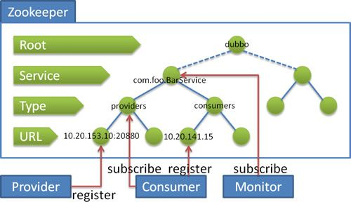

## java的spi机制
SPI全称为(Service Provider Interface) ,是JDK内置的一种服务提供发现机制。 目前有不少框架用它来做服务的扩展发现， 简单来说，它就是一种动态替换发现的机制， 举个例子来说， 有个接口，想运行时动态的给它添加实现，你只需要添加一个实现，而后，把新加的实现，描述给JDK知道就行啦

SPI的全名为Service Provider Interface.普通开发人员可能不熟悉，因为这个是针对厂商或者插件的。在java.util.ServiceLoader的文档里有比较详细的介绍。究其思想，其实是和"Callback"差不多。“Callback”的思想是在我们调用API的时候，我们可以自己写一段逻辑代码，传入到API里面，API内部在合适的时候会调用它，从而实现某种程度的“定制”。

SPI也是JDK的一种标准

Java SPI
+ 需要一个目录
  - META/service
  - 放到ClassPath下面
+ 目录下面放置一个配置文件
  - 文件名是要扩展的接口全名
  - 文件内部为要实现的接口实现类
  - 文件必须为UTF-8编码
+ 如何使用
  - ServiceLoad.load(xx.class)
  - ServiceLoad<HelloInterface> loads = ServiceLoad.load(HelloInterface.class)
而后，把新加的实现，描述给JDK知道就行了(通过改一个文本文件即可)，
目前Dubbo框架就基于SPI机制提供扩展功能。

典型的是Collections.sort（List<T> list,Comparator<? super T> c）
这个方法，它的第二个参数是一个实现Comparator接口的实例。我们可以根据自己的排序规则写一个类，实现此接口，传入此方法，那么这个方法就会根据我们的规则对list进行排序。

## Dubbo实践

### Dubbo的核心功能？

主要3个核心功能：

Remoting: 网络通信框架，提供对多种NIO框架抽象封装，包括“同步转异步”和“请求-响应”模式的信息交换方式。

Cluster: 服务框架，提供基于接口方法的透明远程过程调用，包括多协议支持，以及软负载均衡，失败容错，地址路由，动态配置等集群支持。

Registry: 服务注册，基于注册中心目录服务，使服务消费方能动态的查找服务提供方，是地址透明，是服务方可以平滑增加或减少机器。

### Dubbo的核心组件？

组件		说明
Provider	暴露服务的服务提供方
Consumer	调用远程服务的服务消费方
Regitry		服务注册与发现的注册中心
Monitor		统计服务调用次数和调用时间的监控中心
Container	服务运行容器

### Dubbo的主要应用场景？

透明化的远程方法调用，就像调用本地方法一样调用远程方法，只需简单配置，没有任何API侵入。

软负载均衡及容错机制，可在内网替代F5等硬件负载均衡器，降低成本，减少单点。

服务自动注册与发现，不再需要写死服务提供方地址，注册中心基于接口名查询服务提供者的IP地址，并且能够平滑添加或删除服务提供者。

## zookeeper在Dubbo中扮演了一个什么角色，起到了什么作用啊？
是dubbo推荐的注册中心。

流程：
1.服务提供者启动时向/dubbo/com.foo.BarService/providers目录下写入URL
2.服务消费者启动时订阅/dubbo/com.foo.BarService/providers目录下的URL向/dubbo/com.foo.BarService/consumers目录下写入自己的URL
3.监控中心启动时订阅/dubbo/com.foo.BarService目录下的所有提供者和消费者URL

支持以下功能：

1.当提供者出现断电等异常停机时，注册中心能自动删除提供者信息。

2.当注册中心重启时，能自动恢复注册数据，以及订阅请求。

3.当会话过期时，能自动恢复注册数据，以及订阅请求。

4.当设置<dubbo:registry check="false" />时，记录失败注册和订阅请求，后台定时重试。

5.可通过<dubbo:registry username="admin" password="1234" />设置zookeeper登录信息。

6.可通过<dubbo:registry group="dubbo" />设置zookeeper的根节点，不设置将使用无根树。

7.支持`*`号通配符<dubbo:reference group="*" version="*" />，可订阅服务的所有分组和所有版本的提供者。

注意的是阿里内部并没有采用Zookeeper做为注册中心，而是使用自己实现的基于数据库的注册中心，即：Zookeeper注册中心并没有在阿里内部长时间运行的可靠性保障，此Zookeeper桥接实现只为开源版本提供，其可靠性依赖于Zookeeper本身的可靠性。