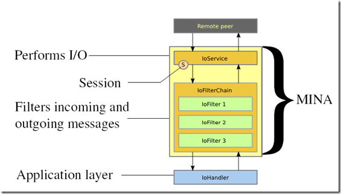
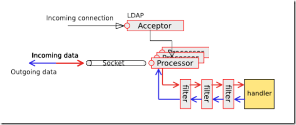

Mina网络通信框架


## 什么是MINA
Apache MINA(Multipurpose Infrastructure for Network Applications，多用途基础设施for网络应用)是一个网络应用框架，可以帮助我们开发高性能和高扩展性的网络应用。它通过封装Java NIO提供了一个支持各种传输协议（如：TCP/IP和UDP/IP）的抽象事件驱动异步API

`Mina是对Java NIO框架进行了一层封装的Socket类库`


`Apache MINA自带了许多子项目： 
异步http服务 
ftp服务 
一个支持ssh协议的java库 
XMPP服务
`

Mina框架主页： 
https://mina.apache.org/ 
Mina框架下载地址： 
https://mina.apache.org/downloads-mina.html


## 为什么使用Mina?

### 传统socket：阻塞式通信
每建立一个Socket连接时，同时创建一个新线程对该Socket进行单独通信（采用阻塞的方式通信）。这种方式具有很高的响应速度，并且控制起来也很简单，在连接数较少的时候非常有效，但是如果对每一个连接都产生一个线程的无疑是对系统资源的一种浪费，如果连接数较多将会出现资源不足的情况。

### nio：非阻塞通信
nio设计背后的基石：反应器模式，用于事件多路分离和分派的体系结构模式

反应器模式的核心功能如下： 
将事件多路分用 
将事件分派到各自相应的事件处理程序

NIO 的非阻塞 I/O 机制是围绕 `选择器`和 `通道`构建的
Channel类表示服务端和客户机之间的一种通信机制。
Selector类是Channel的多路复用器。

Selector 类将`传入的客户机请求` 多路复用，并将它们分派到各自的的请求处理程序


#### 简单的来说：NIO是一个基于事件的IO架构
最基本的思想就是：有事件我通知你，你再去做你的事情。而且NIO的主线程只有一个，不像传统的模型，需要多个线程以应对客户端请求，也减轻了JVM的工作量


Channel必需要注册到Selector
Channel注册至Selector以后，

#### `经典的调用方法`如下
nio中取得事件通知，就是在selector的select事件中完成的。
在selector事件时有一个线程向操作系统询问，
selector中注册的Channel&&SelectionKey的键值对的各种事件是否有发生，
如果有则添加到selector的selectedKeys属性Set中去，并返回本次有多少个感兴趣的事情发生
如果发现这个值>0，表示有事件发生，马上迭代selectedKeys中的selectionKey，根据key中表示的事件，来做相应的处理
实际上，这段说明表明了异步socket的核心，即异步socket不过是将多个socket的调度(或者还有他们的线程调度)全部交给操作系统自己去完成，异步的核心Selectot，不过是将这些调度收集，分发而已。


## 总体框架


内部可以分为3 个层次：

I/O Service - 执行实际的I / O，可以选择现成的Services如 (`*Acceptor`)，也可以自己写。

I/O Filter Chain - 这是一个由多个过滤器组成的过滤器链，在这个环节将字节数据转换到特定的数据结构中（Filters/Transforms bytes into desired Data Structures and vice-versa） 

I/O Handler - 实际的业务逻辑部分 这也是实际开发过程中需要用户自己编写的部分代码。


## 真实应用

### Server端应用

对socket通信来说，使用比较广泛的是基于Server端的应用，尤其是并发规模达到一定程度后，颇具挑战性。那么我们来看一下，基于MINA框架的Server端应用：

1、IOAcceptor 监听指定的端口，处理新的网络连接；一旦一个新的连接到达后，IOAcceptor 就产生一个session，后续所有从这个IP和端口发送过来的请求就将通过这个Session被处理。

2、Session创建后，后续所有的数据包都被人到过滤器链中，通过过滤器将原始的字节码转变成高层的对象，这个环节PacketEncoder/Decoder就十分有用。

3、最后数据包或对象被传送给Handler做业务逻辑处理；




### Mina网络传输框架的执行流程

你只需要关心你要发送、接收的数据以及你的业务逻辑即可。同样的，无论是哪端，Mina 的执行流程如下所示：
(1.) IoService：这个接口在一个线程上负责套接字的建立，拥有自己的Selector，监听是否有连接被建立。
(2.) IoProcessor：这个接口在另一个线程上，负责检查是否有数据在通道上读写，也就是说它也拥有自己的Selector，这是与我们使用JAVA NIO 编码时的一个不同之处，通常在JAVA NIO 编码中，我们都是使用一个Selector，也就是不区分IoService与IoProcessor 两个功能接口。另外，IoProcessor 负责调用注册在IoService 上的过滤器，并在过滤器链之后调用IoHandler。
(3.) IoFilter：这个接口定义一组拦截器，这些拦截器可以包括日志输出、黑名单过滤、数据的编码（write 方向）与解码（read 方向）等功能，其中数据的encode 与decode是最为重要的、也是你在使用Mina 时最主要关注的地方。
(4.) IoHandler：这个接口负责编写业务逻辑，也就是发送，接收数据的地方。


#### 小例子
```java
/**
 * Mina实例01
 *
 * @Author: wangzhuo
 * @Date: 2018/09/22
 */
public class MinaTest01 {

    private static final int PORT = 9123;

    /**
     * TimeServer主进程
     * @param args
     */
    public static void main(String[] args) throws IOException {

        IoAcceptor ioAcceptor = new NioSocketAcceptor(100);

        ioAcceptor.getFilterChain().addLast("logger", new LoggingFilter());
        ioAcceptor.getFilterChain().addLast("codec", new ProtocolCodecFilter(new TextLineCodecFactory(Charset.forName("UTF-8"))));

        //挂上TimeServerHandler
        ioAcceptor.setHandler(new TimeServerHandler());

        ioAcceptor.bind(new InetSocketAddress(PORT));

    }
}
```
1、创建IoAcceptor；

2、加入日志记录和解码的过滤器，其中日志过滤器用SL4J库记录信息，而编码过滤器则解码所有收到的信息。使用 new TextLineCodecFactory() 发送的信息迕行编码，返是MINA自带的，功能有限，只能处理文本戒者String类型。

3、设置ServerHandler，这里是一个自定义的Handler：TimeServerHandler；

4、设置Session的对应的I/O processor 读缓存区大小2048；通常这个参数不需要设置；

5、设置空闲时间，这里的BOTH_IDLE指EADER_IDLE 和 WRITER_IDLE. 都为10秒；

6、绑定监听端口9123；


```java
/**
 * TimeServer处理类
 * 接收请求后，返回当前时间的字符串表达式
 *
 * @Author: wangzhuo
 * @Date: 2018/09/22
 */
public class TimeServerHandler extends IoHandlerAdapter{

    //日期格式器
    private static SimpleDateFormat sdf = new SimpleDateFormat("yyyy-MM-dd HH:mm:ss");

    //Long类型时间戳
    private static Long timestamp = 0L;

    /**
     * 自定义异常处理
     * @param ioSession
     * @param throwable
     * @throws Exception
     */
    @Override
    public void exceptionCaught(IoSession ioSession, Throwable throwable) throws Exception {
        throwable.printStackTrace();
    }

    /**
     * 接收消息后进行处理
     * @param ioSession
     * @param o
     * @throws Exception
     */
    @Override
    public void messageReceived(IoSession ioSession, Object o) throws Exception {
        //TODO 具体业务处理逻辑
        String str = o.toString();
        if (null!=str && str.trim().equalsIgnoreCase("quit")){
            ioSession.close();
            return;
        }

        Date now = new Date();
        timestamp = now.getTime();
        ioSession.write(sdf.format(new Date(timestamp)));
    }

    @Override
    public void messageSent(IoSession ioSession, Object o) throws Exception {
        
    }
}
```
几个主要的方法：

messageReceived(…)，对接收到的消息（已经解码）迕行下一步处理，这里对收到的字符串进行判断，如果是”quit”则断开连接；否则输出当前时间的字符串格式；

exceptionCaught(…)，自定义异常处理， 要不然异常会被“吃掉”；

sessionIdle，当Session处于IDLE状态的时候，输出空闲状态次数；

 

 

测试，输入：telnet 127.0.0.1 9123，随便输入一串字符串，显示当前的时间：


