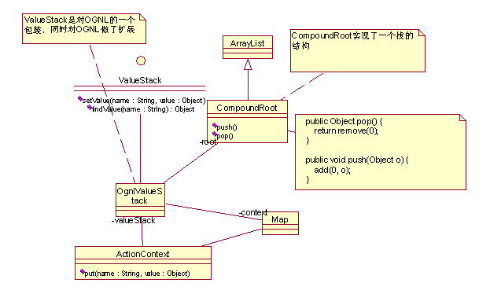

[TOC]

# Struts2数据传输背后机制：ValueStack(值栈)
 

在这一切的背后，是因为有了ValueStack（值栈）！

 

## ValueStack基础：OGNL
要了解ValueStack，必须先理解OGNL(Object Graphic Navigatino Language)！

OGNL是Struts2中使用的一种表达式语言，它可以用于JSP的标签库中，以便能够方便的访问各种对象的属性；它用于界面将参数传递到Action（并进行类型转换）中；它还可以用于struts2的配置文件中！所以，非常有必要理解OGNL的基本机制。

 

### Root对象
OGNL称为对象图导航语言。所谓对象图，即以任意一个对象为根，通过OGNL可以访问与这个对象关联的其它对象。如：
```java
package cn.com.leadfar.struts2.actions;

 

public class User {

    private String username;

    private Group group;

   

    public String getUsername() {

       return username;

    }

    public void setUsername(String username) {

       this.username = username;

    }

   

    public Group getGroup() {

       return group;

    }

    public void setGroup(Group group) {

       this.group = group;

    }

}

 

package cn.com.leadfar.struts2.actions;

 

public class Group {

    private String name;

    private Organization org;

    public String getName() {

       return name;

    }

 

    public void setName(String name) {

       this.name = name;

    }

 

    public Organization getOrg() {

       return org;

    }

 

    public void setOrg(Organization org) {

       this.org = org;

    }

}

 

package cn.com.leadfar.struts2.actions;

 

public class Organization {

    private String orgId;

 

    public String getOrgId() {

       return orgId;

    }

 

    public void setOrgId(String orgId) {

       this.orgId = orgId;

    }

}

```

 

上面三个类，描述了通过一个User对象，可以导航到Group对象，进而导航到Organization对象，以User对象为根，一个对象图如下所示：

 

User(root)

   -- username

   -- group

      -- name

      -- org

         -- orgId

 

在真实的环境下，这个对象图可能会极其复杂，但是通过基本的getters方法，都应该能够访问到某个对象的其它关联对象。【对象图的导航，必须通过getters方法进行导航】

 

下述代码将创建一个User对象，及其相关的一系列对象：

       User user = new User();

       Group g = new Group();

       Organization o = new Organization();

        o.setOrgId("ORGID");

       g.setOrg(o);

       user.setGroup(g);

 

如果通过JAVA代码来进行导航（依赖于getters方法），导航到Organization的orgId属性，如下所示：

 

//用JAVA来导航访问

user.getGroup().getOrg().getOrgId();

 

 

【注意：导航的目的，是为了获取某个对象的值或设置某个对象的值或调用某个对象的方法！】

【注意：OGNL表达式语言的真正目的，是为了在那些不能写JAVA代码的地方执行JAVA代码，或者是为了更方便地执行JAVA代码】

 

利用OGNL进行导航的代码如下：

 
```java
       //利用OGNL表达式访问

       String value = (String)Ognl.getValue("group.org.orgId", user);
```
 

Ognl.getValue()方法的第一个参数，就是一条OGNL表达式，第二个参数是指定在表达式中需要用到的root对象！

完整代码如下：
```java
    public void testOgnl01() throws Exception{

       User user = new User();

       user.setUsername("张三");

      

       //利用OGNL表达式访问user对象的username属性

       String value = (String)Ognl.getValue("username", user);

       log(value);

    }

   

    public void testOgnl02() throws Exception{

       User user = new User();

       Group g = new Group();

       Organization o = new Organization();

       o.setOrgId("ORGID");

       g.setOrg(o);

       user.setGroup(g);

      

       //用JAVA来导航访问

       log(user.getGroup().getOrg().getOrgId());

      

       //利用OGNL表达式访问

       String value = (String)Ognl.getValue("group.org.orgId", user);

       log(value);

    }

   

    public void testOgnl03() throws Exception{

       User user = new User();

       Group g = new Group();

       Organization o = new Organization();

       o.setOrgId("ORGID");

       g.setOrg(o);

       user.setGroup(g);

      

       //用JAVA来导航访问

       log(user.getGroup().getOrg().getOrgId());

      

       //也可以在表达式中使用#root来代表root对象

       String value = (String)Ognl.getValue("#root.group.org.orgId", user);

       log(value);

    }

    private void log(Object o){

       System.out.println(o);

    }
```
 

 

### Context对象
在OGNL的表达式中，有可能需要访问到多个毫不相干的对象，这时候，我们需要给OGNL传递一个Map类型的对象，把表达式中需要用到的对象放到Map中即可！这个Map对象，称为context。

 

要在表达式中访问到context中的对象，需要使用“#对象名称”的语法规则。

如：
```java
    public void testOgnl04() throws Exception{

       User user = new User();

       user.setUsername("张三");

       Group g = new Group();

       Organization o = new Organization();

       o.setOrgId("ORGID");

       g.setOrg(o);

       user.setGroup(g);

      

       User user2 = new User();

       user2.setUsername("李四");

      

       /**
        * 所谓context其实就是一个Map类型的对象。主要是因为在OGNL中，不支持多个root对象，那么
        * 如果需要在表达式中访问更多毫不相干的对象时，只能通过一个Map来把这些对象统一传递给OGNL。
        */

       Map context = new HashMap();

       context.put("u1", user);

       context.put("u2", user2);

      

       //在表达式中需通过“#+对象的名称”来访问context中的对象

       //如果表达式中没有用到root对象，那么可以用任意一个对象代表root对象！

       String value = (String)Ognl.getValue("#u1.username + ',' + #u2.username", context,new Object());

       log(value);

    }

   

    public void testOgnl05() throws Exception{

       User user = new User();

       user.setUsername("张三");

       Group g = new Group();

       Organization o = new Organization();

       o.setOrgId("ORGID");

       g.setOrg(o);

       user.setGroup(g);

      

       User user2 = new User();

       user2.setUsername("李四");

      

       User user3 = new User();

       user3.setUsername("王五");

      

       Map context = new HashMap();

       context.put("u1", user);

       context.put("u2", user2);

      

       //给OGNL传递root对象及context对象，以便解释对应的表达式

       String value = (String)Ognl.getValue("#u1.username + ',' + #u2.username + ',' + username", context,user3);

       log(value);

    }
```
 

### 利用OGNL表达式进行赋值
 

OGNL表达式也可以用于赋值操作。
```java
    public void testOgnl06() throws Exception{

       User user = new User();

      

       //调用setValue()方法来进行赋值

       //第一个参数：OGNL表达式

       //第二个参数：root对象

       //第三个参数：要赋的值     

       Ognl.setValue("username", user, "张三");

 

       log(user.getUsername());

    }

   

    public void testOgnl07() throws Exception{

       User user = new User();

      

       Map context = new HashMap();

       context.put("u", user);

      

       //调用setValue()方法来进行赋值

       //第一个参数：OGNL表达式

       //第二个参数：context对象

        //第三个参数：root对象

       //第四个参数：要赋的值

       Ognl.setValue("#u.username", context, new Object(), "张三");

 

       log(user.getUsername());

    }

   

    public void testOgnl08() throws Exception{

       User user = new User();

      

       Map context = new HashMap();

       context.put("u", user);

       

       //利用赋值符号"="来进行赋值

       Ognl.getValue("#u.username = '李四'", context, new Object());

 

       log(user.getUsername());

    }

   

    public void testOgnl09() throws Exception{

       User user1 = new User();

       User user2 = new User();

       Map context = new HashMap();

       context.put("u1", user1);

       context.put("u2", user2);

      

       //在一个表达式中可以用逗号分隔，同时执行多个表达式

       Ognl.getValue("#u1.username = '李四',#u2.username='王五'", context, new Object());

 

       log(user1.getUsername());

       log(user2.getUsername());

    }
```
 

### 利用OGNL调用对象的方法
 
```java
    //************************* OGNL调用对象的方法 *****************************//

    public void testOgnl10() throws Exception{

       User user = new User();

      

       //如果是调用root对象的方法，可以直接使用方法的名称来调用方法

       Integer value = (Integer)Ognl.getValue("addSomething(1,1)", user);

       log(value);

    }

   

    public void testOgnl11() throws Exception{

       User user = new User();

       user.setUsername("李四");

       //如果是调用root对象的方法，可以直接使用方法的名称来调用方法

       String value = (String)Ognl.getValue("getUsername()", user);

       log(value);

    }

   

    public void testOgnl12() throws Exception{

       User user = new User();

       Ognl.getValue("setUsername('王五')", user);

       String value = (String)Ognl.getValue("getUsername()", user);

       log(value);

    }

   

    //************************* OGNL调用静态方法和变量 *********************//

    public void testOgnl13() throws Exception{

       User user = new User();

       user.setUsername("王五");

       //调用静态变量

       //注意：out是System中的静态变量，out是PrintStream类型的一个对象

       //而println()则是out这个对象中的实例方法（不是静态方法）

       //调用静态方法，需要在类名和变量名前面加上@来调用，对于实例方法，用"."来调用

       Ognl.getValue("@System@out.println(username)", user);

    }

   

    public void testOgnl14() throws Exception{

       User user = new User();

       user.setUsername("wangwu");

       //调用静态方法,注意使用全路径类名

        Ognl.getValue("@System@out.println(@cn.com.leadfar.utils.Utils@toUpperCase(username))", user);

    }
```
 

### 利用OGNL访问数组、集合对象
 
```java
    public void testOgnl15() throws Exception{

      

       Object root = new Object();

       Map context = new HashMap();

      

       //利用OGNL创建java.util.List对象

       List list = (List)Ognl.getValue("{123,'xxx','kdjfk'}", context, root);

       context.put("list", list);

      

       //利用OGNL创建数组

       int[] intarray = (int[])Ognl.getValue("new int[]{23,45,67}", context, root);

       context.put("intarray", intarray);

      

       //利用OGNL表达式创建java.util.Map对象

       Map mapvalue = (Map)Ognl.getValue("#{'listvalue':#list,'intvalue':#intarray}", context, root);

       context.put("mapvalue", mapvalue);

      

       //利用OGNL表达式访问这些数组和集合对象

       Ognl.getValue("@System@out.println(#list[1])", context,root);

       Ognl.getValue("@System@out.println(#intarray[2])", context,root);

       Ognl.getValue("@System@out.println(#mapvalue.listvalue[0])", context,root);

       Ognl.getValue("@System@out.println(#mapvalue['intvalue'][0])", context,root);

    }

   

    public void testOgnl16() throws Exception{

      

       List root = new ArrayList();

       User user1 = new User();

       user1.setUsername("张三");

       User user2 = new User();

       user2.setUsername("李四");

       root.add(user1);

       root.add(user2);

      

       //如果root对象是List类型

       log(Ognl.getValue("#root[0].username", root));

       log(Ognl.getValue("#root[1].username", root));

    }
```
 

 

 

### 更多的特性，请参考官方的文档
 

OGNL官方文档地址：http://www.opensymphony.com/ognl/html/LanguageGuide/index.html

 

## 应用：ValueStack
 

理解ValueStack的基本机制！对各种现象作出解释。

ValueStack实际上就是对OGNL的封装，OGNL主要的功能就是赋值与取值，Struts2正是通过ValueStack来进行赋值与取值的！




ValueStack是一个接口，而OgnlValueStack是strtus2中的缺省实现。ValueStack中的数据，分两个部分存放：root和context（这与OGNL中的概念一致），同时ValueStack暴露相关的接口：

void setValue(String expr, Object value);

Object findValue(String expr);

用来通过OGNL表达式对ValueStack中的数据进行操作！

 

ValueStack中的root对象是CompoundRoot，CompoundRoot继承了ArraryList，提供了额外的方法：push()和pop()方法，用来对root对象中所包含的数据进行存取！
```java
public class CompoundRoot extends ArrayList {

 

    public CompoundRoot() {

    }

 

    public CompoundRoot(List list) {

        super(list);

    }

 

 

    public CompoundRoot cutStack(int index) {

        return new CompoundRoot(subList(index, size()));

    }

 

    public Object peek() {

        return get(0);

    }

 

    public Object pop() {

        return remove(0);

    }

 

    public void push(Object o) {

        add(0, o);

    }

}
```
 

正是通过这两个方法，CompoundRoot变成了一个栈结构！压栈操作，将导致对象被放到CompoundRoot的第0个元素上（第0个元素是栈顶），其它对象被依次往后移动；出栈操作，将导致CompoundRoot的第0个元素被移除（即栈顶元素被弹出），其它对象被依次往前移动！

 

OGNL不支持多个root对象，而struts2能够支持多个root对象，它对OGNL做了扩展。

如果某个OGNL表达式被传递给ValueStack（即调用ValueStack的setValue或findValue方法），而表达式中包含有对root对象的访问操作，ValueStack将依次从栈顶往栈底搜索CompoundRoot对象中所包含的对象，看哪个对象具有相应的属性，找到之后，立刻返回。

 

在Struts2中，一个请求在最终到达Action的方法之前，Action对象本身会被压入ValueStack（实际上就是放到ValueStack的CompoundRoot中），所以Action对象是CompoundRoot中的一个元素。看下面的代码：
```java
public class UserAction {

    private String username;

    private Integer age;

    private boolean valid;

   

    //查看用户的详细信息

    public String detail(){

      

       username = "张三";

       age = 18;

       valid = true;

      

       return "detail";

    }
}
```
在Action中，给Action的username/age/valid赋值。Detail页面如下：

username:<s:property value="username"/> <br/>

valid:<s:property value="valid"/> <br/>

age:<s:property value="age"/> <br/>

上述JSP页面将能正确将它们的值取出。<s:property value=”ognl表达式”/>。在s:property标签中的OGNL表达式，最终会交给ValueStack来解释。username就是一个OGNL表达式，意思是调用root对象的getUsername()方法。Struts2将自动搜索CompoundRoot中有哪些元素（从第0个元素开始搜索），检测这些元素是否有getUsername()方法，如果第0个元素没有getUsername()方法，将继续搜索第1、2、3……个元素是否有getUsername()方法。

 

在上面的例子中，CompoundRoot中只有一个对象，就是userAction对象，而这个对象中正好有getUsername()方法，所以，上述JSP代码将能够将值正确取出。

 

再看下面的例子：
```java
public class UserAction {

    private String username;

    private String name;

   

    //查看用户的详细信息

    public String detail(){

       username = "张三";

       name = "王五";

      

       User u = new User();

       u.setUsername("赵毅");

       ActionContext.getContext().getValueStack().push(u);

      

       return "detail";

    }
}
```
在上面这个UserAction的代码中，我们直接调用ActionContext.getContext().getValueStack().push()方法，把一个User对象（这个对象拥有getUsername()和setUsername()方法）直接压入到ValueStack中，这时候，在ValueStack的CompoundRoot中将有两个元素：第0个元素是刚刚压入的user对象[赵毅],而第1个元素是userAction对象[张三]，如果在JSP中使用下面的表达式来取值：

<s:property value=”username”/> ，那么输出的值将是“赵毅”！道理上面已经讲过了，struts2将会从第0个元素开始搜索CompoundRoot中的对象，第0个元素正是刚刚压入的那个user对象！

如果在JSP中使用<s:property value=”name”/>来取值，将取出“王五”，因为第0个元素user对象没有name属性，所以，会继续搜索第1个元素userAction对象，在这个对象中就有name属性了！

 

再看下面的代码：
```java
public class UserAction {

    private String username;

   

    //查看用户的详细信息

    public String detail(){

       username = "张三";

      

       List list = new ArrayList();

       for(int i=0; i<10; i++){

           User user = new User();

           user.setUsername("User"+i);

           list.add(user);

       }

       ActionContext.getContext().put("users", list);

      

       User u = new User();

       u.setUsername("赵毅");

       ActionContext.getContext().getValueStack().push(u);

      

       return "detail";

    }
}
```

对应的JSP如下：

1:  <s:property value="username"/> <br/>

2:  <s:iterator value="#users">

3:     <s:property value="username"/>

4:     <s:property value="#root[2].username"/><br/>

5:  </s:iterator>

6:  <s:property value="username"/>

7:  <s:property value="#root[1].username"/> <!-- 张三 -->

 

根据刚才的示例，我们知道，第1行的username是“赵毅”（因为JSP在执行这行代码的时候，CompoundRoot中有两个元素：第0个是“user对象赵毅”，第1个是“userAction对象张三”），因此第1行的username将取出CompoundRoot中第0个元素的username属性：赵毅

 

第2行代码是iterator标签，只定义了一个value属性，iterator标签将循环访问users这个List中的User对象，并把当前循环的user对象压入到CompoundRoot中！所以，在第3行和第4行代码被执行的时候，CompoundRoot中总共有3个元素：第0个元素是被iterator标签压入的当前循环的user对象；第1个元素是“user对象赵毅”；第2个元素是“userAction对象张三”，因此第3行代码的执行结果就是输出“UserX”，即当前循环的user对象的username属性！iterator标签将会依次取出List中的user对象，并不断压入/弹出user对象（每次循环，都将执行一遍压入/弹出）。而第4行代码取第2个元素的username属性，即userAction对象的username属性：张三。

 

第5行代码执行完成之后，在CompoundRoot中将剩下2个元素，与第2行代码被执行之前一样。所以，第6行代码的输出和第1行代码的输出结果是一样的，而第7行代码将取出userAction对象的username属性：张三