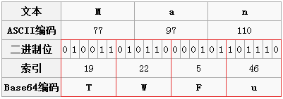
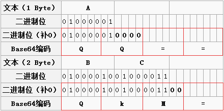

## 编解码

### 文件编码

不管是文本还是图片或视频，在计算机存储上都是一视同仁，全都是字节流。但是从方便人们阅读的角度上还是分为文本文件和二进制文件。文本文件的可视形式就是文本字符，在存储和显示时有文本字符编解码的过程，可以直接用文本编辑器阅读。除文本文件以外就是二进制文件，不同类型的二进制文件都有相应的结构标准，例如java的class文件，前四个字节代表文件类型，后边两个字节代表大版本号，再后边两个字节代表小版本号。具体哪些字节代表什么意思，值是float类型还是int类型，都有一定的标准，所以需要特定的软件按照标准去读取解析。

在不同的编程语言中，往往提供不同的类对文本文件和二进制文件进行读写。最常用的就是文本文件的读写例如C#中有StreamReader和StreamWriter，Java中有BufferedReader和BufferedWriter。还有二进制文件的读写例如C#中有BinaryReader和BinaryWriter，Java中有DataInputStream和DataOutputStream。当然读写二进制文件的类也可以读写文本文件，因为文本文件和二进制文件的存储在本质上是没有区别的，都是二进制。只不过专门读写文本文件的类封装的更好，读写文本文件更方便。

### Base64编码

#### Base64编码由来

为什么会有Base64编码呢？因为有些网络传送渠道并不支持所有的字节，例如传统的邮件只支持可见字符的传送，像ASCII码的控制字符就不能通过邮件传送。这样用途就受到了很大的限制，比如图片二进制流的每个字节不可能全部是可见字符，所以就传送不了。最好的方法就是在不改变传统协议的情况下，做一种扩展方案来支持二进制文件的传送。把不可打印的字符也能用可打印字符来表示，问题就解决了。Base64编码应运而生，Base64就是一种基于64个可打印字符来表示二进制数据的表示方法。

#### Base64编码原理

看一下Base64的索引表，字符选用了`A-Z、a-z、0-9、+、/` 64个可打印字符。数值代表字符的索引，这个是标准Base64协议规定的，不能更改。64个字符用6个bit位就可以全部表示，一个字节有8个bit位，剩下两个bit就浪费掉了，这样就不得不牺牲一部分空间了。这里需要弄明白的就是一个Base64字符是8个bit，但是有效部分只有右边的6个bit，左边两个永远是0。

那么怎么用6个有效bit来表示传统字符的8个bit呢？8和6的最小公倍数是24，也就是说3个传统字节可以由4个Base64字符来表示，保证有效位数是一样的，这样就多了1/3的字节数来弥补Base64只有6个有效bit的不足。你也可以说用两个Base64字符也能表示一个传统字符，但是采用最小公倍数的方案其实是最减少浪费的(专家已经证明，此处省略证明)。

结合下边的图比较容易理解。Man是三个字符，一共24个有效bit，只好用4个Base64字符来凑齐24个有效位。红框表示的是对应的Base64，6个有效位转化成相应的索引值再对应Base64字符表，查出"Man"对应的Base64字符是"TWFU"。

说到这里有个原则不知道你发现了没有，要转换成Base64的最小单位就是三个字节，对一个字符串来说每次都是三个字节三个字节的转换，对应的是Base64的四个字节。这个搞清楚了其实就差不多了。

         

但是转换到最后你发现不够三个字节了怎么办呢？

愿望终于实现了，我们可以用两个Base64来表示一个字符或用三个Base64表示两个字符，像下图的A对应的第二个Base64的二进制位只有两个，把后边的四个补0就是了。所以A对应的Base64字符就是QQ。上边已经说过了，原则是Base64字符的最小单位是四个字符一组，那这才两个字符，后边补两个"="吧。其实不用"="也不耽误解码，之所以用"="，可能是考虑到多段编码后的Base64字符串拼起来也不会引起混淆。

z由此可见Base64字符串只可能最后出现一个或两个"="，中间是不可能出现"="的。下图中字符"BC"的编码过程也是一样的。

#### 总结　　

说起Base64编码可能有些奇怪，因为大多数的编码都是由字符转化成二进制的过程，而从二进制转成字符的过程称为解码。而Base64的概念就恰好反了，由二进制转到字符称为编码，由字符到二进制称为解码。

Base64编码主要用在传输、存储、表示二进制等领域，还可以用来加密，但是这种加密比较简单，只是一眼看上去不知道什么内容罢了，当然也可以对Base64的字符序列进行定制来进行加密。

Base64编码是从二进制到字符的过程，像一些中文字符用不同的编码转为二进制时，产生的二进制是不一样的，所以最终产生的Base64字符也不一样。例如"上网"对应utf-8格式的Base64编码是"5LiK572R"，对应GB2312格式的Base64编码是"yc/N+A=="。

