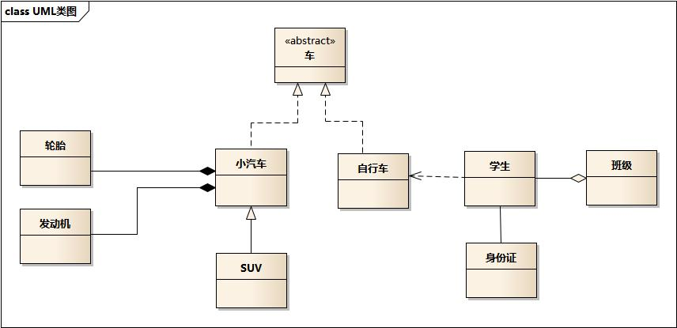

## 类的关系

### 类图作用
类图是软件工程的统一建模语言一种静态结构图，该图描述了系统的类集合，类的属性和类之间的关系。
帮助人们简化对系统的理解，它是系统分析和设计阶段的重要产物，也是系统编码和测试的重要模型依据。

### UML类关系图示例
请看以下这个类图，类之间的关系是我们需要关注的：

车的类图结构为<>，表示车是一个抽象类；
它有两个继承类：小汽车和自行车；它们之间的关系为实现关系，使用带空心箭头的虚线表示；
小汽车为与SUV之间也是继承关系，它们之间的关系为泛化关系，使用带空心箭头的实线表示；
小汽车与发动机之间是组合关系，使用带实心箭头的实线表示；
学生与班级之间是聚合关系，使用带空心箭头的实线表示；
学生与身份证之间为关联关系，使用一根实线表示；
学生上学需要用到自行车，与自行车是一种依赖关系，使用带箭头的虚线表示；

### 类之间的关系
在UML类图中类与类之间存在多种关系，如

泛化(Generalization)关系，
实现（Realization)关系，
依赖(Dependence)关系，
关联（Association）关系，
聚合(Aggregation)关系， 
组合(Composition)关系。

