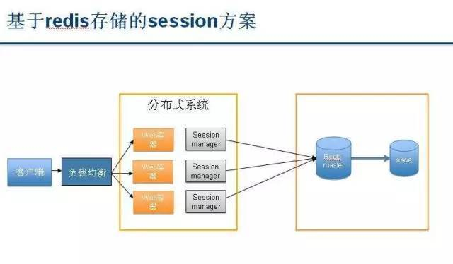
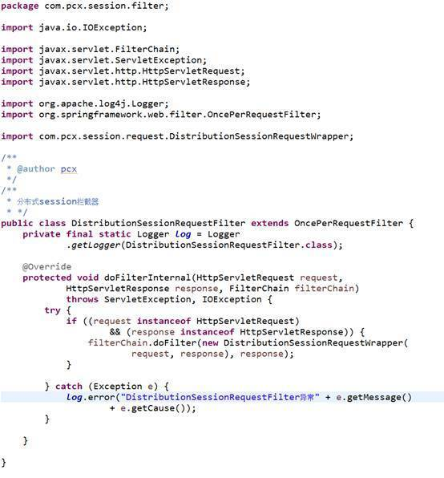
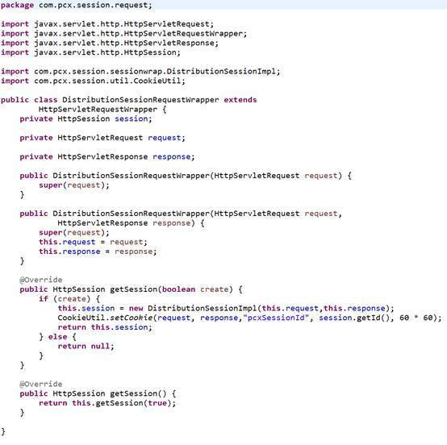
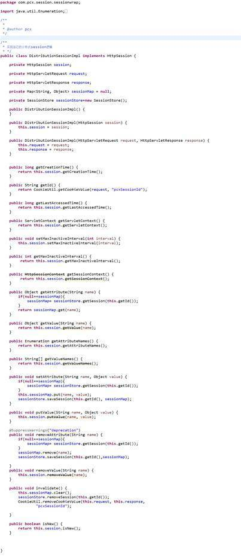
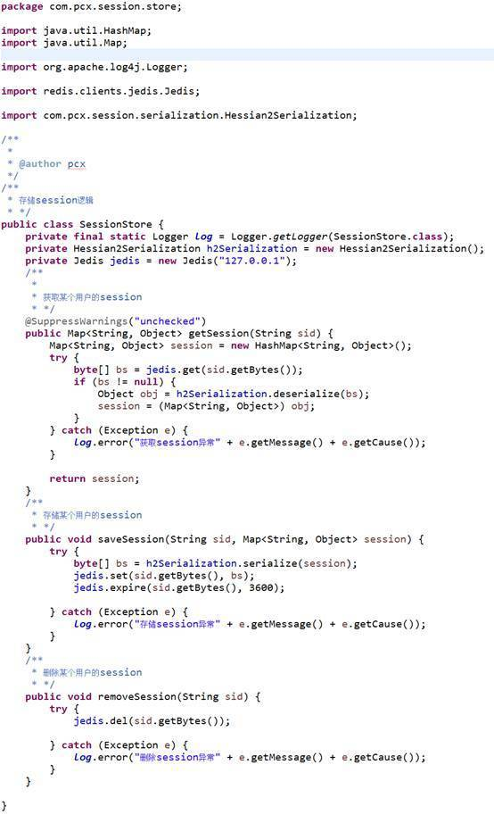

[TOC]


## 首要问题

### 1.session 是啥？

在说session是啥之前，我们先来说说为什么会出现session会话？它出现的机理是什么？
>我们知道，我们用浏览器打开一个网页，用到的是HTTP协议，学过计算机的应该都知道这个协议，它是无状态的，什么是无状态呢？就是说这一次请求和上一次请求是没有任何关系的，互不认识的，没有关联的。但是这种无状态的的好处是快速。

>所以就会带来一个问题就是，我希望几个请求的页面要有关联，比如：我在www.a.com/login.php 里面登陆了，我在www.a.com/index.php 也希望是登陆状态，但是，这是2个不同的页面，也就是2个不同的HTTP请求，这2个HTTP请求是无状态的，也就是无关联的，所以无法单纯的在index.php中读取到它在login.php中已经登陆了！

>那咋搞呢？我不可能这2个页面我都去登陆一遍吧。或者用笨方法这2个页面都去查询数据库，如果有登陆状态，就判断是登陆的了。这种查询数据库的方案虽然可行，但是每次都要去查询数据库不是个事，会造成数据库的压力。

>所以正是这种诉求，这个时候，一个新的客户端存储数据方式出现了：cookie。cookie是把少量的信息存储在用户自己的电脑上，它在一个域名下是一个全局的，只要设置它的存储路径在域名www.a.com 下 ，那么当用户用浏览器访问时，php就可以从这个域名的任意页面读取cookie中的信息。所以就很好的解决了我在www.a.com/login.php 页面登陆了，我也可以在www.a.com/index.php 获取到这个登陆信息了。同时又不用反复去查询数据库。

>我擦，终于把session是怎么诞生的给圆清楚了，不容易啊！！！

好，session 诞生了，从上面的描述来讲，它就是在一次会话中解决2次HTTP的请求的关联，让它们产生联系，让2两个页面都能读取到找个这个全局的session信息。session信息存在于服务器端，所以也就很好的解决了安全问题。

### 2.怎么保存的？

同样也是用到session_id。session_id是32位的，服务器会用 sess_前缀 + session_id 的形式存在这个临时目录下，比如上面这个例子：


所以，每一次生成的session_id都会生成一个这样的文件，用来保存这次会话的session信息。

我们往session里写入些数据，来看看session是怎么往这个文件里写数据的，我们同样在a.php页面继续加上写入session的语句：
```php
$_SESSION['hello'] = 123;

$_SESSION['word'] = 456;
```
然后，我刷新页面，由于我并没有关闭页面，就这是说这次会话还没结束，那么肯定还会是同样的session_id : bjvlo4p38cfqkr1hr7pe924ts3

然后，我们 用编辑器打开它的存储文件sess_bgg20mcl86drbt3j08jg5h5h17这个文件，看看里面是啥?

`hello|i:123;word|i:456;`

是序列化的数据，我们肉眼也能读出来。当我们往`$_SESSION`全局变量里写数据时，它会自动往这个文件里写入。读取session的时候，也会根据session_id 找到这个文件，然后读取需要的session变量。

这个sess文件不会随着客户端的PHPSESSID过期，也一起过期掉，它会一直存在，出息GC扫描到它过期或者使用session_destroy()函数摧毁，我们在下面讲到session·回收的时候会说到。

大致总结下:
`HTTP请求一个页面后，如果用到开启session，会去读cookie中的PHPSESSID是否有，如果没有，则会新生成一个session_id，先存入cookie中的PHPSESSID中，再生成一个sess_前缀文件。当有写入$_SESSION的时候，就会往sess_文件里序列化写入数据。当读取的session变量的时候，先会读取cookie中的PHPSESSID，获得session_id，然后再去找这个sess_sessionid文件，来获取对应的数据。由于默认的PHPSESSID是临时的会话，在浏览器关闭后，会消失，所以，我们重新访问的时候，会新生成session_id和sess_这个文件。`


### 3.如何运行？

既然，它也是一种服务区存储数据的方式，肯定也是存在服务器的某个地方了。确实，它存在服务器的/tmp 目录下，这一点我们接下来慢慢讲。

我们先说下它的运行机制，是怎么分配的。我们主要用PHP中session的机制，其实各种语言都差不多。

如果这个时候，我们需要用到session，那我们第一步怎么办呢？第一步是开启session：

session_start();

这是个无任何返回值的函数，既不会报错，也不会成功。它的作用是开启session，并随机生成一个唯一的32位的session_id，类似于这样：
`4c83638b3b0dbf65583181c2f89168ec`

session的全部机制也是基于这个session_id，它用来区分哪几次请求是一个人发出的。为什么要这样呢？因为HTTP是无状态无关联的，一个页面可能会被成百上千人访问，而且每个人的用户名是不一样的，那么服务器如何区分这次是小王访问的，那次是小名访问的呢？所以就有了找个唯一的session_id 来绑定一个用户。一个用户在一次会话上就是一个session_id，这样成千上万的人访问，服务器也能区分到底是谁在访问了。


## Java中接口HttpSession
- Session会话，存储在服务器端，用于在多个页面之间标识客户端，可以存储客户端信息

### HttpSession生命周期
- 创建
    + 第一次请求的时候就创建
- 销毁
    + 客户端丢失JSESSIONID, 关浏览器
    + 服务器关闭
    + 超过最大不活动时间
        1 默认是30分钟，在Tomcat/conf/web.xml中有设置
        2 可以在本项目/web.xml中自定义时间(分钟)
        3 可以通过Servlet中API设置session.setMaxInactiveInterval(seconds)
    + 手动session.invalidate()

### Session超时设置说明
 1.优先级：Servlet中API设置 > 程序/web.xml设置 > Tomcat/conf/web.xml设置
 2.若访问服务器session超时（本次访问与上次访问时间间隔大于session最大的不活动的间隔时间）了，即上次会话结束，但服务器与客户端会产生一个新的会话，之前的session里的属性值全部丢失，产生新的sesssionId
 3.客户端与服务器一次有效会话（session没有超时），每次访问sessionId相同，若代码中设置了session.setMaxInactiveInterval()值，那么这个session的最大不活动间隔时间将被修改，并被应用为新值。
 4.Session的销毁（代表会话周期的结束）：在某个请求周期内调用了Session.invalidate()方法，此请求周期结束后，session被销毁；或者是session超时后自动销毁；或者客户端关掉浏览器
 5.对于JSP，如果指定了<%@ page session="false"%>，则在JSP中无法直接访问内置的session变量，同时也不会主动创建session，因为此时JSP未自动执行request.getSession()操作获取session。


### HttpSession的跟踪机制
通过Cookie来管理，在Cookie中通过JSessionID来表示客户端

### HttpSession运行原理.
1. 当客户端浏览器访问服务器时,服务器接收请求后会判断请求中是否在Cookie包含JSESSIONID.
2. 如果包含JSESSIONID把对应值取出,做为Key从全局Map<String,Session>(把Redis当成这个大Map)对象往出取Session对象.
3. 如果有对应的key,把Session对象取出.根据自己业务添加操作.
4. 如果请求对象中JSESSIONID在全局Map<String,Session>没有或请求对象中Cookie没有JSESSSIONID ,会执行新建Session步骤
5. Tomcat会新建(new)一个Sesssion对象,同时产生一个UUID,把UUID做为Map的key,新建的Session对象做为Value,还会把UUID放入到Cookie做为value,value对应的Key是JSESSIONID


## 类Cookie

`public class Cookie extends Object implements Cloneable`

- Cookie: 它用于存储一些少量的信息，首先在Servlet中`Cookie myCookie = new Cookie();`创建，然后可以通过`rsp.addCookie(myCookie)`发送到客户端浏览器进行保存，在之后的访问服务器的过程中，浏览器会自动携带Cookie信息
- Cookie信息默认存储于浏览器内存中, 关闭浏览器或使用不同的浏览器, 均无法获取到cookie信息
- 可以通过setMaxAge(seconds)方法给Cookie设置最大存活时间。设置后，Cookie会保存到本地硬盘中，到期后自动删除。
- setMaxAge(0)会将cookie删除
- 可以通过setPath(uri)方法给Cookie设置访问路径信息，设置后，只有访问固定模式路径时，浏览器发出请求才会携带cookie信息
- 后台可以通过getCookies()方法获取cookie信息，比较方便

## 保存状态的两种方式
Cookie存储于客户端，不适合保存大量的数据，不安全，效率低
Session存储于服务器端，适合保存大量的数据，安全，效率高；
Session跟踪机制中需要cookie来保存和传递sessionId


# 分布式系统中Session到底能不能共享
>
答案一定是能。


# 重写servlet API实现分布式session共享

在使用分布式 session 前会有这样两个疑问：

## 1）为什么采用分布式 session ：
当我们的系统当中有多台服务器的时候，我们无法保证 session 在多台机器都存在，这是因为我们用户的请求不一定会被路由到同一台机器上。也就是说对应一个用户的 session 信息在服务器 A 上存在，但是在服务器 B 上不存在，因为请求被路由到了服务器 A 上，所以我们需要让集群中的多台机器共享 session信息。


## 2）为什么重写 session：
session 只能存储在本地 web服务器的内存当中，但无法满足 session 在多台服务器的分布式环境下，多台机器共享 session 数据的问题，所以我们需要重写，让它在分布式环境下，拥有 session 数据共享功能。


session配置方法
当程序需要为某个客户端的请求创建一个 session 的时候，服务器首先检查这个客户端的请求里是否包含了一个 session 标识，称为 session-id。
如果已经包含一个 session-id 则说明以前已经为此客户创建过 session，服务器就按照session-id 把这个 session 检索出来使用(如果检索不到，可能会新建一个，这种情况可能出现在服务端已经删除了该用户对应的 session 对象，但用户人为地在请求的 URL 后面附加上一个 JSESSION 的参数)。
如果客户请求不包含 session-id，则为此客户创建一个 session 并且生成一个与此 session 相关联的 session-id，这个session-id将在本次响应中返回给客户端保存。
其实分布式 session 并不是一个特别难的课题，实现的思路也有很多种。今天我将介绍一种使用起来非常简单的方法，只要做如下配置即可使用：
1 ）导入一个 jar 在 pom 文件中


2） 在 web.xml 文件中配置一个 filter


session 使用方法
分布式 session 的使用：从使用者的角度不需要知道是否为分布式 session，一句即可搞定，而且和容器无关。
为了保证读者可以理解这种方法，下面我将以最简洁的方法来实现。

## 1、 拦截器的实现
这个拦截器拦截了所有路径的客户端请求，并且在请求进去 Controller 之前把HttpServletRequest 替换成我自己实现的一个 HttpServletRequest，叫做DistributionSessionRequestWrapper


## 2、 DistributionSessionRequestWrapper 的实现



HttpServletRequestWrapper 是 HttpServletRequest 的装饰类,通过继承它，覆盖你希望改变的方法，你可以改变当前 HttpServletRequest 对象的状态。
从 session 的使用角度上来说，你只会用 getSession() 这个方法，那么我覆盖这个方法就ok了，在 getSession() 中我做了两件事：
new 了一个的 HttpSession 实现叫做 DistributionSessionImpl
在 cookie 当中写入一个叫 pcxSessionId 的 cookie 进去，实际上就和 tomcat 的 jessionid 一样，这个就是用来从分布式缓存中寻找对应 session 数据的 key。

## 3、 DistributionSessionImpl的实现


在 DistributionSessionImpl 中有两个属性比较重要
sessionMap用来存储一次请求中的 session 数据
sessionStore把用户的 session 数据存储到分布式缓存的类
getId() 方法通过这个方法可以获取用户的 cookie 中 key=pcxSessionId的value 值

getAttribute()通过key中 pcxSessionId从缓存中获取用户的 session 数据

setAttribute()如果为空的话，那么从分布式缓存中获取用户的 session 数据，当然如果这个用户是第一次访问的话，这个 sessionMap 可能还是为空，这个逻辑的话在sessionStore 有判断；把key-value数据存储到本地的sessionMap中，然后把数据推送到分布式缓存中
removeAttribute()清除本地 map 中的 Attribute 然后再把分布式缓存中的getID() 给删掉
Invalidate()先清除本地的 sessionmap 然后删除分布式缓存中的 session 数据，最后清除cookie

## 4、 SessionStore的实现



session 存储的时候使用 hession 的序列化，然后通过调用 jedis的 api 存放session 数据。这个类应该是很容易理解的，当然具体你用 redis 还是 memcached 这个随意了。

至此，一个基本的分布式 session 就实现了。

它的本质`是加一个拦截器然后把 HttpServletRequest 替换成自己定义了，然后覆盖掉 getSession 方法，最后用一个我自己定义的 HttpSession 实现来完成各种操作。`

## 总结
上述代码只是保留了最基本的实现，我们也可以继续优化封装，添加更多的功能。下面笔者以减少用户与分布式缓存机器的通信次数的优化为例，供大家参考。
从 DistributionSessionImpl 中我们可以看出，每次 setAttribute 和removeAttribute 数据都会同步到分布式缓存，这个实际上是没有必要的，虽说分布式缓存和我们的 server 虽然是在内网中通信，但是来回的次数会增加其时间损耗。
我们不能保证把一个用户的请求一直路由到同一台机器上，但是能够保证一次 request 在一台机器上，我们可以在用户的一次请求结束后把这个用户的 Session 数据同步到分布式缓存当中，以减少了与分布式缓存机器的通信次数。


