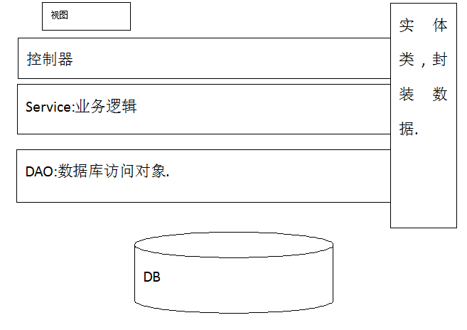
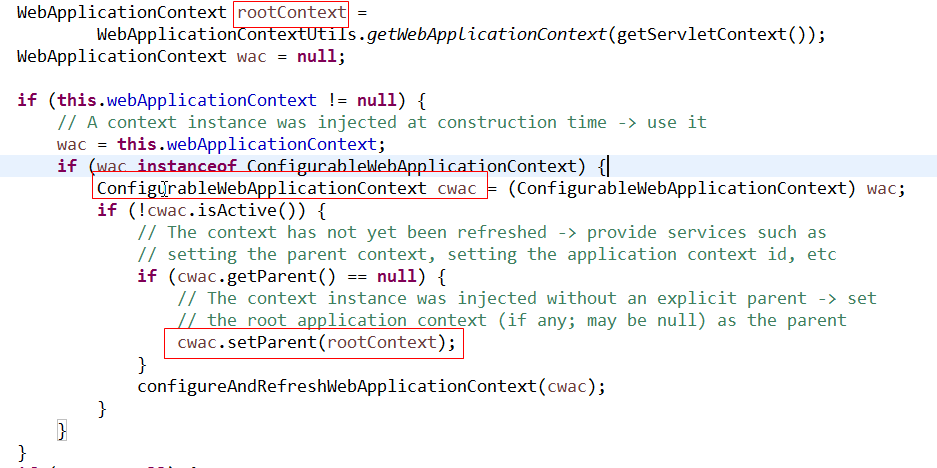
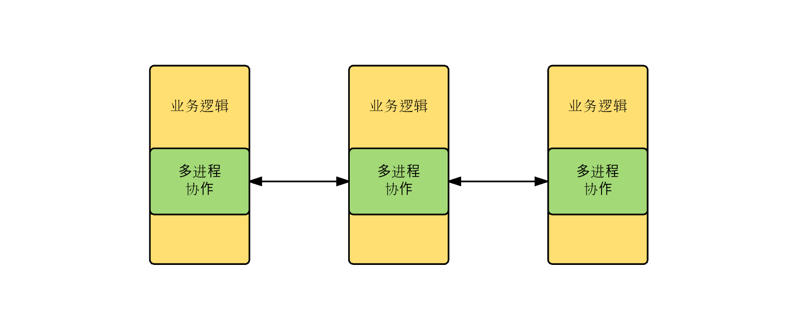
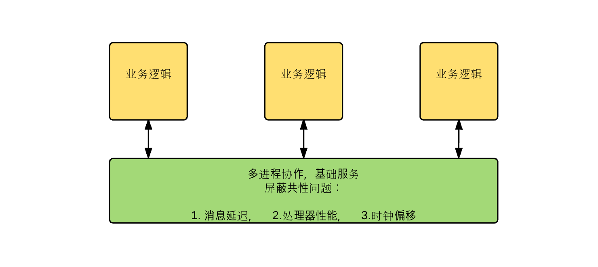
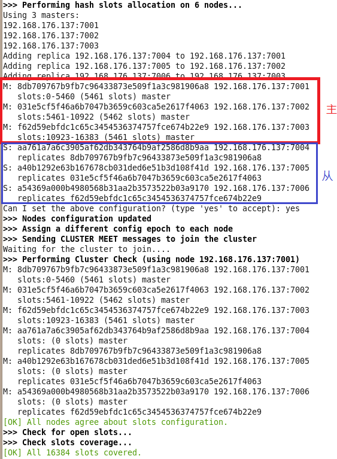
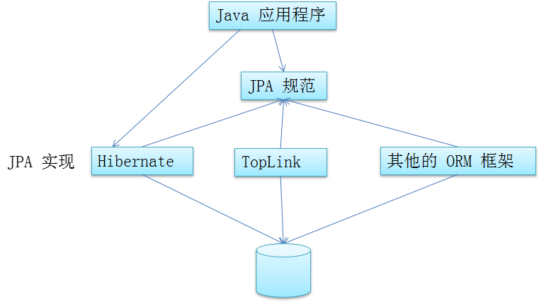

CLASSPATH
.;%JAVA_HOME%\lib


JAVA_HOME
D:\Java\jdk1.7.0_80

M2_HOME
D:\maven\maven-3.3.9


Path
G:\SXTOracle\product\11.2.0\dbhome_1\bin\;C:\Program Files (x86)\Intel\iCLS Client\;C:\Program Files\Intel\iCLS Client\;%SystemRoot%\system32;%SystemRoot%;%SystemRoot%\System32\Wbem;%SYSTEMROOT%\System32\WindowsPowerShell\v1.0\;C:\Program Files\Intel\Intel(R) Management Engine Components\DAL;C:\Program Files\Intel\Intel(R) Management Engine Components\IPT;C:\Program Files (x86)\Intel\Intel(R) Management Engine Components\DAL;C:\Program Files (x86)\Intel\Intel(R) Management Engine Components\IPT;%JAVA_HOME%\bin;%JAVA_HOME%\jre\bin;D:\mysql_5.6\bin;%GRAPHVIZ_DOT%;%GIT%;%M2_HOME%\bin

# 高级笔记

## 讲课时长
46天 (9周+1天)

## 重点文件夹
06~25

## 集成开发环境

### JDK
JDK 7
程序员的习惯：坚决使用解压版+自己配置。
`用着舒心，看着放心`


### Eclipse
mars2

### DB
MySQL  Navicat

### 其他

## 数据库SQL命令
- 创建数据库并指定编码
	+ `CREATE database ssm DEFAULT CHARACTER set utf8;`
- 创建表 
	+ `约束是保证数据完整性最后一道屏障`
	+ 备注必须写


## Eclipse 使用
Eclipse会自己默认下载所需tomcat最简结构

## 命名规范

### 项目名
没有要求

### 包
公司域名倒写

### 持久层
`mapper` dao 

### 实体
`pojo` entity  model 

### 业务逻辑
`service`

### 控制器
`servlet` controller web

### 过滤器
filter

### 异常
exception

### 监听器
listener

### 注释
- 类/方法 文档注释 /** */
- 在方法里面 //  或/* */

### 类
大驼峰

### 方法，属性
小驼峰

## MVC开发模式
### Model
实体 业务 dao

### View
JSP

### Controller控制器
servlet
- 作用：视图和逻辑分离	

### mvc使用场景
大型项目

### 图示例
- 先设计数据库 
- 先写实体类
- 持久层
- 业务逻辑
- 控制器
- 视图



## 开始编码

- 实体


### 长链接

### servlet中
重定向  防止 表单重复提交

### 页面加载完成后执行

```js
//javascript写法
window.onload=function(){}

//jQuery写法(2种)
$(function(){
	
});
//或者
$(document).ready(function(){});
```

-表单选择器
$(":text:eq(0)")  
//获取input标签type属性为text的第一个表单项

-form子标签 才有val()

## 高级分区
### ssm(Spring+SpringMVC+MyBatis) 11天+5天项目
- MyBatis 数据访问层框架
- Spring框架 IoC AOP维护对象
- SpringMVC 封装Servlet

分布式项目开发(电商Ego)6天+14天+5天

SSH框架5天

# 框架概念

## 框架是啥？
框架：软件的半成品。框架已经写了一部分功能，在提供功能基础上进行扩充，提高开发效率，

框架中一些不能封装的代码(变量)，需要使用者新建一个xml文件，在文件中添加变量内容
	+ 需要建立特定位置/名称的配置文件
	+ 需要使用xml解析技术和反射技术

类库和框架
	+ 类库：提供的类没有封装一定逻辑，理解成：`名言警句，简答题`
	+ 框架：区别于类库，有约束，理解成：`填空题` 很多人都说：框架是项目的半成品

## 为什么学习框架
帮助程序员完成的一部分内容，开发起来更加方便.

## 框架的缺点
需要学习成本
必须按照框架制定的规则

## 代码层面使用框架
编写xml配置文件
业务代码


# Mybatis

## MyBatis简介
`MyBatis改造的是DAO层`

- 原名iBatis
- 数据访问层框架 底层是对JDBC的封装
- 优点：使用MyBatis不需要写实现类，只要写SQL语句

## 环境搭建

### 导入包
asm.jar cglib依赖包
cglib.jar 动态代理包
commons-logging 日志包
javassist.jar 字节码解析包
log4j.jar 日志包
log4j-api.jar 日志包
log4j-core.jar 日志包
mybatis.jar mybatis核心包
mysql-connector-java.jar 驱动包
slf4j-api.jar 日志包
slf4j-log4j.jar 日志包

### 编写全局配置文件
- 没有名称和路径要求
- <configuration>标签
- <dataSource>标签 设置JDBC四个参数
- 配置<mappers>标签
	+ resource属性中，mapper.xml路径使用/分割

### 新建mapper包，new 实体类名+Mapper.xml
- 引入dtd
- <mapper> 标签
	+ namespace理解成实现类的全路径(包名+类名)
	+ 同一个mapper包下，不同mapper标签的namespace要唯一
- <select> 查询标签
	+ id 方法名
	+ parameterType 参数类型
	+ resultType 返回结果类型

### 使用测试类测试效果


### 使用Tomcat7新的连接池—Tomcat jdbc pool
tomcat jdbc pool 是 tomcat 的一个模块
在META-INF/下new context.xml, 配置连接池

可以在java中使用JNDI获取数据库连接池中对象


### 3种查询方式

接口SqlSession 中有三种常用的
- selectList 返回值为List<resultType属性控制>
- selectOne 返回值为Object
- selectMap 返回值为Map

常用的DefaultSqlSession implements SqlSession


### 注解的目的
简化XML开发

@interface表示注解声明
注解可以有属性，注解其实就是一个接口(类)

## 路径

### 路径分类
- 相对路径：从当前资源出发找到其他资源的过程
	+ 标志：只要不以/开头都是相对路径
- 绝对路径：从根目录(项目根目录或服务器根目录)出发找到其他资源的过程
	+ 标志: 只要以/开头的都是绝对路径

### 绝对路径
- 如果是请求转发，`/`表示项目根路径(WebContent)
- 其他重定向，静态资源引用，比如` <script> <style>, location`等 /表示服务器根路径(tomcat/webapps文件夹)

- 必须保证`js中 EL表达式  的脚本在 jsp文件中`,不能外部载入

### 控制器的路径
如果客户端请求的控制器，控制器转发到JSP后，JSP如果使用相对路径，需要按照`控制器的路径`去找其他资源

## log4j


### 使用步骤:
- 导入log4j-xxx.jar
- 在src下新建log4j.properties(路径和名称都不允许改变)
	+ ConversionPattern :写表达式
	+ log4j.appender.LOGFILE.File 文件位置及名称(日志文件扩展名.log)


### 输出级别, 目的地 (Line 1)
- fatal 致命错误，无法解决
- error 错误
- warn 警告
- info 普通信息
- debug 调试信息
 fatal(致命错误)  > error (错误) > warn (警告) > info(普通信息) > debug(调试信息)
 在log4j.properties的第一行中控制输出级别

### log4j输出目的地
5.1 在一行控制输出目的地


### pattern中常用几个表达式
6.1 %C   包名+类名
6.2%d{YYYY-MM-dd HH:mm:ss}		时间
6.3%L		行号
6.4%m   信息
6.5%n		换行

## <settings>标签
### 在mybatis全局配置文件中通过<settings>标签控制mybatis全局开关

### 在mybatis.xml中开启log4j

### log4j中可以输出指定内容的日志(控制某个局部内容的日志级别)
- 命名级别(包级别)

- 类级别
namespace属性值，namespace类名

- 方法级别
使用namespace属性值+标签id属性值


## parameterType属性

在XXXMapper.xml中<select><delete>等标签的parameterType可以控制参数类型

 SqlSession的selectList()的第二个参数
 selectOne()的第三个参数都表示方法的参数
```java
People p = session.selectOne("a.b.selById",1);
System.out.println(p);
```

### 获取参数
在Mapper.xml中可以通过#{}获取参数
- parameterType控制参数类型
- #{}获取参数内容
	+ 使用索引，从0开始` #{0}`表示第一个参数
	+ 也可以使用`#{param1}`第一个参数
	+ 如果`只有一个参数(基本数据类型或String)`,MyBatis对#{}里面内容没有要求只要写内容即可
	+ 如果参数是对象，`#{属性名}`
	+ 如果参数是map，`#{key}`

### #{} 和 ${} 的区别
- #{} 获取参数的内容支持 索引获取,param1获取指定位置参数,并且SQL使用?占位符
- ${} 字符串拼接不使用?,默认找${内容}内容的get/set方法,如果写数字,就是一个数字

### XML文件转义标签
如果在xml文件中出现 “<” , “>” ,双引号 等特殊字符时可以使用XML文件转义标签(XML自身的)
` <![CDATA[ 内容 ]]>`

### mybatis中实现mysql分页写法
- ?不允许在关键字前后进行数学运算,需要在代码中计算完成后传递到mapper.xml中


## typeAliase别名

### 系统内置别名
全部使用小写

### 给某个类起别名
<typeAliases>标签中设置
xxxMapper.xml中直接使用别名

### 某个包下所有类起别名
各个类不区分大小写

## MyBatis增删改查

### 概念复习
- 功能:从应用程序角度出发,软件具有哪些功能.
- 业务:完成功能时的逻辑.对应Service中一个方法
- 事务:从数据库角度出发,完成业务时需要执行的SQL集合,统称一个事务.
	+ 事务回滚.如果在一个事务中某个SQL执行事务,希望回归到事务的原点,保证数据库数据的完整性.

### 默认关闭JDBC的自动提交功能
`在mybatis中默认是关闭了JDBC的自动提交功能`

- 在mybatis中默认是关闭了JDBC的自动提交功能
	+ 每一个SqlSession默认都是不自动提交事务.
	+ session.commit()提交事务.
	+ openSession(true);自动提交.setAutoCommit(true);

### 事务相关
在openSession()时Mybatis会创建SqlSession时同时创建一个Transaction(事务对象),同时autoCommit都为false
- 如果出现异常,应该session.rollback()回滚事务.


### 新增


增删改 必须提交事物

实现新增的步骤
- 在mapper.xml中提供<insert>标签，没有返回值类型
- 编写代码中 session.insert("a.b.ins", peo);


## MyBatis接口绑定方案及多参数传递

### 作用
实现创建一个接口后把mapper.xml由MyBatis生成接口的实现类，调用接口对象就可以获取mapper.xml中编写的的sql
`后面mybatis和spring整合时使用的是这个方案.`

### 步骤
- 创建一个接口
	+ 接口包名和接口名与mapper.xml中<mapper>namespace相同
	+ 接口中方法名和mapper.xml中标签的id一致
- 在mybatis.xml中使用<package>标签扫描接口和mapper.xml
- 如果接口中的方法有多个参数，mapper.xml中的paramterType不写
- `如果同时写了mapper.xml和接口类，那么不再添加<mapper>标签了；如果只写了mapper.xml而没写接口类, 则必须添加<mapper>标签	`

### 多参数实现办法
在接口中声明方法
`List<Log> selByAccinAccout(String accin,String accout);`
在mapper.xml中添加
`当多参数时,不需要写parameterType `
 #{}中使用0，1，2或param1，param2，

```xml
<!-- Mapper中参数名fstart如果没加@Param，<select>中不能直接用 -->
List<Flight> selByParam(int fstart, int fend);

<!--根据参数查询-->
<select id="selByParam" resultMap="mymap" >
    SELECT f.*, a.aid, a.aname, a.acity, b.aid aid1, b.aname aname1, b.acity acity1 from flight f
    LEFT JOIN airport a ON f.fstart = a.aid
    LEFT JOIN airport b ON f.fend = b.aid
    WHERE 1=1
    <!-- OGNL表达式,直接写key或对象的属性.不需要添加任何特字符号 -->
    <if test="param1!=null and param1!=''">
        AND f.fstart = #{0}
    </if>
    <if test="param2!=null and param2!=''">
        AND f.fend = #{1}
    </if>
</select>
```

### 可以使用注解方式
在接口中声明方法

```java
	/**
	 * mybatis把参数转换为map了,其中@Param("key") 参数内容就是map的value
	 * @param accin123
	 * @param accout3454235
	 * @return
	 */
	List<Log> selByAccinAccout(@Param("accin") String accin123,   @Param("accout") String accout34568)
```
在mapper.xml中添加
 #{} 里面写@Param(“内容”)参数中内容

```xml
<select id="selByAccInAccout" resultType="Log">
	select * from log where accin=#{accin} and accout=#{accout}
</select>
```

## 动态SQL

### <set>

id=#{id} 目的防止<set>中没有内容 导致的生成SQL语句有语法错误

### <trim>

### <bind>
给参数重新赋值

场景
- 模糊查询
- 在原内容前后添加内容

### <foreach>

循环遍历内容，还具备在内容的前后添加内容，还具备添加分隔符功能

场景
- 在 in 查询中经常使用
- 批量新增中，（MyBatis中foreach效率不高）

### <sql>和<include>

某些SQL片段如果希望复用，可以使用<sql>定义这个片段

在<select> 或<delete> <insert> <update>中使用 <include>引用

```xml
<select id="">
	select <include refid="xxsql"></include>
	from log
</select>
```

### ThreadLocal

为了优化service中代码

service代码 和 servlet 中代码 在同一个线程中

MyBatisUtil
获取sqlSession 对象

OpenSessionInView


## 缓存
通常应用在查询中
让应用程序减少对数据库的访问，提高应用程序运行效率

MyBatis中默认SqlSession缓存开启

缓存的是statement对象
一个<select >对应一个 statement对象
有效范围必须是同一个SqlSession对象


### 缓存流程
- 先找缓存区是否有statement
- 返回结果
- 如果没有缓存statement ，去数据库获取statement，执行查询
- 数据库返回结果
- 把查询结果放到缓存区中

### SqlSessionFactory缓存
也叫：二级缓存

有效范围：同一个 factory内 每个SqlSession都可以获取

使用场景：当数据频繁使用，很少被修改

使用：
- 在mapper.xml中添加 <cache readOnly="true"></cache>
- 如果不写readOnly="true" 需要把实体类序列化

当SqlSession对象close()时或commit()时会把SqlSession缓存的数据刷(flush)到SqlSessionFactory缓存区中


//dom对象转换成jquery对象 $(dom对象)
为了使用 jquery的方法


## MyBatis多表查询

- resutlMap标签
- 
- 

### resutlMap标签
使用resutlMap标签  <select> 中不再使用resultType 属性

#### 单表resutlMap写法
<resutlMap>
	<id column> 主键列
	<result column=> 其他列

#### 多表resutlMap写法

- N+1查询方式  

<resutlMap id="mymap">
	<id column> 主键列
	<result column=> 其他列
	<!-- 关联一个对象 -->
	`<association property="teacher" select="...selById" column="tid"(作为参数传给另一个查询) >`
	<result column="tid" property="tid"> 必须显示装配
</resutlMap>
<select id="" resultMay="mymap"> 
</select>

在service中写的代码，现在由mapper中实现


- 联合查询方式

<resutlMap>
	<id column> 主键列
	<result column=> 其他列
	<!-- 关联一个对象 -->
	`<association property="teacher" javaType="Teacher"(java类) >`
		<id column="tid" > 主键列
		<result column="tname" > 其他列
	</association>
</resutlMap>
<select id="" resultMay="mymap"> 
</select>	

此时把association 看成一个小的<resutlMap>


- 对比
	+ N+1 多条SQL 适用：需求不确定
	+ 联合查询 适用：需求中确定查询时两个表一定都要查


- N+1 由来
	+ 缺点 效率低

	+ 优点

	+ 场景： 有的时候需要查询学生同时查询老师，有时候只需要查询学生的信息

	+ 


resultMap  查询关联集合对象 (N+1)

<resutlMap resultType="Teacher" id="mymap">
	<id column> 主键列
	<result column=> 其他列
	<!-- 关联一个对象 -->
	`<collection property="list" ofType="Student" select="...selById" column="id" >`
		<id column="tid" > 主键列
		<result column="tname" > 其他列
	</collection>
</resutlMap>	

<select id="" resultMay="mymap"> 
</select>
		


resultMap  查询关联集合对象 (联合查询方式)
不会创建重复teacher

<resutlMap resultType="Teacher" id="mymap2">
	<id column="tid" property="id"> 主键列
	<result column=> 其他列
	<!-- 关联一个对象 -->
	`<collection property="list" ofType="Student" select="...selById" column="id" >`
		<id column="tid" > 主键列
		<result column="tname" > 其他列
	</collection>
</resutlMap>
<select id="" resultMay="mymap2"> 
</select>


### Auto Mapping 结合别名实现 多表查询

只能使用联合查询

要求查询出的列名和属性名相同

别名`对象.属性名`使用 ``包裹  (集合.属性名)无法使用auto Mapping


## MyBatis 注解

注解 --->简化 mapper.xml文件
`如果涉及动态SQL依然使用mapper.xml`
`mapper.xml和注解可以共存`

使用注解时，MyBatis.xml中

```xml
<mappers>
<package class="" />
</mappers>
```

### 注解实现
@Select
实现查询
@Insert
实现新增
@Update
实现修改
@Delete
实现删除

#### 注解实现<resultMap>功能
@Results - <resultMap>
@Result  - <id>或<result>标签
@Many    - <collection>
@One     - <assioation>


## 运行原理

Resources  MyBatis I/O 流工具类 
	加载全局配置文件

SqlSesionFactoryBuilder   SqlSesionFactory构建器
	构建SqlSesionFactory接口实现类DefaultSqlSesionFactory
	

XMLConfigBuilder MyBatis全局配置文件内容构建器类
	该对象 --》解析全局配置文件流

Configuration  封装全局配置文件信息
	将该对象传递给 DefaultSqlSesionFactory，完成工厂创建

TransactionFactary  创建 Transaction对象
	SqlSesionFactory 工厂创建SqlSession

Transaction 事务类

Executor 
	+ 负责执行 SQL命令 
	+ 相当于statement或preparedStatement
	+ 默认的执行器都是SimpleExecutor


DefaultSqlSesion
	+ SqlSession的实现类
	+ 


# Spring框架

## Spring Core Container
Spring 核心容器
Spring运行必要的最基本环境
- Beans 创建并管理bean实例
- Core 核心类
- Context 上下文环境 获取外部资源或管理注解
- SpEL expression.jar


## Spring-web包
web项目使用 
Spring可以使用 普通java项目，也可以适用web项目

## Ioc(Inversion of Control)
控制反转  -----> 就是一个管理对象的事情

完成的事情，原先由程序员主动通过new实例化对象事情，转交给Spring负责

控制：控制类的对象
反转：转交给spring负责

- IoC最大的作用：解耦
	+ 程序员不需要管理对象，解除了对象管理和程序员之间的耦合

`IoC从学习开始到工作，都必须牢记`


### ApplicationContext Spring中最大的容器

applicationContext.xml 配置的信息都存储到了ApplicationContext容器中

### 配置文件

schema用于扩展功能
`配置文件中只需引入基本Schema`

通过bean创建对象

xml文件加载时 对象就创建

getBeanDefinitionNames()

getBean("<bean>标签id值", 返回值类型) 没有返回类型，则返回Object

```
<bean id class="">
	<ref 引用 balue基本数据类型或String等>
	<constractor-arg index="0" value="123" />
</bean>
```

### Spring创建对象三种方式

- 通过构造方法创建
	+ 无参构造器
	+ 有参构造器(通过index name type 确定唯一构造器)

- 实例工厂
	+ 需要实例化工厂
	+ 创建类的对象


- 静态工厂
	+ 不需要创建工厂 在工厂方法中添加static
	+ 可以快速创建对象
`<bean id="peo2" class="" factory-method="newPeople">`

### 如何给bean的属性赋值(注入)

- 设值注入 通过set方法
	+ 基本类型或String型
	+ set
	+ list
	+ array
	+ map
	+ property


## DI 依赖注入

DI 和 IoC是一样的

当一个类A中需要依赖另一个类对象B时，把另一个对象B赋值给A的过程就是依赖注入

代码体现

```xml
<bean id="peo2" class="" factory-method="newPeople">
	<property name="desk" ref="d1"></property>
</bean>
<bean id="d1" class="com.bjxt.pojo.Desk"></bean>
```

## 使用spring简化MyBatis

### jar包
导入Mybatis所有jar包，和spring的基本包
context core expression jdbc tx

### applicationContext.xml配置文件


```xml
<beans>

	<!-- 数据源封装类 ---获取数据库连接 -->
	<bean id="dataSource" class="org.spring.dataSource.DriverManager">
		<property></property>
	</bean>

	<bean id="factory" class="">
		
	</bean>

	<!-- 扫描器 相当于xml中 package标签 -->
	<bean id="factory">
		
	</bean>
</beans>
```

### spring 无法管理Servlet


# AOP
面向切面编程(Aspect Oriented Programming)

## 概念解释
正常程序执行流程都是纵向执行流程
+ 又叫面向切面编程，	在原有纵向执行流程中添加横切面
+ 不需要修改原有代码
	- 高扩展性
	- 原有功能相当于释放了部分逻辑，让职责更加明确
总结
`在程序原有纵向执行流程中，针对某一个或某一些方法添加通知，形成横切面的过程就叫做面向切面编程`


## 常用概念
- pointcut切点： 原有功能
- before advice前置增强：在切点之前执行的功能 
- after advice后置增强：在切点之后执行的功能 
- throwing advice异常增强：执行切点出现异常，
- aspect切面：所有功能总称为切面
- weaving织入： 把切面嵌入到原有功能的过程


## Spring提供了2种AOP的实现方式

### Schema-based
`必须要在Schema中引入aop命名空间`
	+ 每个通知需要实现接口或类
	+ 在applicationContext.xml配置文件配置<aop:config>中

* 通配符
匹配任意类名 任意一级包名 任意方法名
前置通知
	+ arg0： 切点方法对象Method
	+ arg1： 切点方法参数
	+ arg2： 切点所在那个类的对象

后置通知
	+ arg0： 切点方法返回值
	+ arg1： 切点方法对象Method
	+ arg2： 切点方法参数
	+ arg3： 切点所在那个类的对象

### 实现
aopaliance
aspectjweaver
新建通知类 (前置或后置都可以单独存在) 
	+ implements MethodBeforeAdvice接口
配置文件
	+ aop命名空间
	+ 配置通知类的bean
	+ 配置切面
编写测试代码


Schema-based方式 异常通知
新建一个类实现throwsAdvice接口
	+ 方法名  throwException
	+ 有1个参数或4个参数
	+ 和抛出异常类型要一致


### Aspect 
对配置文件要求严格   
	
	+ 每个通知不需要实现接口或类
	+ 在applicationContext.xml配置文件配置<aop:config>中
	的子标签<aop: aspect>中

### 实现
新建类 声明任意名称的方法
配置文件中
	+ <aop: aspect>的ref属性：方法在哪个类中
	+ <aop: xxx> 表示 哪种通知  
	+ method 当触发这个通知时，调用哪个方法
	+ throwing="e1"  异常对象名，必须和通知中方法参数名相同(可以不再通知中声明异常对象   )


### 环绕通知
Schema-based

### 和配置顺序有关

ProcessingJointPoint

	
## 使用AspectJ方式实现通知获取切点参数


### 配置spring配置文件
```xml
<aop:pointcut expression="execution(* com.bjsxt.text.Demo.demo2(String, int)) and args(name1, age1)" id="mypoint"/>
<aop:before method="mybefore" point-ref="mypoint" arg-names="name1, age1"/>
```

- <aop:after/> 后置通知  是否出现异常都执行
- <aop:after-returning/> 后置通知 当切点正常执行时 才执行
- execution()括号不能	包括args
	+ 中间使用and不能使用 && 由spring把and解析成&&
	+ args(参数名) 名称自定义的，顺序和demo1(参数，参数)对应
- <aop:before /> 中arg-names="参数名" 参数名来源于expression=""中args(), 名称必须一样
	+ args()有几个参数，arg-names里面必须有几个参数
	+ arg-names=""里面名称必须和通知方法参数名对应


## 注解实现(基于AspectJ)

### 引入 xmlns:context 命名空间
告诉Spring那些包下 可有有注解

### <bean>注解
@Component
	+ 相当于<bean/>
	+ 如果没有参数  把类名首字母小写 相当于<bean id=""/>
	+ @Component("自定义名称")

#### 过程
- 切点
	+ @Component 
	+ @Pointcut  切点方法上

- 通知类
	+ @Component 
	+ @Aspect
	+ @Before 前置通知方法上
	+ @After


# 代理设计模式

##静态代理

### 优点
保护真实的对象
使真实对象的功能更明确
扩展

### 涉及对象
- 真实对象 老总
- 代理对象 秘书
- 抽象对象（抽象功能） 谈小目标  抽象为接口

## 动态代理
目的：为了解决静态代理频繁编写代理功能方法的缺点

### JDK动态代理
重点：`完全依赖反射`

Proxy类的
Proxy.newProxyInstance(Foo.class.getClassLoader, new Class[]{Foo.class}, handler)三个参数
- 反射时使用的类加载器
- Proxy需要实现什么接口
- 通过接口对象调用方法时，需要调用哪个类的invoke方法

`Gongneng gongneng = Proxy.newProxyInstance(Laozong.class.getClassLoader, new Class[]{Gongneng}, new Mishu())`

缺点：
- 真实对象必须实现接口
- 利用反射机制，效率不高  

### cjlib动态代理

重点：`基于字节码，生成真实对象的子类`

优点：
- 运行效率高于JDK动态代理
- 不需要实现接口

## 自动注入

大前提 在Spring配置文件中对象名和ref 

### 配置文件中配置


注解扫描
属性文件加载
数据源
sqlsessionFAc
	+ 如果不使用SqlSessionFactoryBeanName属性，有可能加载不到属性文件
扫描器
声明式事务

service中注解

数据库设计：员工表 部门表
页面显示使用ajax


<bean autowire="">   autowire 设置在`被注入的对象bean`
default  走全局设置;  如果全局没有设置，则等同于no
byId
byName
no
constructor


### 加载properties文件
- 在src下新建xxx.properties文件
- 在spring配置文件中 引入xmlns:context命名空间
- <bean > 自动注入 注意点
	+ 自动注入只会影响 ref


## spring的bean作用域scope属性 有5个：
- <bean/> 标签的属性
- 作用：控制对象的作用范围(单例，多例等)
- <bean/> 标签对象默认的scope是单例

singleton 单例(默认值)，实例化只一次，每次请求都访问同一个实例
prototype 多例，每次获取重新实例化
request：每次`请求`都会产生一个新的实例，和prototype不同的是，创建以后spring依然在监听。
session：每次`会话`，同上
global session 在一个全局的HTTP Session 中，一个bean定义对应一个实例。

## 单例模式

### 懒汉式
### 饿汉式

## 事务管理

### 声明式事务属性
- name=""哪些方法需要有事务控制
	+ 支持* 通配符
- readonly="boolean" 是否是只读事务
	+ 如果为true，是只读事务 
	+ false(默认)，是可提交事务
- propagation 控制事务传播行为
	+ REQUIRED
	+ SUPPORT
	+ MANDATORY 必须在事务中执行，没有就报错
	+ REQUIRES_NEW 必须在事务中执行
	+ NOT SUPPORTED 必须在非事务下执行
	+ NEVER 必须在非事务下执行，有事务就报错
	+ NESTED 必须在事务中执行

## Spring中常用注解

@Component 创建类对象
	+ 相当于配置<bean/>

@Service 与 Component功能相同
	+ 写在ServiceImp类

@Repository
	+ 写在数据访问层类上

@Controller
	+ 写在Servlet控制器类上

@Resource JDK提供的

@AutoWired Spring提供的


## AJAX

- 标准的请求响应时浏览器的动作(同步)

- ajax异步请求
	- 局部刷新，通过异步请求，请求到服务器资源数据后，通过脚本修改页面中部分数据
- ajax由javascript推出的

### jquery中ajax分类
- 第一层
	+ $.ajax({url, [data]..}); 最完整的 最复杂的
- 第二层
	+ $.get(url, [data], [dataType], [success]);
		- 没有error功能
	+ $.post(url, [data], [dataType], [success]);
		- 没有error功能
- 第三层
	+ $.getJSON(url, [data], [success]);

	+ $.getScript(url, [data], [success]);

### JSON数据格式
- JSONObject ： json对象
	+ {"key": value, "key": value,...}
- JSONArray： json数组 []
	+ [{"key": value, "key": value,...},{}]

#### JSON解析器 jackson


type 请求方式
url 请求服务器地址
data 请求参数
contentType 
dataType 服务器返回数据类型
error：function(){ } 错误时执行的功能
succes：function(){ } 请求成功时的功能


## SpringMVC

### SpringMVC中重要组件
DispatcherServlet：前端控制器，接收所有请求(如果配置`/`不包含jsp)
HandlerMapping：解析请求格式的，判断希望要执行的哪个类的方法
HandlerAdaptor：负责调用具体的方法
ViewResolver：视图解析器，解析结果，准备跳转到具体的物理视图

### SpringMVC原理

大前提
如果在web.xml中设置Dispathcer的urlpattern为  `/`  时

当用户发起请求，请求一个控制器时，
首先会执行 DispatcherServlet ，
由DS 调用 HandlerMapping组件的DAHM解析URL，

解析URL后， 调用HandlerAdaptor组件的AMHA调用 controller中的HandlerMethod，

当HandleMethod执行完成后会返回view，
会被ViewResovler进行视图解析，
解析后调用jsp对应的.class文件并运行，
最终把运行.class文件的结果响应给客户端，

===以上就是springmvc运行原理(给面试官)


### Spring容器和SpringMVC容器的关系
Spring容器和SpringMVC容器是父子容器

SpringMVC容器能够调用Spring容器的所有资源



### 传参
- 把内容写到方法(HandlerMethod)参数中，SpringMVC只要有这个内容，注入内容

- 基本数据类型参数
	+ 默认保证参数名称和请求中传递的参数名相同
	+ 如果请求参数名和方法参数名不对应使用@RequestParam()赋值
	+ 如果方法参数是基本数据类型(不是封装类)可以通过@RequestParam设置默认值.
		- 防止没有参数时500
	+ 如果强制要求必须有某个参数`@RequestParam(required=true) String name`
- 方法(HandlerMethod)中参数是对象类型

- 请求参数中包含多个同名参数的获取方式
	+ `复选框传递的参数就是多个同名参数`

```java
@RequestMapping("demo5")
	public String demo5(String name,int age,@RequestParam("hover")List<String> abc){
		System.out.println(name+"  "+age+"  "+abc);
		return "main.jsp";
	}
//页面
 //<input type="checkbox" name="hover" value="1">1
//输出：
//www  25  [on, on]
//www  25  [2, 3]
```
- 请求参数中对象.属性格式
	+ jsp中代码
```
	<input type="text" name="peo.name"/>
	<input type="text" name="peo.age"/>
```
	+ 新建一个类
		- 对象名和参数中点前面名称对应

```java
public class Demo {
	private People peo;//还得有一个people类里面有两个属性name和age
}
```
	+ 控制器
```java
	@RequestMapping("demo6")
	public String demo6(Demo demo){
		System.out.println(demo);
		return "main.jsp";
	}
```
- restful传值方式
	+ 简化jsp中参数编写格式
	+ 在jsp中设定特定的格式
	<a href="demo8/123/abc">跳转</a>
	+ 在控制器中
		- 在@RequestMapping中一定要和请求格式对应
		- {名称} 大括号是占位符，大括号内的中名称自定义名称，可以随便取
		- @PathVariable 获取@RequestMapping中的内容,默认按照方法参数名称去寻找.

```java
	@RequestMapping("demo8/{id1}/{name}")
	public String demo8(@PathVariable String name,@PathVariable("id1") int age){
		System.out.println(name +"   "+age);
		return "/main.jsp";《绝对路径》
	}
```


### 视图解析器

#### 默认配置
在src下新建springmvc.xml没有配视图解析器使用的是默认的视图解析器

### 自定义视图解析器

不能加前缀 

#### forword:或redirect:
如果希望不执行自定义视图解析器，就在方法返回值前面添加forword：或redirect：，这样就不走配置的视图解析器，而走默认的视图解析器

```java
 @RequestMapping("demo10")
    public String demo10() {
        return "redirect:demo11";
    }
```
上面demo10的返回值前加了forword 就认为执行完demo10 后执行demo11这个方法，相当于一个servlet跳到另一个servlet


### @ResponseBody
1. 在方法上只有@RequestMapping时,无论方法返回值是什么认为需要跳转,`只有返回值类型是void才不跳转》`

2. 在方法上添加@ResponseBody(恒不跳转)
- 如果返回值满足key-value形式(对象或map)
	+ 把响应头设置为application/json;charset=utf-8
	+ 把返回值转换成json形式
	+ 把转换后的内容输出流的形式响应给客户端.
- 如果返回值不满足key-value,例如返回值为String
	+ 把相应头设置为text/html
	+ 把方法返回值以流的形式直接输出《方法返回值是什么就输出什么》.
	+ 如果返回值包含中文,出现中文乱码
		- 2.2.3.1 produces表示响应头中Content-Type取值.

```java
@RequestMapping(value="demo12",produces="text/html;charset=utf-8")
@ResponseBody
public String demo12() throws IOException{
People p = new People();
p.setAge(12);
p.setName("张三");
return "中文";
}
```

3. 底层使用Jackson进行json转换,在项目中一定要导入jackson的jar
- spring4.1.6 对jackson不支持较高版本,jackson 2.7 无效.


### 四大作用域

#### page

#### request
一次请求结束后，下一次请求重新实例化一个request对象

#### session
- 一次会话
- 只要 传递的 jsessionid不变，都是同一个session会话
- 实际有效时间
-

#### application
- 出于安全考虑，application不允许作为参数传递


### SpringMVC传值方式

#### 四大作用域原生传值方式
在handlerMethod参数中添加作用域对象

```java
public String demo1(HttpServletRequest abc,HttpSession sessionParam){
		//request作用域
		abc.setAttribute("req", "req的值");
		//session作用域
		HttpSession session = abc.getSession();
		session.setAttribute("session", "session的值");
		sessionParam.setAttribute("sessionParam", "sessionParam的值");
}
```

#### map传值
相当于把map中内容放入request作用域

#### Model传值
相当于把内容最终放入到request作用域中
model.addAttribute("model", "model的值");

#### modelAndView传值
使用SpringMVC中的ModelAndView类
mav.addObject("mav", "mav的值");


## 文件下载

访问资源时，响应头如果没有设置Content-Disposition,浏览器默认按照inline值进行处理，能显示就显示，不能就下载

设置响应流响应头信息，文件的处理方式
Content-Disposition，"attachment;fileName=bbb.txt"
获取文件路径 用完整磁盘路径、

attachment;fileName=bbb.txt


## 文件上传

encType="Multipart/form-data"  

在java中，Multipart对象名要和 <input type="upload" >name属性一致

在springmvc.xml中配置MultipartResolver 解析器

```xml
<!-- 配置MultipartResolver 解析器 -->
<bean id="MultipartResolver" class=""  >
	<property name="maxUploadSize" value="50"></property>
</bean>
```


## Spring 拦截器

定义拦截器之后就不能直接访问控制器controller中的方法了，必须先经过控制器才能进入控制器中的方法

### AOP与Filter对比

Filter拦截的是请求

AOP拦截的是特定方法前后扩充(对ServiceImpl)

Spring拦截器 只能拦截控制器controller(对controller)


- 全拦截 
- 或 只拦截特定 controller
<mvc:interceptors>  
    <!-- 使用bean定义一个Interceptor，直接定义在mvc:interceptors根下面的Interceptor将拦截所有的请求 -->  
    <bean class="com.host.app.web.interceptor.AllInterceptor"/>  
    <mvc:interceptor>  
        <mvc:mapping path="/test/number.do"/>  
        <!-- 定义在mvc:interceptor下面的表示是对特定的请求才进行拦截的 -->  
        <bean class="com.host.app.web.interceptor.LoginInterceptor"/>  
    </mvc:interceptor>  
</mvc:interceptors>  

### 实现HandlerInterceptor接口

HandlerInterceptor 接口中定义了三个方法，我们就是通过这三个方法来对用户的请求进行拦截处理的。
#### preHandle (HttpServletRequest request, HttpServletResponse response, Object handle) 方法
该方法的返回值是布尔值Boolean 类型的，当它返回为false 时，表示请求结束，后续的Interceptor 和Controller 都不会再执行；当返回值为true 时就会继续调用下一个Interceptor 的preHandle 方法，如果已经是最后一个Interceptor 的时候就会是调用当前请求的Controller 方法
#### postHandle (HttpServletRequest request, HttpServletResponse response, Object handle, ModelAndView modelAndView) 
#### afterCompletion(HttpServletRequest request, HttpServletResponse response, Object handle, Exception ex) 方法

### 拦截器栈


### SpringMVC原理

大前提
如果在web.xml中设置Dispathcer的urlpattern为  `/`  时

当用户发起请求，请求一个控制器时，
首先会执行 DispatcherServlet ，
由DS 调用 HandlerMapping组件的DAHM解析URL，

解析URL后， 调用HandlerAdaptor组件的AMHA调用 controller中的HandlerMethod，

当HandleMethod执行完成后会返回view，
会被ViewResovler进行视图解析，
解析后调用jsp对应的.class文件并运行，
最终把运行.class文件的结果响应给客户端，

===以上就是springmvc运行原理(给面试官)


## Spring+SpringMVC+MyBatis 环境搭建

### 导入jar包
WEB-INF/lib/aopalliance.jar
WEB-INF/lib/asm-3.3.1.jar
WEB-INF/lib/aspectjweaver.jar
WEB-INF/lib/cglib-2.2.2.jar
WEB-INF/lib/commons-logging-1.1.3.jar
WEB-INF/lib/jackson-annotations-2.4.0.jar
WEB-INF/lib/jackson-core-2.4.1.jar
WEB-INF/lib/jackson-databind-2.4.1.jar
WEB-INF/lib/javassist-3.17.1-GA.jar
WEB-INF/lib/jstl-1.2.jar
WEB-INF/lib/log4j-1.2.17.jar
WEB-INF/lib/log4j-api-2.0-rc1.jar
WEB-INF/lib/log4j-core-2.0-rc1.jar
WEB-INF/lib/mybatis-3.2.7.jar
WEB-INF/lib/mybatis-spring-1.2.3.jar
WEB-INF/lib/mysql-connector-java-5.1.30.jar
WEB-INF/lib/servlet-api.jar
WEB-INF/lib/slf4j-api-1.7.5.jar
WEB-INF/lib/slf4j-log4j12-1.7.5.jar
WEB-INF/lib/spring-aop-4.1.6.RELEASE.jar
WEB-INF/lib/spring-beans-4.1.6.RELEASE.jar
WEB-INF/lib/spring-context-4.1.6.RELEASE.jar
WEB-INF/lib/spring-core-4.1.6.RELEASE.jar
WEB-INF/lib/spring-expression-4.1.6.RELEASE.jar
WEB-INF/lib/spring-jdbc-4.1.6.RELEASE.jar
WEB-INF/lib/spring-tx-4.1.6.RELEASE.jar
WEB-INF/lib/spring-web-4.1.6.RELEASE.jar
WEB-INF/lib/spring-webmvc-4.1.6.RELEASE.jar
WEB-INF/lib/standard-1.1.2.jar

### 配置web.xml
`四组标签`

### 配置applicationContext.xml
`五组标签`

### 配置springmvc.xml
`七组标签`


## RBAC基本概念

RBAC 认为权限授权实际上是 Who、What、How 的问题。在 RBAC 模型中，who、what、how 构成了访问权限三元组,也就是“Who 对 What(Which)进行 How 的操作”

- Who：权限的拥有者或主体(如Principal, User, Group, Role, Actor等等)
- What：权限针对的对象或资源
- How：具体的权限(Privilege，正向授权与负向授权)。
- Operator：操作。表明对what的How操作。


### 使用RBAC思想设计用户--菜单表关系

#### RBAC1.0
经典版
SupermeMng使用 

#### RBAC2.0
超大项目


## 项目教训


### 表设计放首位


### 调试错误

- service实现类组件必须要写@Service注解

- Spring内置字符编码过滤器只能设置POST请求的`请求实体`的编码格式,对GET请求无效

- .html属于静态资源，DispatcherServlet会拦截静态资源，浏览器显示错误404, 在springmvc.xml中添加放行
    <mvc:resources mapping="/rsxz/**" location="/rsxz/"></mvc:resources>
    <mvc:resources mapping="/task/**" location="/task/"></mvc:resources>
    <mvc:resources mapping="/xtsz/**" location="/xtsz/"></mvc:resources>


## Maven

### Maven项目目录结构(jar类型)
- src/main/java真实目录的快捷目录,写java代码
- src/main/resources 快捷目录
	+ 存放配置文件.
	+ 虽然看见resources但是里面所有配置文件最终会被编译放入到classes类路径.
- src/test/java 写测试java代码
- src/text/resources 测试的配置文件夹
- pom.xml maven的配置文件
	+ 当前项目所依赖的其他项目或jar或插件等

 pom.xml maven的配置文件

### Maven项目之间的关系

- 依赖关系
	+ 标签<dependency>把另一个项目的jar引入到当过前项目
	+ 自动下载另一个项目所依赖的其他项目

- 继承关系
- 聚合关系

### Maven私服使用办法

前提:已经配置JDK环境变量

1. 把压缩包解压到任意非中文目录中

2. 根据自己的系统选择对应的版本
D:\nexus\soft\nexus-2.12.0-01\bin\jsw

3. 运行install-nexus.bat 在系统中注册服务

4. 注册后可以通过start-nexus.bat/stop-nexus.bat 开启服务和关闭服务
也可以在系统服务中开启关闭服务

	4.1 uninstall-nexus.bat 表示卸载服务

5. 在浏览器输入   http://localhost:8081/nexus 进入主界面

6. 在主界面右上角log in 进行登录,默认用户名和密码是 
	用户名:admin
	密码:admin123


### POM.xml

#### 资源拷贝插件
```xml
<!-- 资源拷贝插件配置 -->
<resources>
    <resource>
        <directory>src/main/java</directory>
        <includes>
            <include>**/*.xml</include>
        </includes>
    </resource>
    <resource>
        <directory>src/main/resources</directory>
        <includes>
            <include>**/*.xml</include>
            <include>**/*.properties</include>
        </includes>
    </resource>
</resources>
```

## Dubbo
是一个分布式，高性能，透明化的RPC服务框架


Provider 提供者，服务发布方
Container Dubbo容器,依赖spring容器
Consumer 消费者，调用服务方
Registry 注册中心，当Container启动时把所有可以提供的服务列表上Registry中进行注册
Monitor 监听器


#### 注册中心
一定先要启动注册中心

- Zookeeper
	+ 支持网络集群
	+ 稳定性受限于zookeeper
- Redis
	+内存型数据库

#### 为什么有 ZooKeeper
一个应用程序，涉及多个进程协作时，业务逻辑代码中混杂有大量复杂的进程协作逻辑。

上述多进程协作逻辑，有2个特点：

- 处理复杂
- 处理逻辑可重用

因此，考虑将多进程协作的共性问题拎出，作为基础设施，让 RD 更加专注业务逻辑开发，即：


ZooKeeper 就是上述多进程协作基础服务的一种。

#### Dubbo协议

- 采用NIO复用单一长链接，使用线程池进行处理
- 大文件传输 可能出现问题


### Dubbo中provider

### Dubbo中管理界面

### Dubbo中consumer搭建过程

#### menu项目架构

menu-parent

menu-pojo

menu-service依赖pojo

menu-dubbo(服务实现)依赖service
menu-management(后台)依赖service
menu-portal(前台)依赖service


## VSFTPD

## NGINX


## Redis
五种数据类型
String(字符串)
List(列表)
Hash(字典)
Set(集合)
Sorted Set(有序集合)

### Redis的持久化
RDB 和 AOF
RDB持久化是指在指定的时间间隔内将内存中的数据集快照写入磁盘。
AOF是指redis会将每一个收到的写命令都通过write函数追加到文件中(默认是 appendonly.aof)。

### 配置Redis集群
使用“主-从模式”


注意：配置好后 在iptables中放行端口，并重启iptables服务

#### Redis集群步骤
1.`# yum install ruby -y`
1.1 后面需要用到ruby脚本
2.`# yum install rubygems -y`
1.1 安装ruby包管理器
3.`# gem install redis-3.0.0.gem`
3.1 脚本需要ruby其他包,所以安装这个redis.gem
4.`# mkdir reids-cluster`
4.1 在/usr/local中新建redis-cluster文件夹
5.`# cp -r bin ../redis-cluster/redis01`
5.1 把之前安装好的redis/bin复制到redis-cluster中并起名为redis01
6.`# rm -rf dump.rdb`
6.1 删除掉redis01 中dump.rdb数据库文件
7.`# vi redis.conf` 
7.1 修改redis01中端口号为7001, 找到port 后面修改为7001
7.2 去掉cluster-enabled yes前面的注释
7.3 如果之前设置过密码,注释掉密码.如果没有设置过过略7.3这步骤
8.# 
```shell
cp -r redis01 redis02
cp -r redis01 redis03
cp -r redis01 redis04
cp -r redis01 redis05
cp -r redis01 redis06
```
8.1 把redis01文件夹在复制5份,分别起名为redis02,redis03,redis04,redis05,redis06
9`# vi redis02/redis.conf`
9.1 此命令需要在redis-cluster下执行
9.2 把其他5个文件夹中redis.conf中port修改成不同的值,分别为7002,7003,7004,7005,7006
10.`# cp *.rb /usr/local/redis-cluster/`
10.1 去redis解压目录中src下执行此命令
10.2 把redis-trib.rb复制到reids-cluster中.
11.`# vi startall.sh`
11.1 创建一个批量启动文件
11.2 把下面内容粘贴到文件中
```shell
      cd redis01
      ./redis-server redis.conf
      cd .. 
      cd redis02
      ./redis-server redis.conf
      cd .. 
      cd redis03
      ./redis-server redis.conf
      cd .. 
      cd redis04
      ./redis-server redis.conf
      cd .. 
      cd redis05
      ./redis-server redis.conf
      cd .. 
      cd redis06
      ./redis-server redis.conf
      cd .. 
```
12.`# chmod +x startall.sh`
12.1 给脚本设置一个可启动权限
13.`# ./startall.sh`
13.1 执行脚本,启动所有redis服务
14.# ps aux|grep redis
14.1 查看所有服务是否启动成功

15.`# ./redis-trib.rb create --replicas 1 192.168.192.130:7001 192.168.192.130:7002 192.168.192.130:7003 192.168.192.130:7004 192.168.192.130:7005  192.168.192.130:7006`
15.1 创建集群
15.2 在执行时按照提示输入’yes’
16.`# ./redis01/redis-cli -h 192.168.10.128 -p 7001 -c`
16.1 进入任意节点测试

17.`# redis01/redis-cli -p 7001 shutdown`
17.1 关闭其中一个redis

18.# vi shutdown.sh
18.1 在redis-cluster中创建文件,并添加下面内容
```shell
      ./redis01/redis-cli -p 7001 shutdown
      ./redis02/redis-cli -p 7002 shutdown
      ./redis03/redis-cli -p 7003 shutdown
      ./redis04/redis-cli -p 7004 shutdown
      ./redis05/redis-cli -p 7005 shutdown
      ./redis06/redis-cli -p 7006 shutdown
```


### Jedis
Jedis是一个Redis的客户端工具jar

### 使用JUnit4测试Jedis工具
- 引用依赖Junit4
- 引用依赖Jedis


### 系统类别
crm客户关系管理系统


# JPA

## JPA概念
JPA是Java Persistence API的简称，中文名Java持久层API，是JDK 5.0注解或XML描述对象－关系表的映射关系，并将运行期的实体对象持久化到数据库中。

## JPA实现

Hibernate, TopLink, 其他的ORM框架

# Hibernate

## Hibernate与Jpa的关系

直到我现在在新公司，做项目要用到Hibernate。
我想抛开jpa，直接使用hibernate的注解来定义Model，很快发现了几个问题：
- jpa中有Entity, Table，hibernate中也有，但是内容不同
- jpa中有Column,OneToMany等，Hibernate中没有，也没有替代品
我原以为hibernate对jpa的支持，是另提供了一套专用于jpa的注解，但现在看起来似乎不是。一些重要的注解如Column, OneToMany等，hibernate没有提供，这说明jpa的注解已经是hibernate的核心，hibernate只提供了一些补充，而不是两 套注解。要是这样，hibernate对jpa的支持还真够足量，我们要使用hibernate注解就必定要使用jpa。

第一个是问如果想用hibernate注解，是不是一定会用到jpa的。网友的回答：“是。如果hibernate认为jpa的注解够用，就直接用。否则会弄一个自己的出来作为补充”
第二个是问，jpa和hibernate都提供了Entity，我们应该用哪个，还是说可以两个一起用？网友回答说“Hibernate的Entity是继承了jpa的，所以如果觉得jpa的不够用，直接使用hibernate的即可”。

## Hibernate注解主键生成策略

### @GeneratedValue --> JPA通用策略生成器 。
JPA提供的四种标准用法为TABLE,SEQUENCE,IDENTITY,AUTO. 

TABLE：使用一个特定的数据库表格来保存主键。 

SEQUENCE：根据底层数据库的序列来生成主键，条件是数据库支持序列。 
```java
@Id  
@GeneratedValue(strategy = GenerationType.SEQUENCE,generator="payablemoney_seq")  
@SequenceGenerator(name="payablemoney_seq", sequenceName="seq_payment")  
```

IDENTITY：主键由数据库自动生成（主要是自动增长型） 
```java
@Id  
@GeneratedValue(strategy = GenerationType.IDENTITY)  
```

AUTO：主键由程序控制。 　
```java
@Id  
@GeneratedValue(strategy = GenerationType.AUTO) 
```

###　@GenericGenerator --> Hibernate主键策略生成器 
@GenericGenerator注解配合@GeneratedValue一起使用，@GeneratedValue注解中的"generator"属性要与@GenericGenerator注解中name属性一致,strategy属性表示hibernate的主键生成策略 
```java
@Id
@GeneratedValue(generator="increment")
@GenericGenerator(name="increment", strategy = "increment")
```

native: 对于 oracle 采用 Sequence 方式，对于MySQL 和 SQL Server 采用identity（自增主键生成机制），native就是将主键的生成工作交由数据库完成，hibernate不管（很常用）。 
```java
@GeneratedValue(generator = "xxx")    
@GenericGenerator(name = "xxx", strategy = "native")   
```

uuid: 采用128位的uuid算法生成主键，uuid被编码为一个32位16进制数字的字符串。占用空间大（字符串类型）。 
```java
@GeneratedValue(generator = "xxx")    
@GenericGenerator(name = "xxx", strategy = "uuid")
```

hilo: 使用hilo生成策略，要在数据库中建立一张额外的表，默认表名为hibernate_unique_key,默认字段为integer类型，名称是next_hi（比较少用）。 
```java
@GeneratedValue(generator = "xxx")    
@GenericGenerator(name = "xxx", strategy = "hilo")   
```

assigned: 在插入数据的时候主键由程序处理（很常用），这是 `<generator>`元素没有指定时的默认生成策略。等同于JPA中的AUTO。 
```java
@GeneratedValue(generator = "xxx")    
@GenericGenerator(name = "xxx", strategy = "assigned ")   
```

identity: 使用SQL Server 和 MySQL 的自增字段，这个方法不能放到 Oracle 中，Oracle 不支持自增字段，要设定sequence（MySQL 和 SQL Server 中很常用）; 等同于JPA中的INDENTITY。 
```java
@GeneratedValue(generator = "xxx")    
@GenericGenerator(name = "xxx", strategy = "identity ") 
```

sequence: 调用底层数据库的序列来生成主键，要设定序列名，不然hibernate无法找到。 
```java
@GeneratedValue(generator = "xxx")
@GenericGenerator(name = "xxx", strategy = "sequence", parameters = { @Parameter(name = "sequence", value = "底层数据库sequenceName") }) 
```

increment: 插入数据的时候hibernate会给主键添加一个自增的主键，但是一个hibernate实例就维护一个计数器，所以在多个实例运行的时候不能使用这个方法。 

```java
@GeneratedValue(generator = "xxx")    
@GenericGenerator(name = "xxx", strategy = "increment")   
```

guid: 采用数据库底层的guid算法机制，对应MYSQL的uuid()函数，SQL Server的newid()函数，ORACLE的rawtohex(sys_guid())函数等。 
```java
@GeneratedValue(generator = "xxx")    
@GenericGenerator(name = "xxx", strategy = "guid")   
```

uuid.hex: 看uuid，建议用uuid替换。 
```java
@GeneratedValue(generator = "xxx")    
@GenericGenerator(name = "xxx", strategy = "uuid.hex")   
```

## Hibernate entity使用sequence方式时，id增量50且与sequence值不一致的问题
```java
@Table(name = "t_user")  
@SequenceGenerator(name="userid_seq",sequenceName="SEQ_userid")
public class Content {
    @Id
    @GeneratedValue(strategy=GenerationType.SEQUENCE,generator="userid_seq")
    private int userid;
}
```

1，这是其中一个实体类，我使用的Oracle的数据库，主键采用oracle的序列，但是问题来了，我发现我的id增长不是以1递增，而是以50递增的，当时我就很纳闷了，后面我就上网查，原来也有人遇到了这个问题，原来是少了`allocationSize=1` 这个，原来JPA默认的递增大小是50。同时initialValue默认为0，一般都是设置为initialValue=1 修改后的如下所示：
`@SequenceGenerator(name="userid_seq",allocationSize=1,initialValue=1, sequenceName="SEQ_userid")`

2，还有一个要注意问题：注解到底是写在 get方法上，还是写在属性上，这个一定要统一，千万不能混淆使用，我`推荐写在getter方法上`。

## HibernateTemplate
HibernateTemplate是Spring提供的一个就Hibernate访问持久层技术而言、支持Dao组件的一个工具。HibernateTemplate提供持久层访问模板，应用HibernateTemplate无须实现特定的接口，它只需要提供一个sessionFactory的引用就可以执行持久化操作。


# Struts2
Struts2 本质就是xwork2.3版本
Strut 和 Struts2 完全没有继承关系，底层原理也不同

## 


