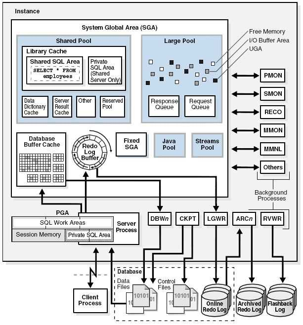

[TOC]

# Oracle安装

## 主目录
G:\SXTOracle

## 服务名
通常是全局数据库名

## Oracle实例是什么
(内存结构+一系列进程结构)
安装好oracle后，需要配置一个数据库，数据库是静态的，具体就是存储在硬盘的一系列文件；启动数据库即启动一个实例，就是运行起来的一系列管理数据库的后台进程和内存区域


## ERROR

### ORA-12560 TNS服务未启动

### ORA-00937 不是单组分组函数


### sql Developer设置java.exe
product/11.2.0/dbhome_1/jdk/bin/java.exe

## 监听问题
默认监听TCP端口1521
G:\SXTOracle\product\11.2.0\dbhome_1\network\admin\listener.ora
`注意：LISTENER中的host最好设置为主机名(HOST = Basketball)，使用localhost可能会在以后出问题`

## 监听程序/本地网络服务名配置
NetConfigurationAssistant官方工具
配置作用会作用到listener.ora和tnsnames.ora文件中

## jar包
就是一个项目(ZIP压缩)

## 各种账户默认密码
sys/change_on_install
system/manager
scott/tiger

## Oracle客户端字符集设置

### 检查编码
```sql
-- Oracle 版本查看
select * from v$version;
-- 检查数据库服务器编码
select * from nls_database_parameters where parameter ='NLS_CHARACTERSET';
-- 检查oracle客户端编码
select * from nls_instance_parameters where parameter='NLS_LANGUAGE';
```
oracle客户端在获取字符集设置信息时的优先级顺序依次为：session、环境变量、注册表、参数文件，因此可以通过设置这些位置实现客户端字符集设置的目的，因此本文采用设置session的方法，设置NLS_LANG变量值，从而覆盖所有设置值

# SQL

## SQL语言的分类
- DQL(数据查询语言)
select(最重要的SQL语句)

- DML(数据操作语言)
针对表中的数据，
insert update delete

- DDL(数据定义语言)
针对数据库对象 (用户，角色，表，索引，视图，触发器，存储过程，函数，表空间)
creat alter drop

- DCL(数据控制语言)
grant revoke

## 问题：int(3) 和 int(11) 有什么区别？


## where子句

### and 比 or 的优先级高

## 字符函数
`TO_CHAR( value [, format_mask] [, nls_language] )`

- value
A number or date that will be converted to a string.
- format_mask
Optional. This is the format that will be used to convert value to a string.
- nls_language
Optional. This is the nls language used to convert value to a string.

### with Numbers
```
TO_CHAR(1210.73, '9999.9')
Result: ' 1210.7'

TO_CHAR(-1210.73, '9999.9')
Result: '-1210.7'

TO_CHAR(1210.73, '9,999.99')
Result: ' 1,210.73'

TO_CHAR(1210.73, '$9,999.00')
Result: ' $1,210.73'

TO_CHAR(21, '000099')
Result: ' 000021'
```

### with Dates
Parameter|	Explanation
-|-
YEAR|	Year, spelled out
YYYY|	4-digit year
YYY|	Last 3, 2, or 1 digit(s) of year.
YY|
Y|
IYY|	Last 3, 2, or 1 digit(s) of ISO year.
IY|
I|
IYYY|	4-digit year based on the ISO standard
Q|	Quarter of year (1, 2, 3, 4; JAN-MAR = 1).
MM|	Month (01-12; JAN = 01).
MON|	Abbreviated name of month.
MONTH|	Name of month, padded with blanks to length of 9 characters.
RM|	Roman numeral month (I-XII; JAN = I).
WW|	Week of year (1-53) where week 1 starts on the first day of the year and continues to the seventh day of the year.
W|	Week of month (1-5) where week 1 starts on the first day of the month and ends on the seventh.
IW|	Week of year (1-52 or 1-53) based on the ISO standard.
D|	Day of week (1-7).
DAY|	Name of day.
DD|	Day of month (1-31).
DDD|	Day of year (1-366).
DY|	Abbreviated name of day.
J|	Julian day; the number of days since January 1, 4712 BC.
HH|	Hour of day (1-12).
HH12|	Hour of day (1-12).
HH24|	Hour of day (0-23).
MI|	Minute (0-59).
SS|	Second (0-59).
SSSSS|	Seconds past midnight (0-86399).
FF|	Fractional seconds.

```
TO_CHAR(sysdate, 'yyyy/mm/dd')
Result: '2003/07/09'

TO_CHAR(sysdate, 'Month DD, YYYY')
Result: 'July 09, 2003'

--You will notice that in some TO_CHAR function examples, the format_mask parameter begins with "FM".
--This means that zeros and blanks are suppressed. This can be seen in the examples below.
TO_CHAR(sysdate, 'FMMonth DD, YYYY')
Result: 'July 9, 2003'

TO_CHAR(sysdate, 'MON DDth, YYYY')
Result: 'JUL 09TH, 2003'

TO_CHAR(sysdate, 'FMMON DDth, YYYY')
Result: 'JUL 9TH, 2003'
```


## 数值函数

## 日期函数
to_date()函数
`SELECT to_date('17-07-2017', 'dd-MM-yyyy') FROM dual;`

Oracle 中有两种主要日期与时间类型，DATE 以及 TIMESTAMP。
DATE: 仅存 年 月 日
TIMESTAMP: 保存 年 月 日 时 分 秒 纳秒

## 转换函数


## 控制流函数
### NVL函数
NVL函数　Oracle/PLSQL中的一个函数。
格式为：
`NVL( string1, replace_with)`
功能：如果string1为NULL，则NVL函数返回replace_with的值，否则返回string1的值。
注意事项：string1和replace_with必须为同一数据类型，除非显示的使用TO_CHAR函数。
例：NVL(TO_CHAR(numeric_column), 'some string') 其中numeric_column代指某个数字类型的值。
例：nvl(yanlei777,0) > 0
NVL(yanlei777, 0) 的意思是 如果 yanlei777 是NULL， 则取 0值


## 多行函数(分组函数)(给好多行记录只会产生一行输出)
“所有的雇员中平均工资多少，最高工资多少。。。”
-- [1]sum 求和
-- [2]avg 求平均值
-- [3]count 计数
-- [4]max 求最大值
-- [5]min 求最小值

--统计
select sum(sal), avg(sal), count(empno) from emp;

-- 多行函数可以操作什么类型的数据?
-- 只能操作数值
`select sum(sal) from emp;`正常
`select avg(ename) from emp;`报错

-- 所有类型都能操作
`select count(ename) from emp;`
`select max(ename), min(hiredate) from emp`

--多行函数不能和普通字段同时查询
`SELECT  deptno, sum(sal), avg(sal), max(sal) from emp where deptno=10;`
报错 ORA-00937: 不是单组分组函数
很好理解：你既然指定了分组函数，又同时制定了其他列，还想不按照指定的列来分组，你到底想让oracle怎么做呢？这根本就得不出结果。就像你需要统计班上男女生的人数，但是又不能分组，只能在一条数据里表示出来，怎么能办得到呢？
`select deptno from emp where deptno=10;`正常

--计算所有员工的平均工资
`SELECT  avg(sal), max(sal) from emp ;`

--统计每个部门的总工资，总人数，平均工资 排除 部门10
-- where 子句要写在 group by之前  先过滤再分组
`select deptno, sum(sal), count(*), avg(sal) from emp where deptno<>10 group by deptno order by deptno;`

## SQL中group by的用法

### 概述
“Group By”从字面意义上理解就是根据“By”指定的规则对数据进行分组，所谓的分组就是将一个“数据集”划分成若干个“小区域”，然后针对若干个“小区域”进行数据处理。

### group by中的易错点
使用了group by子句后， select列表中的字段如果不在分组函数中，就必须要出现在group by子句中
`原因：MAX(sal)返回的一定是单个数值，但是拿到该数值工资的人数可能有多个，无法和Max(sal)返回的单一值组成ResultSet`

常见的分组函数如下表：
函数  作用  支持性
sum(列名) 求和  　　　　
max(列名) 最大值 　　　　
min(列名) 最小值 　　　　
avg(列名) 平均值 　　　　
first(列名) 第一条记录 仅Access支持
last(列名)  最后一条记录  仅Access支持
count(列名) 统计记录数 注意和count(`*`)的区别
示例5：求各组平均值
`select 类别, avg(数量) AS 平均值 from A group by 类别;`

示例6：求各组记录数目
`select 类别, count(*) AS 记录数 from A group by 类别;`

## SQL执行顺序
from 取数据
where 过滤数据
groupby 进行分组
having 对分组进行限制
select 查具体字段
orderby 最后的结果进行排序

综合练习
```
--对薪水>1200的员工，按deptno分组，分组后平均薪水>1500
--查询--->分组内的平均工资，按照工资的倒序进行排序
  SELECT deptno, AVG(sal) avgSal
  FROM emp 
  WHERE sal>1200 
  GROUP BY deptno 
  HAVING AVG(sal)>1500
  ORDER BY avgSal DESC;
```

## SQL JOINS


left join 和 right join

A表left join B表 等价于 B表 right join A表

inner join 
规律：
A表inner join B表：则返回A表和B表同时符合条件的记录。
```
两种写法，后者使用的居多

SELECT `user`.`name`,`user`.mobile,`order`.order_id,`order`.`status`,`order`.amout
 FROM `order` INNER JOIN `user` ON `user`.uid=`order`.uid;

等价于

SELECT `user`.`name`,`user`.mobile,`order`.order_id,`order`.`status`,`order`.amout
 FROM `order`,`user` WHERE `user`.uid=`order`.uid;
```

	

## SQL92版

### 等值连接
当被连接的多个表中存在同名字段时，须在该字段前加上"表名."前缀
可使用AND 操作符增加查询条件；
使用表别名可以简化查询
使用表名（表别名）前缀可提高查询效率；

### 非等值连接
```
查询员工的工资等级

select  empno,ename,job,sal,grade 
from emp e,salgrade s
where e.sal<s.hisal and e.sal>s.losal;
```
例子：
```
--查询20部门员工姓名，入职日期，薪水和薪水等级
SELECT *
FROM emp e, salgrade s
WHERE e.sal BETWEEN s.losal AND s.hisal--关联条件
AND e.deptno=20;--过滤条件
```

### 左外连接
左外连接显示左边表的全部行
SELECT	table.column, table.column
FROM		table1, table2
WHERE	table1.column = table2.column(+);

### 右外连接
右外连接显示右边表的全部行
SELECT	table.column, table.column
FROM		table1, table2
WHERE	table1.column(+) = table2.column;

## 自连接
将一个表当两个表使用
例子：
```
--查询所有员工的编号，姓名以及领导的编号和姓名
SELECT e1.empno, e1.ename, e1.mgr, e2.ename 
FROM emp e1, emp e2
WHERE e1.mgr=e2.empno
ORDER BY e1.empno;
```
### 缺点
语句过滤条件和表连接的条件都放到了where子句中
当条件过多时，连接条件多，过滤条件多时，就容易造成混淆。

SQL99修正了这个缺点，把连接条件，过滤条件分开来，包括以下新的TABLE JOIN 的句法结构：
交叉连接（Cross join）
自然连接（Natural join）
使用Using子句建立连接
使用On子句建立连接
外连接（ Outer join ）
 左外连接
 右外连接
 全外连接

内链接 在SQL99规范中，内连接只返回满足连接条件的数据

## SQL99 

### 特点
SQL99等值连接（连接条件写在ON子句中，where子句中只放过滤条件）

###多表连接查询

```
--[1]交叉连接：CROSS JOIN 作用实际是SQL92中的笛卡儿积
SELECT * FROM emp, dept;
SELECT * FROM emp CROSS JOIN dept;

--[2]自然连接：NATURAL JOIN 作用就是按照两表所有【同名字段】进行等值连接
-- 在自然链接中，同名字段不能用表（表别名）前缀修饰

SELECT * FROM emp NATURAL JOIN dept;

SELECT * FROM emp, dept WHERE emp.deptno=dept.deptno;
```

## SQL99和SQL92对比
```
--92emp表和dept表做笛卡尔乘积
SELECT * FROM emp, dept;

--99emp表和dept表连接做笛卡尔乘积
SELECT * FROM emp cross JOIN dept;

--SQL92等值连接
SELECT * FROM emp, dept WHERE emp.deptno=dept.deptno;

--SQL99等值连接（连接条件写在ON子句中，where子句中只放过滤条件）
SELECT * FROM emp JOIN dept ON (emp.deptno=dept.deptno);

--SQL99 非等值连接
SELECT ename, empno, grade
FROM emp e JOIN salgrade s ON (e.sal BETWEEN s.losal AND s.hisal);

--SQL99三表连接
SELECT ename, empno, grade 
FROM emp e JOIN dept d ON (e.deptno=d.deptno)
JOIN salgrade s ON (e.sal BETWE EN s.losal AND s.hisal)
WHERE ename NOT LIKE '_A%';

--SQL99自连接
SELECT a.ename, b.ename
FROM emp a JOIN emp b ON a.mgr=b.empno;

--SQL99左外连接
--(会把左边那张表的多余的数据(不能和另外表连接的数据)也拿出来)
SELECT a.ename, b.ename
FROM emp a LEFT JOIN emp b ON a.mgr=b.empno;

SELECT * FROM dept; 

--SQL99右外连接
SELECT a.ename, b.deptno, b.dname
FROM emp a RIGHT JOIN dept b ON (a.deptno=b.deptno);
```

## 子查询
```
SELECT empno,ename,sal 
FROM emp 
WHERE sal>(SELECT AVG(sal) FROM emp);

```

## 特点
子查询在主查询前执行一次
主查询使用子查询的结果

## 单行子查询
单行子查询只返回一行记录
对单行子查询可使用[单行记录比较运算符]
```
--查询工资比所有"SALESMAN"的最高工资更高的雇员信息
--单行子查询
SELECT empno,ename,sal
FROM emp
WHERE sal>(SELECT MAX(sal) FROM emp WHERE job='SALESMAN')
```

## 多行子查询
多行子查询返回多行记录
对多行子查询只能使用[多行记录比较运算符]
ALL 和子查询返回的所有值比较
ANY 和子查询返回的任意一个值比较
IN 等于列表中的任何一个

```
--查询工资比所有"SALESMAN"的最高工资更高的雇员信息
--多行子查询
SELECT empno,ename,sal
FROM emp
WHERE sal>ALL(SELECT sal FROM emp WHERE job='SALESMAN')
```

## 模糊查询
like ‘%ALL%’ 包含字符ALL
like '_A%' 第二个字符是A

## 表约束

### 主键约束 primary key
要求主键列数据唯一，并且不允许为空。主键可以包含表的一列或多列，如果包含表的多列，则需要在表级定义
```
--创建学生表
CREATE TABLE student(
`--sno NUMBER(3) CONSTRAINT pk_student PRIMARY KEY, --在列级别定义主键约束` 
--在表级别定义主键约束
--定义主键约束
`--CONSTRAINT pk_student PRIMARY KEY (sno)`
--PRIMARY KEY (sno) --简化版
);
```

### 唯一约束 unique key
要求该列唯一，允许为空

邮箱地址使用 唯一约束

表级别 定义 唯一约束
`CONSTRAINT uk_student_email UNIQUE(email)`


### 非空约束 not null

`sname VARCHAR2(15) CONSTRAINT nn_student_sname NOT NULL,--非空约束只能在字段级别添加`


### 检查约束

--表级别 定义 检查约束
`CONSTRAINT ck_student_age CHECK(age BETWEEN 18 AND 30)`


### 外键约束
```
--创建学生表
CREATE TABLE student(
      
   --表级别 定义 外键约束
   CONSTRAINT fk_student_cno FOREIGN KEY(cno) REFERENCES clazz(cno)
);
```

对于主表的删除和修改主键值的操作，会对依赖关系产生影响，以删除为例：当要删除主表的某个记录（即删除一个主键值，那么对依赖的影响可采取下列3种做法：
RESTRICT方式：只有当依赖表中没有一个外键值与要删除的主表中主键值相对应时，才可执行删除操作。
CASCADE方式：将依赖表中所有外键值与主表中要删除的主键值相对应的记录一起删除
SET NULL方式：将依赖表中所有与主表中被删除的主键值相对应的外键值设为空值

```
--撤销FOREIGN KEY约束
ALTER TABLE prders
DROP FOREIGN KEY fk_perOrders
```

## 注释
```
--添加表注释：
COMMENT ON table tb_order IS '订单表';
--添加字段注释：
comment on column tb_order.orderno is '订单号';
comment on column tb_order.genetime is '订单生成时间';
comment on column tb_order.accid is '账号';
comment on column tb_order.orderstat is '状态(1正常、2申请取消、3取消中、0已取消)';
comment on column tb_order.paid is '是否已支付';
```

# 序列

## 创建序列
create sequence seq_student_sno;

## 创建序列指定详细信息
`create    start with 1000 increment by 1;`

## 查询
先 select 序列名.nextval(该值每次会先自增再参与运算)
再 select 序列名.currval

## 删除序列
drop sequence 序列名;

# 索引
索引是关系数据库中用于存放每一条记录的一种对象，主要目的是加快数据的读取速度和完整性检查。建立索引是一项技术性要求高的工作。一般在数据库设计阶段的与数据库结构一道考虑。应用系统的性能直接与索引的合理直接有关。下面给出建立索引的方法和要点。

数据库的索引和词典中的索引非常相似, 他是对表的一列或多列进行排序的结构. 如果表中某一列经常被作为关键字搜索, 则建议对此列创建索引.
Oracle支持以下几种索引结构:
- B-树索引
- B-树簇索引
- 哈希簇索引
- 全局和本地索引
- 反向索引
- 位图索引
- 函数索引
- 域索引

## 建立索引
1. CREATE INDEX命令语法:
```
CREATE INDEX
CREATE [unique] INDEX [user.]index
ON [user.]table (column [ASC | DESC] [,column
[ASC | DESC] ] ... )
[CLUSTER [scheam.]cluster]
[INITRANS n]
[MAXTRANS n]
[PCTFREE n]
[STORAGE storage]
[TABLESPACE tablespace]
[NO SORT]
Advanced
```
 
其中：
   schema ORACLE模式，缺省即为当前帐户
   index 索引名
   table 创建索引的基表名
   column 基表中的列名，一个索引最多有16列，long列、long raw
              列不能建索引列
   DESC、ASC 缺省为ASC即升序排序
   CLUSTER 指定一个聚簇（Hash cluster不能建索引）
   INITRANS、MAXTRANS 指定初始和最大事务入口数
   Tablespace 表空间名
   STORAGE 存储参数，同create table 中的storage.
   PCTFREE 索引数据块空闲空间的百分比(不能指定pctused)
   NOSORT 不（能）排序（存储时就已按升序，所以指出不再排序）

2.建立索引的目的：

 
建立索引的目的是：
l 提高对表的查询速度；
l 对表有关列的取值进行检查。

 
但是，对表进行insert,update,delete处理时，由于要表的存放位置记录到索引项中而会降低一些速度。
注意：一个基表不能建太多的索引；
      空值不能被索引
      只有唯一索引才真正提高速度,一般的索引只能提高30%左右。

## 	修改/删除 索引
ALTER/DROP INDEX
修改
不可用: UNUSABLE
重新使用: REBUILD


# 视图view

## 作用
视图可以隐藏表格的部分数据

将复杂的查询简单化


## 定义只读视图
```
--定义只读视图: 只能执行DQL, 不能执行DML
CREATE OR REPLACE VIEW view_cla AS (
     SELECT c.*,COUNT(s.sno) countStu, AVG(age) avrAge
     FROM student s, clazz c
     WHERE s.cno(+) = c.cno
     GROUP BY c.cno, c.cname, c.cdate
)WITH READ ONLY;
```

## 基于视图来创建视图
```
CREATE OR REPLACE VIEW view_test AS (SELECT cname, countStu FROM view_cla);
SELECT * FROM view_test;
```

# 事务管理

一个事务起源于一条DML语句
结束于以下情况：
1用户显示执行commit 或 rollback
2用户执行 DDL
3数据库正常连接断开，事务会自动提交
4非正常断开连接时，自动回滚事务


# rowid 和 rownum

rownum只能使用：<,<=
`select rownum,id,age,name from loaddata where rownum > 2`

rownum>2，没有查询到任何记录。
因为rownum总是从1开始的，第一条不满足去掉的话，第二条的rownum 又成了1。依此类推，所以永远没有满足条件的记录。

可以这样理解：rownum是一个序列，是Oracle数据库从数据文件或缓冲区中读取数据的顺序。
它取得第一条记录则rownum值为1，第二条为2。依次类推。

当使用“>、>=、=、between...and”这些条件时，从缓冲区或数据文件中得到的第一条记录的rownum为1，不符合sql语句的条件，会被删除，接着取下条。

下条的rownum还会是1，又被删除，依次类推，便没有了数据

`因为检索和操作rownum的时候游标的指向必须从1开始，不能跳过`
另外还要注意：rownum不能以任何基表的名称作为前缀

## 分页
```sql
--分页查询  另外还要注意：rownum不能以任何基表的名称作为前缀
SELECT b.* FROM (
    SELECT ROWNUM rn, a.* FROM (
           SELECT t.* FROM emp t ORDER BY sal DESC
    ) a WHERE ROWNUM<=10
) b WHERE rn>5;

-- 每页显示条数: size
-- 当前要显示第几页: page
SELECT b.* FROM (
    SELECT ROWNUM rn, a.* FROM (
           SELECT t.* FROM emp t ORDER BY sal DESC
    ) a WHERE ROWNUM<=15
) b WHERE rn>10;
```

## 导入导出dmp文件

装了oracle客户端(instantclient_11_2 须下载)后，
使用exp导出数据
使用imp导入数据 
```sql
exp wxcedb/wxcedb@10.0.12.31:1521/testlis file=d:\daochu.dmp full=y

imp home/xb101406@10.243.5.101:1521/xe  file=f:\daochu.dmp full=y
```


## 三大范式
范式：数据库设计的一些规则, 一个姓范的兄弟制定的，所以叫范式


### 第一范式
{要有主键，列不可分}
最基本的范式
数据库表每一列都是不可分割的基本数据项，同一列中不能有多个值
简单说就是要确保每列保持原子性

### 第二范式 (多对多)
{不能够存在部分依赖}
即在一个数据库表中只能保存一种数据，不可以把多种数据保存在同一张数据库表中。

### 第三范式 (一对多)
{每一个非主键字段都依赖主键}
确保数据表中的每一列数据都和主键直接相关，而不能间接相关
属性不依赖于其他非主属性

## 范式总结
使用范式可以减少冗余，但是会降低性能

## PL/SQL重点--游标


# JDBC(Java Data Base Connectivity,Java数据库连接)
是一种用于执行SQL语句的Java API，为多种关系数据库提供统一访问
它由一组由Java语言编写的类和接口组成

内容：供程序员调用的接口与类，集成在java.sql和javax.sql包中，如：
DriverManager类 作用：管理各种不同的JDBC驱动
Connection接口
Statement接口
ResultSet接口

## JDBC驱动
提供者：数据库厂商
作用：负责连接各种不同的数据库

JDBC对Java程序员而言是API，对实现与数据库连接的服务提供商而言是接口模型。

SUN公司制定规范 制订了规范JDBC(连接数据库规范)
数据库厂商微软，甲骨文等分别提供实现JDBC接口的驱动jar包
程序员学习JDBC规范来应用这些jar包里的类

JDBC可做三件事
与数据库建立连接
发送操作数据库的语句
处理结果集

## JDBC访问数据库步骤
加载一个Driver驱动
创建数据库连接(Connection)
创建SQL命令发送器statement
使用statement发送SQL命令并获取结果
处理SQL结果
关闭资源

## ResultSet
表示数据库结果集的数据表，通常通过执行查询数据库的语句生成。 
### RS注意点
```java
rs = prest.executeQuery();
if (rs.next()){
    return rs.getInt(1);
}
```
rs.getInt(参数从1开始)

## PreparedStatement
灵活指定SQL语句中的变量，避免非安全的SQL拼接构造过程，SQL拼接构造过程容易遭受SQL注入恶意攻击。

## Batch
批处理
```java
//关闭自动提交
conn.setAutoCommit(false);

for(int i=0; i<list.size();i++){
    Num num = list.get(i);
    DBUtil.bindParam(prest, num.getNno(), num.getNnumber(), num.getNtype());
    prest.addBatch();
}
//TODO Batch执行
prest.executeBatch();
//手动提交事务
conn.commit();
```
其中，`prest.addBatch();`将构建好的prest添加到批处理，
`prest.executeBatch();`一次性执行prest的批操作

## CallableStatement
调用存储过程


##连接字符串是否设置了编码，如
jdbc:oracle:thin:@10.4.72.117:1521/ORCL


