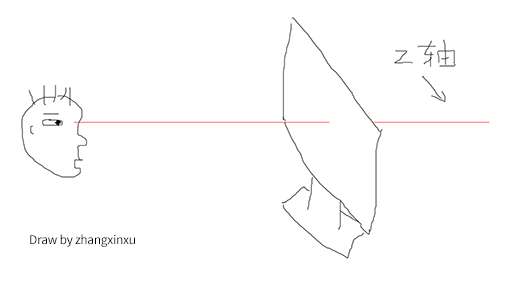

# HTML

## 新老浏览器关于字符集的设置
<!--新浏览器适用-->
<meta charset="utf-8">
<!--老浏览器适用-->
<meta http-equiv="content-type" content="text/html; charset=UTF-8" /><!--元-->


## table表格
```html
<table border='1' cellpadding="字外围的空隙" cellspacing="单元格之间的边距(边框的粗细)"></table>
<th>表头 自动居中加粗
```

## frameset页面布局

### frameset: 用于定义框架集
rows: 用于定义行数
cols: 用于定义列数
border: 指定是否有边框
`您不能与 <frameset></frameset> 标签一起使用 <body></body> 标签`

```html
<!-- 外面不要套body标签 -->
<frameset rows="20%, *" border="1">
    <frame src="hi_frame_up.html"/>
    <frameset cols="20%, *">
      <frame name="left" src="hi_frame_left.html" />
      <frame name="right" src="hi_frame_right.html" />
    </frameset>
</frameset>
```
### frame: 用于定义框架集中的每个窗口
src: 用于指定窗口的位置
name: 用于定义窗口的名称, 方便将来用target属性来指定
scrolling: 表示滚动条
noresize: 是否可以调整窗口大小 

### HTML 与 XHTML 之间的差异
在 HTML 中，<frame> 标签没有结束标签。
在 XHTML 中，<frame> 标签必须被正确地关闭。

## form表单
```html
  <!-- form表单标签 用于包含一些表单域 -->
  <form action="index.html" method="get">
    <!-- name属性必须要有，否则数据发不了 -->
    用户名：<input type="text" name="name" /><br>
    密&emsp;码：<input type="password" name="password" /><br>
    <input type="submit" />
  </form>
```

### form对象的属性
属性  描述 
action  返回或者设置action属性 
elements  获取一个数组，包括该表单中所有的表单域 
length  返回表单的表单域的数量
method  返回或设置表单的method属性 
name  返回或设置表单的name属性 

### form对象的方法
方法  描述 
submit()  相当于单击submit按钮，表示表单提交到指定页面 
reset()   相当于单击reset按钮，表示所有表单域到初始值 

# CSS

<b> 单纯加粗
<strong> 强调

`<table align ="enter"> `表格相对于父标签居中
`<table> 中 align ="center"`  内容居中


## 样式就近原则
`<td style="background-color: red" class="tdColor" ></td>`
样式遵守就近原则，style属性中red，外部样式tdColor中green，最终显示为red


`<link href="tomcat.css" rel="stylesheet" type="text/css" />`
Rel是relationship的英文缩写，它描述了当前页面与href所指定文档的关系；

## 定位属性  （难点）

### 定位的定义
position: relative | absolute | static | fixed
static 没有特别的设定，遵循基本的定位规定，不能通过z-index进行层次分级。
relative 不脱离文档流，参考自身静态位置,通过 top,bottom,left,right 定位，并且可以通过z-index进行层次分级。
absolute `脱离文档流`，通过 top,bottom,left,right 定位。选取其`最近的父级定位元素`，当父级 position 为 static 时，absolute元素将以body坐标原点进行定位，可以通过z-index进行层次分级。
fixed 固定定位，这里他所固定的对象是可视窗口而并非是body或是父级元素。可通过z-index进行层次分级。


## 什么是层叠上下文
层叠上下文，英文称作”stacking context”. 是HTML中的一个三维的概念。如果一个元素含有层叠上下文，我们可以理解为这个元素在z轴上就“高人一等”。

这里出现了一个名词-z轴，指的是什么呢？

表示的是用户与屏幕的这条看不见的垂直线（参见下图示意-红线）：


层叠上下文是一个概念，跟「块状格式化上下文(BFC)」类似。然而，概念这个东西是比较虚比较抽象的，要想轻松理解，我们需要将其具象化。

>怎么个具象化法呢？
你可以把「层叠上下文」理解为当官：网页中有很多很多的元素，我们可以看成是真实世界的芸芸众生。真实世界里，我们大多数人是普通老百姓们，还有一部分人是做官的官员。OK，这里的“官员”就可以理解为网页中的层叠上下文元素。
换句话说，页面中的元素有了层叠上下文，就好比我们普通老百姓当了官，一旦当了官，相比普通老百姓而言，离皇帝更近了，对不对，就等同于网页中元素级别更高，离我们用户更近了。

## 什么是层叠水平
再来说说层叠水平。“层叠水平”英文称作”stacking level”，决定了同一个层叠上下文中元素在z轴上的显示顺序。level这个词很容易让我们联想到我们真正世界中的三六九等、论资排辈。真实世界中，每个人都是独立的个体，包括同卵双胞胎，有差异就有区分。例如，双胞胎虽然长得像Ctrl+C/Ctrl+V得到的，但实际上，出生时间还是有先后顺序的，先出生的那个就大，大哥或大姐。网页中的元素也是如此，页面中的每个元素都是独立的个体，他们一定是会有一个类似的排名排序的情况存在。而这个排名排序、论资排辈就是我们这里所说的“层叠水平”。层叠上下文元素的层叠水平可以理解为官员的职级，1品2品，县长省长之类；对于普通元素，这个嘛……你自己随意理解。

于是，显而易见，所有的元素都有层叠水平，包括层叠上下文元素，层叠上下文元素的层叠水平可以理解为官员的职级，1品2品，县长省长之类。然后，对于普通元素的层叠水平，我们的探讨仅仅局限在当前层叠上下文元素中。为什么呢？因为否则没有意义。

这么理解吧~ 上面提过元素具有层叠上下文好比当官，大家都知道的，这当官的家里都有丫鬟啊保镖啊管家啊什么的。所谓打狗看主人，A官员家里的管家和B官员家里的管家做PK实际上是没有意义的，因为他们牛不牛逼完全由他们的主子决定的。一人得道鸡犬升天，你说这和珅家里的管家和七侠镇娄知县县令家里的管家有可比性吗？李总理的秘书是不是分分钟灭了你村支部书记的秘书（如果有）。

翻译成术语就是：普通元素的层叠水平优先由层叠上下文决定，因此，层叠水平的比较只有在当前层叠上下文元素中才有意义。

>需要注意的是，诸位千万不要把层叠水平和CSS的z-index属性混为一谈。没错，某些情况下z-index确实可以影响层叠水平，但是，只限于定位元素以及flex盒子的孩子元素；而层叠水平所有的元素都存在。

## 什么是层叠顺序
再来说说层叠顺序。“层叠顺序”英文称作”stacking order”. 表示元素发生层叠时候有着特定的垂直显示顺序，注意，这里跟上面两个不一样，上面的层叠上下文和层叠水平是概念，而这里的层叠顺序是规则。

在CSS2.1的年代，在CSS3还没有出现的时候（注意这里的前提），层叠顺序规则遵循下面这张图：


有人可能有见过类似图，那个图是很多很多年前老外绘制的，英文内容。而是更关键的是国内估计没有同行进行过验证与实践，实际上很多关键信息缺失。上面是我自己手动重绘的中文版同时补充很多其他地方绝对没有的重要知识信息。

缺失的关键信息包括：

位于最低水平的border/background指的是层叠上下文元素的边框和背景色。每一个层叠顺序规则适用于一个完整的层叠上下文元素。
原图没有呈现inline-block的层叠顺序，实际上，inline-block和inline水平元素是同等level级别。
z-index:0实际上和z-index:auto单纯从层叠水平上看，是可以看成是一样的。注意这里的措辞——“单纯从层叠水平上看”，实际上，两者在层叠上下文领域有着根本性的差异。
下面我要向大家发问了，大家有没有想过，为什么内联元素的层叠顺序要比浮动元素和块状元素都高？
疑问

为什么呢？我明明感觉浮动元素和块状元素要更屌一点啊。

嘿嘿嘿，我就不卖关子了，直接看下图的标注说明：


诸如border/background一般为装饰属性，而浮动和块状元素一般用作布局，而内联元素都是内容。网页中最重要的是什么？当然是内容了哈，对不对！

因此，一定要让内容的层叠顺序相当高，当发生层叠是很好，重要的文字啊图片内容可以优先暴露在屏幕上。例如，文字和浮动图片重叠的时候：


上面说的这些层叠顺序规则还是老时代的，如果把CSS3也牵扯进来，科科，事情就不一样了。

## 务必牢记的层叠准则
下面这两个是层叠领域的黄金准则。当元素发生层叠的时候，其覆盖关系遵循下面2个准则：

1. 谁大谁上：当具有明显的层叠水平标示的时候，如识别的z-indx值，在同一个层叠上下文领域，层叠水平值大的那一个覆盖小的那一个。通俗讲就是官大的压死官小的。
2. 后来居上：当元素的层叠水平一致、层叠顺序相同的时候，在DOM流中处于后面的元素会覆盖前面的元素。
在CSS和HTML领域，只要元素发生了重叠，都离不开上面这两个黄金准则。因为后面会有多个实例说明，这里就到此为止。

## 层叠上下文的特性
层叠上下文元素有如下特性：

层叠上下文的层叠水平要比普通元素高（原因后面会说明）；
层叠上下文可以阻断元素的混合模式（见此文第二部分说明）；
层叠上下文可以嵌套，内部层叠上下文及其所有子元素均受制于外部的层叠上下文。
每个层叠上下文和兄弟元素独立，也就是当进行层叠变化或渲染的时候，只需要考虑后代元素。
每个层叠上下文是自成体系的，当元素发生层叠的时候，整个元素被认为是在父层叠上下文的层叠顺序中。
翻译成真实世界语言就是：

当官的比老百姓更有机会面见圣上；
领导下去考察，会被当地官员阻隔只看到繁荣看不到真实民情；
一个家里，爸爸可以当官，孩子也是可以同时当官的。但是，孩子这个官要受爸爸控制。
自己当官，兄弟不占光。有什么福利或者变故只会影响自己的孩子们。
每个当官的都有属于自己的小团体，当家眷管家发生摩擦磕碰的时候（包括和其他官员的家眷管家），都是要优先看当官的也就是主子的脸色。

## 层叠上下文的创建
卖了这么多文字，到底层叠上下文是个什么鬼，倒是拿出来瞅瞅啊！

哈哈。如同块状格式化上下文，层叠上下文也基本上是有一些特定的CSS属性创建的。我将其总结为3个流派，也就是做官的3种途径：

- 皇亲国戚派：页面根元素天生具有层叠上下文，称之为“根层叠上下文”。
- 科考入选派：z-index值为数值的定位元素的传统层叠上下文。
- 其他当官途径：其他CSS3属性。
//zxx: 下面很多例子是实时CSS效果，建议您去原地址浏览，以便预览更准确的效果。

1. 根层叠上下文
指的是页面根元素，也就是滚动条的默认的始作俑者<html>元素。这就是为什么，绝对定位元素在left/top等值定位的时候，如果没有其他定位元素限制，会相对浏览器窗口定位的原因。

1. 定位元素与传统层叠上下文
对于包含有position:relative/position:absolute的定位元素，以及FireFox/IE浏览器（不包括Chrome等webkit内核浏览器）（目前，也就是2016年初是这样）下含有position:fixed声明的定位元素，当其z-index值不是auto的时候，会创建层叠上下文。

知道了这一点，有些现象就好理解了。

# 正则表达式
^是匹配开始
$是匹配结束
\w是匹配所有字符
中括号[]为匹配的字符
大括号{}表示匹配的长度

^[A-Za-z]\w{5,7}$
必须以英文开头，大小写都可以，,必须以数字或字母或下划线结尾(\w等同于[0-9a-zA-Z_])，同时长度在5-7之间

## iframe使用
iframe一般用来包含别的页面，例如我们可以在我们自己的网站页面加载别人网站或者本站其他页面的内容

### 页面内加入iframe

<iframe width=420 height=330 frameborder=0 scrolling=auto src=URL></iframe>，

scrolling表示是否显示页面滚动条，可选的参数为auto、yes、no，如果省略这个参数，则默认为auto。

### 超链接指向这个嵌入的网页，只要给这个iframe命名就可以了。
方法是<iframe name=**>，例如我命名为aa，写入这句HTML语言<iframe width=420 height=330 name=aa frameborder=0 src=http://host.zzidc.com></iframe>，然后，网页上的超链   接语句应该写为：<a  href=URL target=aa>

### 如果把frameborder设为1，效果就像文本框一样

透明的iframe的用法

必需IE5.5以上版本才支持

在transparentBody.htm文件的<body>标签中，我已经加入了style="background-color=transparent" 通过以下四种iframe的写法我想大概你对iframe背景透明效果的实现方法应该会有个清晰的了解：

<iframe ID="Frame1" SRC="transparentBody.htm" allowTransparency="true"></iframe>

<iframe ID="Frame2" SRC="transparentBody.htm" allowTransparency="true" STYLE="background-color: green"> </iframe>

<iframe ID="Frame3" SRC="transparentBody.htm"></iframe>

<iframe ID="Frame4" SRC="transparentBody.htm" STYLE="background-color: green"> </iframe>
