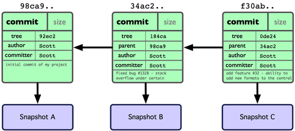

Day 001
fatal: could not create work tree dir 'kivy.: Permission denied

You should do the command in a directory where you have write permission. So:

A:
cd ~/
mkdir code
cd code
git clone https://github.com/kivy/kivy
For example.

fatal: unable to access 'https://github.com/datacharmer/test_db.git/': Unknown SSL protocol error in connection to github.com:443
A:
需要上传本机生成的SSH key到自己在github.com账号中

## 设置git的user name和email：
$ git config --global user.name "Bernard"
$ git config --global user.email "@gmail.com"

3.查看git配置：
$ git config --lis


## 生成 SSH 公钥
`$ ssh-keygen`

Day 002
安装 git
是时候动手尝试下 git 了，不过得先安装好它。有许多种安装方式，主要分为两种，一种是通过编译源代码来安装；另一种是使用为特定平台预编译好的安装包。

# 在 Linux 上安装
如果要在 Linux 上安装预编译好的 git 二进制安装包，可以直接用系统提供的包管理工具。在 Fedora 上用 yum 安装：

$ yum install git-core
在 Ubuntu 这类 Debian 体系的系统上，可以用 apt-get 安装：

$ apt-get install git

初次运行 git 前的配置
一般在新的系统上，我们都需要先配置下自己的 git 工作环境。配置工作只需一次，以后升级时还会沿用现在的配置。当然，如果需要，你随时可以用相同的命令修改已有的配置。

git 提供了一个叫做 git config 的工具（译注：实际是 git-config 命令，只不过可以通过 git 加一个名字来呼叫此命令。），专门用来配置或读取相应的工作环境变量。而正是由这些环境变量，决定了 git 在各个环节的具体工作方式和行为。这些变量可以存放在以下三个不同的地方：

/etc/gitconfig 文件：系统中对所有用户都普遍适用的配置。若使用 git config 时用 --system 选项，读写的就是这个文件。
`~/.gitconfig` 文件：用户目录下的配置文件只适用于该用户。若使用 git config 时用 --global 选项，读写的就是这个文件。
当前项目的 git 目录中的配置文件（也就是工作目录中的 .git/config 文件）：这里的配置仅仅针对当前项目有效。每一个级别的配置都会覆盖上层的相同配置，所以 .git/config 里的配置会覆盖 /etc/gitconfig 中的同名变量。
在 Windows 系统上，git 会找寻用户主目录下的 .gitconfig 文件。主目录即 $HOME 变量指定的目录，一般都是 C:\Documents and Settings\$USER。此外，git 还会尝试找寻 /etc/gitconfig 文件，只不过看当初 git 装在什么目录，就以此作为根目录来定位。

用户信息
第一个要配置的是你个人的用户名称和电子邮件地址。这两条配置很重要，每次 git 提交时都会引用这两条信息，说明是谁提交了更新，所以会随更新内容一起被永久纳入历史记录：

`$ git config --global user.name "John Doe"`
`$ git config --global user.email johndoe@example.com`
如果用了 --global 选项，那么更改的配置文件就是位于你用户主目录下的那个，以后你所有的项目都会默认使用这里配置的用户信息。如果要在某个特定的项目中使用其他名字或者电邮，只要去掉 --global 选项重新配置即可，新的设定保存在当前项目的 .git/config 文件里。

查看配置信息
要检查已有的配置信息，可以使用 git config --list 命令：
```
$ git config --list
user.name=Scott Chacon
user.email=schacon@gmail.com
color.status=auto
color.branch=auto
color.interactive=auto
color.diff=auto
```
有时候会看到重复的变量名，那就说明它们来自不同的配置文件比如 
`/etc/gitconfig  ~/.gitconfig`
不过最终 git 实际采用的是最后一个。

# git基础设置

读完本章你就能上手使用 git 了。
本章将介绍几个最基本的，也是最常用的 git 命令，以后绝大多数时间里用到的也就是这几个命令。
读完本章，你就能初始化一个新的代码仓库，做一些适当配置；开始或停止跟踪某些文件；暂存或提交某些更新。
我们还会展示如何让 git 忽略某些文件，或是名称符合特定模式的文件；如何既快且容易地撤消犯下的小错误；如何浏览项目的更新历史，查看某两次更新之间的差异；以及如何从远程仓库拉数据下来或者推数据上去。

## 取得项目的 git 仓库
取得项目的 git 仓库
有两种取得 git 项目仓库的方法。
第一种是在现存的目录下，通过导入所有文件来创建新的 git 仓库。
第二种是从已有的 git 仓库克隆出一个新的镜像仓库来。

## 在工作目录中初始化新仓库
要对现有的某个项目开始用 git 管理，只需到此项目所在的目录，执行：

`$ git init`
初始化后，在当前目录下会出现一个名为 .git 的目录，所有 git 需要的数据和资源都存放在这个目录中。不过目前，仅仅是按照既有的结构框架初始化好了里边所有的文件和目录，但我们还没有开始跟踪管理项目中的任何一个文件。（在第九章我们会详细说明刚才创建的 .git 目录中究竟有哪些文件，以及都起些什么作用。）
如果当前目录下有几个文件想要纳入版本控制，需要先用 git add 命令告诉 git 开始对这些文件进行跟踪，然后提交：

```bash
$ git add *.c
$ git add README
$ git commit -m 'initial project version'
```

## 远程仓库设置

### 配置远程仓库地址remote

git查看远程仓库地址命令
`git remote -v`

git重命令remote
`git remote rename <old> <new>`
例:
`$ git remote rename origin ori_devToolsRepo`


## branches分支

分支
即，`我想基于这个提交及它所有的父提交进行新的工作`

### 何谓分支


>为了理解 git 分支的实现方式，我们需要回顾一下 git 是如何储存数据的。或许你还记得第一章的内容，git 保存的不是文件差异或者变化量，而只是一系列文件快照。

当使用 git commit 新建一个提交对象前，git 会先计算每一个子目录（本例中就是项目根目录）的校验和，然后在 git 仓库中将这些目录保存为树（tree）对象。之后 git 创建的提交对象，除了包含相关提交信息以外，还包含着指向这个树对象（项目根目录）的指针，如此它就可以在将来需要的时候，重现此次快照的内容了。

现在，git 仓库中有五个对象：三个表示文件快照内容的 blob 对象；一个记录着目录树内容及其中各个文件对应 blob 对象索引的 tree 对象；以及一个包含指向 tree 对象（根目录）的索引和其他提交信息元数据的 commit 对象。概念上来说，仓库中的各个对象保存的数据和相互关系看起来如图 3-1 所示：


作些修改后再次提交，那么这次的提交对象会包含一个指向上次提交对象的指针（译注：即下图中的 parent 对象）。两次提交后，仓库历史会变成图 3-2 的样子：


现在来谈分支。git 中的分支，`其实本质上仅仅是一个指向commit对象的可变指针`。git会使用master作为分支的默认名字。
在若干次提交后，你其实已经有了一个指向最后一次提交对象的 master 分支，它在每次提交的时候都会自动向前移动。


应该这样来理解分支的概念：
`它是用来标记特定的代码提交，每一个分支通过SHA1sum值来标识，所以对分支进行的操作是轻量级的--你改变的仅仅是SHA1sum值`

这个定义或许会有意想不到的影响。比如，假设你有两个分支，“stable” 和 “new-idea”, 它们的顶端在版本 E 和 F:
  A-----C----E ("stable")
   \
    B-----D-----F ("new-idea")
所以提交(commits) A, C和 E 属于“stable”，而 A, B, D 和 F 属于 “new-idea”。如果之后你用下面的命令 将“new-idea” merge 到 “stable” ：
```shell
git checkout stable   # Change to work on the branch "stable"
git merge new-idea    # Merge in "new-idea"
```
…那么你会得到这个：

  A-----C----E----G ("stable")
   \             /
    B-----D-----F ("new-idea")
要是你继续在“new idea” 和“stable”分支提交, 会得到：

  A-----C----E----G---H ("stable")
   \             /
    B-----D-----F----I ("new-idea")
因此现在A, B, C, D, E, F, G 和 H 属于 “stable”，而A, B, D, F 和 I 属于 “new-idea”。

当然了，分支确实有些特殊的属性——其中最重要的是，
`如果你在一个分支进行作业并创建了一个新的提交(commit)，该分支的顶端将前进到那个提交(commits)。这正是你所希望的。当用git merge进行合并(merge)的时候，你只是指定了要合并到当前分支的那个并入分支，以及当前分支的当前进展。`


---------------17/06/10 更新-----------------------------------------------------------
这里注意：
MINGW64: 执行commit操作时，可能在vim下添加注释，使用 `:wq`  退出
vi下命令：
ndd 
删除以当前行开始的n行

git branch 查看本地所有分支
git status 查看当前状态 
git commit 提交 
git branch -a 查看所有的分支
git branch -r 查看远程所有分支
git commit -am "init" 提交并且加注释 

稍后我们再逐一解释每条命令的意思。不过现在，你已经得到了一个实际维护着若干文件的 git 仓库。

# push本地代码到github出错
有如下几种解决方法：

1.使用强制push的方法：
`$ git push -u origin master -f `

这样会使远程修改丢失，一般是不可取的，尤其是多人协作开发的时候。

2.push前先将远程repository修改pull下来
```shell
$ git pull origin master

$ git push -u origin master
```


## 自定义Git

### 搭建Git服务器


服务器端

1.先从yum安装git

yum –y install git
2.在需要的位置创建一个裸仓库（最后以.git结尾）

cd /usr/local
mkdir git
cd git
git init --bare learngit.git
3.创建一个git用户并赋予密码

useradd git
passwd git
4.赋予git用户权限

chown -R git:git learngit.git
5.禁用git用户shell登录（一定要禁用）

vi /etc/passwd
　　将git用户修改为如下（一般在最后一行）

git:x:1000:1000::/home/git:/usr/bin/git-shell
其他的不用改。服务端完成。


客户端

我使用的客户端为git for windows

1.安装，略...

2.进入想要将项目放置的目录

3.创建用户

git config --global user.name "你的名字"
git config --global user.email "你的邮箱"
4.创建秘钥（用来防止每次commit或push都需要密码）

ssh-keygen -t rsa -C "你的邮箱"
　　一直回车....

5.将秘钥加入服务器列表

　　5.1 取得公钥（本地）

　　　　在当前目录下(若未改变目录，到C:\Users\Administrator\.ssh\id_rsa.pub)找到.ssh目录下的id_rsa.pub文件，使用notepad++或其他软件打开，复制其中内容（类似如下：

ssh-rsa AAAAB3NzaC1yc2EAAAADAQABAAABAQCq+DNXnrzPoGJe3uCObDG7DcMMotWght/QNZnnO39FLzin+xMj+cOGpwbi5PSRqUwVrq4So7uuQGz2xyLb3vjHYK3z7SG/Sk/HdQctvbIVo+NugXbgmopm25Ps518aDuQ7w8nlPY3IvxTqH1U2ijoCdqgnVrwKCCPf7QY/2HGI+nDbF+s6cCX4CIkhwWnWhJXVqmSxbPSA8sX/2NE71gwhypLLfH8PG8nHr36zSfCdf0/DASdzJD7wE3cdlvICT82TmmqZLPWgYQv+4zNjbuPpzupp5zBIN+piS9VfBv+RdFEtx3oPk3Ou0z1tR9T5Lpe55b+U.......... 你的邮箱
　　　　）

　　5.2 将公钥加入服务器列表（服务器）

　　　　CentOS 7默认列表在/root/.ssh/authorized_keys，使用vi 编辑此文件输入刚才复制的内容，保存退出。

vi /root/.ssh/authorized_keys
    //i修改
    //esc后输入:wq保存退出
　　5.3 可以跳过此步，若克隆远程项目多次仍然需要密码，则检查上一步是否有错误，没有错误后，在配置这一步（服务器）

　　　　在/home目录下创建.ssh目录，进入，创建authorized_keys文件

cd /home
mkdir .ssh
cd .ssh
vi authorized_keys
　　　　加入我们的公钥后保存退出。

6.克隆远程项目（本地）

cd F:
cd git
//把ip换成自己服务器的
git clone git@101.101.101.101:/usr/local/git/learngit.git
7.如果需要密码，输入你设置的git用户密码，若clone之后commit多此后仍然需要密码，执行5.3，若已经执行，检查公钥是否正确，然后退出git for windows，再此打开git for windows克隆。


从现有仓库克隆
如果想对某个开源项目出一份力，可以先把该项目的 git 仓库复制一份出来，这就需要用到 git clone 命令。如果你熟悉其他的 VCS 比如 Subversion，你可能已经注意到这里使用的是 clone 而不是 checkout。这是个非常重要的差别，git 收取的是项目历史的所有数据（每一个文件的每一个版本），服务器上有的数据克隆之后本地也都有了。实际上，即便服务器的磁盘发生故障，用任何一个克隆出来的客户端都可以重建服务器上的仓库，回到当初克隆时的状态（虽然可能会丢失某些服务器端的挂钩设置，但所有版本的数据仍旧还在，有关细节请参考第四章）。

克隆仓库的命令格式为 git clone [url]。比如，要克隆 Ruby 语言的 git 代码仓库 Grit，可以用下面的命令：

`$ git clone git://github.com/schacon/grit.git`
这会在当前目录下创建一个名为grit的目录，其中包含一个 .git 的目录，用于保存下载下来的所有版本记录，然后从中取出最新版本的文件拷贝。如果进入这个新建的 grit 目录，你会看到项目中的所有文件已经在里边了，准备好后续的开发和使用。如果希望在克隆的时候，自己定义要新建的项目目录名称，可以在上面的命令末尾指定新的名字：

`$ git clone git://github.com/schacon/grit.git mygrit`
唯一的差别就是，现在新建的目录成了 mygrit，其他的都和上边的一样。

git 支持许多数据传输协议。之前的例子使用的是 git:// 协议，不过你也可以用 http(s):// 或者 user@server:/path.git 表示的 SSH 传输协议。我们会在第四章详细介绍所有这些协议在服务器端该如何配置使用，以及各种方式之间的利弊。


版本库(Repository)

工作区有一个隐藏目录.git。这个不算工作区，而是git的版本库。
git的版本库里存了很多东西，其中最重要的就是称为stage(或者index)的暂存区，还有git为我们自动创建的第一个分支master，以及指向master的一个指针叫HEAD。

前面我们讲了把文件网git版本库里添加的时候，是分两步执行的：
第一步，
是git add把文件添加进去，实际上就是把文件修改添加到暂存区；
第二步，
是用git commit提交更改，实际上就是把暂存区的所有内容提交到当前分支。
因为我们创建版本库时，git自动为我们创建了唯一一个master分支，所以，现在git commit就是往master分支上提交更改。  


## git高频用法

### 分支与合并

两种方式 git merge, git rebase


### 搜索
git grep
在当前working directory下搜索含有某个字符串的文件，要显示行号可以使用-n参数。
`git grep -n socket`

只显示包含的文件和其包含的个数可以使用--count参数。
`git grep --count socket`
JS&jQuery学习笔记.md:1
TCP协议.md:2
git_note.md:1
netty_note.md:5


### git bash清楚命令历史记录
所有命令历史记录都存储在`~/.bash_history`文件中，所以可以直接vi编辑该文件，删除记录就可以
另外，`HISTSIZE=10`可以设置方向键查询历史命令条数

### 查询log
查看指定fileName相关的commit记录
git log filename

查看某次提交中的变化
git show <commit...>

只看某次提交中的某个文件变化，可以直接加上fileName
git show <commit...> filename


### git取消对文件的跟踪
- 对git未跟踪的文件不跟踪
将该文件加入.gitignore文件即可
- 停止对git已跟踪的文件跟踪，但保留之前该文件的跟踪状态
git rm --cached 文件名
- 暂时让git忽略已跟踪的文件
git update-index --assume-unchanged 文件名

### git reset revert回退回滚取消提交返回上一版本
总有一天你会遇到下面的问题.
改完代码匆忙提交，上线发现有问题，怎么办？赶紧回滚
改完代码测试也没有问题，但是上线发现你的修改影响了之前运行正常的代码报错，必须回滚
这些开发中很常见的问题，所以git的取消提交，回退甚至返回上一版本都是特别重要的。

大致分为下面2种情况：
1 没有push
这种情况发生在你的本地代码仓库，可能你add，commit以后发现代码有点问题，准备取消提交，用到下面命令
```shell
git reset [--soft | --mixed | --hard]
```
上面常见三种类型
--mixed
会保留源码，只是将git commit和index信息退回到了某个版本
```shell
git reset --mixed 等价于 git reset
```
--soft
保留源码，只回退到commit 信息到某个版本，不涉及index的回退，如果还需要提交，直接commit即可。

--hard
源码也会回退到某个版本，commit和index都会回退到某个版本。（注意，这种方式是改变本地代码仓库源码）

当然有人在push代码以后，也使用reset --hard <commit...>回退代码到某个版本之前，但是这样会有一个问题，你线上的代码没有变，线上commit，index都没有变，当你把本地代码修改完提交的时候你会发现全是冲突...

所以这个时候，你要使用下面的方式

2 已经push
对于已经把代码push到线上仓库，你回退本地代码其实也想同时回退线上代码，回滚到某个指定的版本，线上，线下代码保持一致，你要用到下面的命令

revert
git revert用于反转提交，执行revert命令时要求工作树必须是干净的。
git revert用一个新提交来消除一个历史提交多做点任何修改。

revert之后你的本地代码会回滚到指定的历史版本，这时候你再git push既可以把线上的代码更新。（这里不会像reset造成冲突的问题）

revert的使用，需要先找到你想回滚版本唯一的commit标识代码，可以用git log或者在adgit搭建的web环境历史提交记录里查看。
```shell
git revert c011eb3234990234ab080c9cdfe
```
通常，前几位即可
```shell
git revert c011eb3
```

git revert是用一次新的commit来回滚之前的commit，git reset是直接删除指定的commit
看似达到的效果是一样的,其实完全不同.

第一:
上面我们说的如果你已经push到线上代码库, reset 删除指定commit以后,你git push可能导致一大堆冲突.但是revert 并不会.

第二:
如果在日后现有分支和历史分支需要合并的时候,reset 恢复部分的代码依然会出现在历史分支里.但是revert 方向提交的commit 并不会出现在历史分支里.

第三:
reset 是在正常的commit历史中,删除了指定的commit,这时 HEAD 是向后移动了,而 revert 是在正常的commit历史中再commit一次,只不过是反向提交,他的 HEAD 是一直向前的.


### 分支合并

假设我们想要将分支修补程序合并 到您的主分支中。您如何确保您已准备好合并您的更改？

#### 准备合并
检查您的本地存储库是否与来自远程服务器的最新更改保持一致git fetch。
提取完成后，使用该 git checkout master命令。
通过执行确保主分支具有最新的更新git pull。

#### 合并
一旦准备工作完成后，你可以开始与合并 git merge hotfix的命令。

#### 快进合并

一个快进合并时，有之间的线性路径可以发生分支，我们要合并。如果主服务器没有发生分离，而不是创建一个新的提交，它只会将主服务器指向修补程序分支的最新提交。所有来自修补程序分支的提交现在都可以在主分支中使用

然而，如果分支机构已经分化，则快速合并是不可能的。在这种情况下，您想使用三路合并。

#### 三路合并
三路合并用额外的commit来将两个分支联系在一起。


#### 冲突解决合并

一个合并冲突，当你试图合并这两个两个分支改变了同一个文件的同一部分出现。发生这种情况时，Git将无法确定要使用哪个版本。

例如，如果该文件example.java在同一Git存储库的不同分支中的相同行上进行了编辑，或者该文件已被删除，则当您尝试合并这些分支时，您将收到合并冲突错误。在继续之前，合并冲突必须通过新提交来解决

合并冲突只会发生在三方合并的情况下。

生成 需要解析的文件列表： git status
# On branch master# You have unmerged paths.# (fix conflicts and run "git commit")# Unmerged paths:# (use "git add ..." to mark resolution)# both modified: example.rb# no changes added to commit (use "git add" and/or "git commit -a")
当 遇到冲突线时，Git将使用 标记冲突内容两侧的可视指示符编辑受影响文件 的内容。这些可视标记是：

<<<<<<<- 冲突标记，冲突开始于此行之后。
=======- 将您的更改与另一个分支中的更改分开。
>>>>>>>- 冲突线的结束。
